# Architecture

searchengine is a self-hosted hybrid (BM25 + semantic) search engine written in Go, structured as a hexagonal architecture. `internal/domain` holds pure business logic with no I/O dependencies; `internal/ports` defines the interfaces connecting that core to the outside world; `internal/application` orchestrates use cases (search, crawling, background jobs) purely in terms of those ports; and `internal/adapters/*` implement the ports against real infrastructure (SQL databases, HTTP fetchers, embedding/chat APIs, headless browsers). Three independent Go binaries are built on this shared core — `cmd/search` (public), `cmd/admin` (internal), and `cmd/crawl` (internal-only) — and coordinate primarily by sharing one SQL database rather than calling each other directly, with a single exception: `cmd/admin` talks to `cmd/crawl` over an internal HTTP API to start and poll crawl jobs.



Source: [`architecture.mmd`](architecture.mmd) (Mermaid) -- edit that file, then regenerate the picture:

```sh
echo '{"args": ["--no-sandbox"]}' > /tmp/puppeteer-config.json
npx --yes @mermaid-js/mermaid-cli@latest \
  -i docs/architecture.mmd -o docs/architecture.svg -b white \
  -p /tmp/puppeteer-config.json
```

(The `-p`/`--no-sandbox` step works around Puppeteer's headless Chromium
refusing to start under most CI/container/dev-VM setups without it --
`mmdc` fails with `No usable sandbox!` otherwise.)

## Layers

### Domain (`internal/domain`)

Pure logic — every file imports only the Go standard library, with no SQL, HTTP, or framework dependency.

| Component | Responsibility |
|---|---|
| Document & search-result core (`document.go`) | `Document`, `SearchResult`, `IndexedDocument`, `DocumentVersion`, `DomainSummary`, `DocumentsOverview` and related admin-overview shapes. |
| Document aliasing & content dedup (`document_alias.go`, `content_fingerprint.go`, `content_dedup_status.go`) | Canonical-document alias tracking; `ContentHash`/`SimHash64` exact and near-duplicate fingerprinting; persisted dedup-run status. |
| BM25 scoring (`bm25.go`) | `PostingStats`, `TermStat`, `TermScore`; `BM25Score`/`BM25ScoreDocument`/`BM25TermScores` implement the BM25 relevance formula and its per-term breakdown. |
| Hybrid ranking, query parsing & snippets (`hybrid.go`, `query.go`, `snippet.go`, `overrides.go`) | `HybridResult` blending BM25+semantic+PageRank; `ParsedQuery`/`ParseQuery` for term/phrase/site: parsing; `Snippet` highlighting; admin-configured block/boost `RankingOverrides`. |
| Vector math & embedding endpoints (`vector.go`, `embedding_endpoint.go`, `embedding_provider.go`, `embedding_status.go`) | `CosineSimilarity`/`VectorNorm`/`CombineWeighted`; `EmbeddingHTTPEndpoint` config model; persisted recompute status. |
| Fuzzy matching & vocabulary (`fuzzy.go`, `vocabulary_cache.go`, `tokenizer.go`) | Levenshtein-based `NearestTerm` fallback for zero-hit query terms; `VocabularyCache`; shared `Tokenize` used by indexing, query parsing, and overrides. |
| Crawl jobs (`crawljob.go`) | `CrawlJob`/`CrawlJobSummary`/`CrawlPageEvent` models, plus a full in-memory, mutex-protected `CrawlJobStore` implementation used as the lightweight/test stand-in for the DB-backed one. |
| Scheduled crawls (`scheduled_crawl.go`) | `ScheduledCrawl` model for admin-created recurring or one-off crawl definitions. |
| PageRank (`pagerank.go`) | Iterative `PageRank` computation over the crawled link graph; persisted `PageRankStatus`. |
| Operational & tuning settings (`settings.go`, `tuning.go`, `link_scope.go`, `renderer.go`, `url_normalize.go`) | `OperationalSettings`, `TuningSettings`, link-scope/renderer enums, `CanonicalizeURL`. |
| Chat (`chat.go`) | `ChatMessage`, `ChatEndpoint` config -- web search/fetch is exclusively via admin-configured `ChatHook`s the model invokes (see `chat_hook.go`), not a direct search performed by this layer. |
| Corpus stats cache (`corpus_stats.go`) | Concurrency-safe cached snapshot of corpus-wide totals BM25 scoring needs per request. |
| Overview/admin metrics shapes (`overview_metrics.go`) | Pure data shapes feeding the admin Overview page's charts. |

### Ports (`internal/ports`)

23 interfaces defining pure contracts between the core and adapters; the package imports `database/sql` only for the `sql.DBStats` value type, performing no I/O itself.

| Port | Responsibility | Implemented by |
|---|---|---|
| `Fetcher` / `AuthFetcher` / `Renderer` | Plain HTTP fetch, authenticated fetch with per-request options, headless-browser rendering. | `httpfetcher`, `browserfetcher` |
| `RobotsChecker` | robots.txt compliance check before fetching. | `robots` |
| `EmbeddingProvider` | Text-to-vector conversion. | `hashembed`, `httpembed` |
| `SQLRepository` | Broad relational-DB port: document save/versioning/embeddings, postings/corpus-stats/vocabulary lookups, alias resolution, ANN semantic search. | `sqlrepo` |
| `PageRankRepository`, `ContentDedupRepository`, `EmbeddingRepository` | Narrow slices of `SQLRepository`, scoped to exactly what each background job needs. | `sqlrepo` |
| `SessionStore` | Shared-DB login session tokens. | `sqlrepo` |
| `HealthChecker` | Cheap DB liveness check backing `/healthz`. | `sqlrepo` |
| `AdminRepository` | Read-mostly admin diagnostics port (stats, listings, time series, pool stats). | `sqlrepo` |
| `SearchService` | Primary driving port for public search. | `internal/application` (hybrid search use case) |
| `CrawlerService` | Executes an actual crawl with live per-page progress. | `internal/application` (crawl loop) |
| `CrawlJobService` | Network contract admin-server uses to poll/control crawl-server's jobs. | HTTP client adapter (`crawlclient`) |
| `CrawlJobStore` | crawl-server's own job/page-history persistence. | `domain.CrawlJobStore` (in-memory/test), `sqlrepo` (production) |
| `DebugSearchService` | Raw, unblended BM25/semantic/PageRank score breakdown for admin diagnostics. | `internal/application` |
| `SettingsStore` | Generic key/value settings persistence shared by every process. | `sqlrepo` |
| `ScheduledCrawlStore` | CRUD + scheduling operations on `ScheduledCrawl`, shared by admin CRUD and the crawl-server ticker. | `sqlrepo` |
| `EmbeddingEndpointStore`, `ChatEndpointStore` | CRUD/get-set for admin-configured embedding and chat endpoint config. | `sqlrepo` |
| `ChatCompleter` | Calls an OpenAI-compatible chat-completions endpoint. | `httpchat` |

### Application (`internal/application`)

Orchestration/use-case layer; verified to import only `internal/domain` and `internal/ports` (no adapter imports) in non-test code.

| Component | Responsibility | Key dependencies |
|---|---|---|
| `hybridSearchService` / `hybridSearchAdapter` | Core hybrid BM25 + semantic search: query parsing, concurrent BM25/embedding fetch, candidate pooling, constraint/override filtering, score blending, pagination, snippet hydration; adapted to the plain `SearchService` port. | `SQLRepository`, `EmbeddingProvider` |
| `crawlLoop` | Shared crawl control-flow engine (queueing, link-scope/allow-block filtering, sitemap discovery, robots checks, fetch, thin-content filtering, canonical aliasing) reused by every `CrawlerService` backend via an injected `save` callback. | `AuthFetcher`, `RobotsChecker` |
| `sqlCrawlerService` | Implements `CrawlerService`: drives `crawlLoop`, embeds and persists each fetched page. | `AuthFetcher`, `RobotsChecker`, `SQLRepository`, `EmbeddingProvider` |
| `embedTitleWeighted` | Shared helper computing a title+body weighted embedding, used by the crawler and the recompute job. | `EmbeddingProvider` |
| `RunPageRankJob` / `*WithStatus` | Recomputes PageRank from the link graph and writes results back. | `PageRankRepository`, `SettingsStore` |
| `RunContentDedupJob` / `*WithStatus` | Groups exact/near-duplicate documents (SimHash + LSH) and merges losers into a canonical doc. | `ContentDedupRepository`, `SettingsStore` |
| `RunEmbeddingRecomputeJob` / `*WithStatus` | Re-embeds every document's stored text against currently-enabled providers without recrawling. | `EmbeddingRepository`, `EmbeddingProvider`, `SettingsStore` |
| `TriggerDueCrawls` (scheduler) | Finds and triggers due scheduled crawls, records completion/next-run state. | `ScheduledCrawlStore` |
| `RecoverInterruptedCrawls` | Resumes or fails crawl jobs left queued/running when crawl-server last stopped. | `CrawlJobStore` |
| `RenderAwareFetcher` | Routes fetches through a headless-browser `Renderer` when requested. | `AuthFetcher`, `Renderer` |
| `ChatService` | Orchestrates one chat turn: loads config, optional web-search augmentation, history trimming, delegates completion. | `ChatEndpointStore`, `ChatCompleter`, `WebSearcher` |

### Adapters (`internal/adapters`)

12 adapter packages, plus `restapi` (13 total) as the shared HTTP handler layer for `cmd/search` and `cmd/admin`.

| Adapter | Responsibility |
|---|---|
| `sqlrepo` | SQL persistence layer shared by all three binaries (SQLite locally/CI, Postgres in the dev deployment); implements `SQLRepository`, `PageRankRepository`, `ContentDedupRepository`, `EmbeddingRepository`, `SessionStore`, `AdminRepository`, `CrawlJobStore`, `SettingsStore`, `ScheduledCrawlStore`, `EmbeddingEndpointStore`, `ChatEndpointStore`, and more. |
| `restapi` | HTTP handler layer for both the public search UI/API and the admin UI/API — routing, JSON REST endpoints, embedded static assets, auth/session and crawl-internal-token checks. |
| `httpfetcher` | Default plain-HTTP page fetcher with timeout/UA/cookie/basic-auth support, routed through `netguard`. |
| `browserfetcher` | Renders JS-heavy pages via a headless Chromium or Firefox browser over Playwright. |
| `htmlparser` | Pure HTML title/text/link/canonical-URL extraction. |
| `robots` | Fetches, caches, and evaluates robots.txt rules. |
| `netguard` | Shared SSRF guard (custom `DialContext`) used by every outbound crawler fetch. |
| `hashembed` | Dependency-free fallback embedding provider via feature hashing. |
| `httpembed` | Calls an OpenAI-compatible embeddings HTTP endpoint (e.g. IONOS AI Model Hub) with chunking and rate-limit-aware retry. |
| `httpchat` | Calls an OpenAI-compatible chat-completions endpoint. |
| `crawlclient` | HTTP client `cmd/admin` uses to delegate crawl-job operations to `cmd/crawl`. |
| `settingscrypto` | AES-256-GCM encryption of the admin-configured embedding/chat API key at rest. |

## Binaries

- **`cmd/search`** — public, internet-facing. Serves the index/search page, the `/search` JSON API, and chat endpoints. Per nginx routing, this is the only one of the three exposed directly to the public internet. Reads/writes the shared SQL database via `sqlrepo` but never calls the other two binaries directly.
- **`cmd/admin`** — internal, reached only via nginx's `/admin`, `/login`, `/logout` prefixes. Hosts every `/admin/api/*` endpoint (settings, embedding endpoints, PageRank, content-dedup, sessions/auth, diagnostics, scheduled crawls, chat endpoints). It never fetches pages or touches robots.txt/documents itself — it only starts and polls crawl jobs on crawl-server over the network via `crawlclient` (default `CRAWL_SERVER_URL=http://127.0.0.1:8082`, optional shared-secret `X-Internal-Token`).
- **`cmd/crawl`** — internal only, never exposed by nginx. Runs actual crawls (fetch, robots check, HTML parse, embed, persist), tracks crawl-job state, and exposes an internal HTTP surface (`RoutesCrawlInternal`, default `127.0.0.1:8082`) that only `cmd/admin`'s `crawlclient` calls. Also runs background schedulers (scheduled-crawl trigger poller, PageRank recompute, content-dedup recompute, crawl-job pruner) and recovers interrupted jobs on startup.

At runtime, the three binaries coordinate almost entirely through the shared SQL database rather than direct calls: each opens its own DB connection (a `*sql.DB` can't be shared across OS processes), and `internal/bootstrap`'s `SyncSettings` polls the settings table roughly every 10 seconds so an admin edit made through any one process propagates to the others. The one real inter-binary relationship is `cmd/admin → cmd/crawl` over HTTP via `crawlclient`.

## Deployment

The dev/test deployment (`se.mo-sys.de`) runs all three Go binaries as independent, hardened systemd services from one Debian package: `searchengine-search.service`, `searchengine-admin.service`, `searchengine-crawl.service` (each `NoNewPrivileges=true`, `ProtectSystem=strict`, `ProtectHome=true`, `Restart=on-failure`), sharing one system user (`searchengine`) and one `EnvironmentFile` (`/etc/searchengine/searchengine.env`) holding `DB_DRIVER`/`DB_DSN`, admin credentials, per-service listen addresses (loopback-only by default), `CRAWL_SERVER_URL`/`CRAWL_INTERNAL_TOKEN`, and `SETTINGS_ENCRYPTION_KEY`. `postinst` creates the user and enables/starts all three services on install, but deliberately does **not** install or reload nginx configuration — the tracked `packaging/nginx/searchengine.conf` can drift from the live `/etc/nginx/...` unless manually re-synced.

nginx is the public entrypoint on 80/443 and splits traffic by path: `/login`, `/logout`, and `/admin` (a plain string-prefix match, not path-segment-aware) route to admin-server on `127.0.0.1:8081`; everything else falls through the catch-all to search-server on `127.0.0.1:8080`. crawl-server (`127.0.0.1:8082`) is deliberately given no location block and must never be exposed publicly. A separate, non-public server block on `127.0.0.1:8090` exposes nginx's `stub_status` for scraping.

Observability is host-level and independent of the searchengine package itself: a Prometheus agent (`--enable-feature=agent`, no local TSDB) on `127.0.0.1:9090` scrapes `node-exporter` (9100, host metrics), `nginx-exporter` (9113, via `stub_status`), `postgres-exporter` (9187, reusing the same `DB_DSN` from `searchengine.env`), and optionally SearXNG's own OpenMetrics endpoint, then `remote_write`-forwards everything to an external **IONOS Monitoring Service** pipeline. SearXNG itself — a self-hosted metasearch instance a "web_search" chat hook script queries when the model invokes it (see `packaging/chat-hooks/`) — runs as a separate Docker Compose deployment on `127.0.0.1:8888`, entirely outside the searchengine `.deb`. Everything on the host binds to `127.0.0.1` only, since there is no host firewall.

The admin-configured embedding and chat endpoints (`httpembed`/`httpchat` — generic OpenAI-compatible HTTP clients at the code level) currently point at a dedicated inference host, `gpu.mo-sys.de` (a single NVIDIA H200 NVL GPU), rather than a third-party hosted API. Two independent `vLLM` server processes run there, sharing the one GPU: one serving `Alibaba-NLP/gte-Qwen2-7B-instruct` in pooling/embed mode on `:8000` (backing `httpembed`), and one serving `RedHatAI/Qwen2.5-72B-Instruct-FP8-dynamic` in normal generate mode on `:8001` (backing `httpchat`, `--max-model-len 32768`, no YaRN long-context scaling enabled). Each runs as its own systemd unit, bound to the host's private network interface only, gated by its own bearer API key. The same host also runs `node-exporter` and NVIDIA's `DCGM` GPU exporter, remote-written into the same IONOS Monitoring Service pipeline as `se.mo-sys.de`, distinguished by its own `external_labels.site` (`gpu-h200`).

## Keeping this document current

This document and its diagram must be updated whenever a domain type, port, application use case, adapter, or binary is added, changed, or removed — per the architecture-documentation rule in `CLAUDE.md`. Treat a component change without a matching update here as incomplete work, the same way `CLAUDE.md` already treats an undocumented REST or nginx-routing change.