# Architecture

searchengine is a self-hosted AI chatbot with search-engine features, written in Go and structured as a hexagonal architecture: a chat model that can cite live web results and this instance's own crawled index side by side, backed by a hybrid (BM25 + semantic) search engine also exposed as a plain public search UI. `internal/domain` holds pure business logic with no I/O dependencies; `internal/ports` defines the interfaces connecting that core to the outside world; `internal/application` orchestrates use cases (search, crawling, background jobs) purely in terms of those ports; and `internal/adapters/*` implement the ports against real infrastructure (SQL databases, HTTP fetchers, embedding/chat APIs, headless browsers). Three independent, always-running Go binaries are built on this shared core — `cmd/search` (public), `cmd/admin` (internal), and `cmd/crawl` (internal-only) — and coordinate primarily by sharing one SQL database rather than calling each other directly, with a single exception: `cmd/admin` talks to `cmd/crawl` over an internal HTTP API to start and poll crawl jobs. Four more binaries, `cmd/mcp-web`, `cmd/mcp-datetime`, `cmd/mcp-sandbox`, and `cmd/mcp-files`, are first-party MCP tool servers spawned on demand as `stdio` subprocesses (not systemd services) rather than run continuously -- see the Binaries section below.



Source: [`architecture.mmd`](architecture.mmd) (Mermaid) -- edit that file, then regenerate the picture:

```sh
echo '{"args": ["--no-sandbox"]}' > /tmp/puppeteer-config.json
npx --yes @mermaid-js/mermaid-cli@latest \
  -i docs/architecture/architecture.mmd -o docs/architecture/architecture.svg -b white \
  -p /tmp/puppeteer-config.json
```

(The `-p`/`--no-sandbox` step works around Puppeteer's headless Chromium
refusing to start under most CI/container/dev-VM setups without it --
`mmdc` fails with `No usable sandbox!` otherwise.)

## Layers

### Domain (`internal/domain`)

Pure logic — every file imports only the Go standard library, with no SQL, HTTP, or framework dependency.

| Component | Responsibility |
|---|---|
| Document & search-result core (`document.go`) | `Document`, `SearchResult`, `IndexedDocument`, `DocumentVersion`, `DomainSummary`, `DocumentsOverview` and related admin-overview shapes. |
| Document aliasing & content dedup (`document_alias.go`, `content_fingerprint.go`, `content_dedup_status.go`) | Canonical-document alias tracking; `ContentHash`/`SimHash64` exact and near-duplicate fingerprinting; persisted dedup-run status. |
| BM25 scoring (`bm25.go`) | `PostingStats`, `TermStat`, `TermScore`; `BM25Score`/`BM25ScoreDocument`/`BM25TermScores` implement the BM25 relevance formula and its per-term breakdown. |
| Hybrid ranking, query parsing & snippets (`hybrid.go`, `query.go`, `snippet.go`, `overrides.go`) | `HybridResult` blending BM25+semantic+PageRank; `ParsedQuery`/`ParseQuery` for term/phrase/site: parsing; `Snippet` highlighting; admin-configured block/boost `RankingOverrides`. |
| Vector math & embedding endpoints (`vector.go`, `embedding_endpoint.go`, `embedding_provider.go`, `embedding_status.go`) | `CosineSimilarity`/`VectorNorm`/`CombineWeighted`; `EmbeddingHTTPEndpoint` config model; persisted recompute status. |
| Fuzzy matching & vocabulary (`fuzzy.go`, `vocabulary_cache.go`, `tokenizer.go`) | Levenshtein-based `NearestTerm` fallback for zero-hit query terms; `VocabularyCache`; shared `Tokenize` used by indexing, query parsing, and overrides. |
| Crawl jobs (`crawljob.go`) | `CrawlJob`/`CrawlJobSummary`/`CrawlPageEvent` models, plus a full in-memory, mutex-protected `CrawlJobStore` implementation used as the lightweight/test stand-in for the DB-backed one. |
| Scheduled crawls (`scheduled_crawl.go`) | `ScheduledCrawl` model for admin-created recurring or one-off crawl definitions. |
| PageRank (`pagerank.go`) | Iterative `PageRank` computation over the crawled link graph; persisted `PageRankStatus`. |
| Operational & tuning settings (`settings.go`, `tuning.go`, `link_scope.go`, `renderer.go`, `url_normalize.go`) | `OperationalSettings`, `TuningSettings`, link-scope/renderer enums, `CanonicalizeURL`. |
| Chat (`chat.go`) | `ChatMessage`, `ChatEndpoint` config, `ToolCallResult` -- web search/fetch is exclusively via tools discovered from admin-configured `MCPServer` connections (see `mcp_server.go`) that the model invokes, not a direct search performed by this layer. |
| MCP servers (`mcp_server.go`) | `MCPServer` (an admin-configured MCP connection -- stdio or Streamable HTTP), `MCPTool` (one tool discovered from an active server's own `tools/list` response, rediscovered fresh every turn). |
| Agents (`agent.go`) | `Agent` -- an admin-defined specialization (a static system prompt plus an optional scope over the `MCPServer` catalog), addressed by `ChatEndpoint.DefaultAgentID`/a per-question override in `application.ChatService.Chat`. |
| Corpus stats cache (`corpus_stats.go`) | Concurrency-safe cached snapshot of corpus-wide totals BM25 scoring needs per request. |
| Overview/admin metrics shapes (`overview_metrics.go`) | Pure data shapes feeding the admin Overview page's charts. |

### Ports (`internal/ports`)

27 interfaces defining pure contracts between the core and adapters; the package imports `database/sql` only for the `sql.DBStats` value type, performing no I/O itself.

| Port | Responsibility | Implemented by |
|---|---|---|
| `Fetcher` / `AuthFetcher` / `Renderer` | Plain HTTP fetch, authenticated fetch with per-request options, headless-browser rendering. | `httpfetcher`, `browserfetcher` |
| `RobotsChecker` | robots.txt compliance check before fetching. | `robots` |
| `EmbeddingProvider` | Text-to-vector conversion. | `hashembed`, `httpembed` |
| `SQLRepository` | Broad relational-DB port: document save/versioning/embeddings, postings/corpus-stats/vocabulary lookups, alias resolution, ANN semantic search. | `sqlrepo` |
| `PageRankRepository`, `ContentDedupRepository`, `EmbeddingRepository` | Narrow slices of `SQLRepository`, scoped to exactly what each background job needs. | `sqlrepo` |
| `SessionStore` | Shared-DB login session tokens, each carrying a role (admin vs. regular user) and, for a regular user, which `User` it belongs to. | `sqlrepo` |
| `UserStore` | CRUD for DB-backed regular-user accounts (distinct from the single hardcoded admin account) -- search-only access. Accounts themselves (create/delete) are admin-managed; each account's own password and personal chat prompt (`User.CustomPrompt`, injected into every chat turn that account sends) are self-service, changed by the signed-in user via search-server's `/account` page. | `sqlrepo` |
| `HealthChecker` | Cheap DB liveness check backing `/healthz`. | `sqlrepo` |
| `AdminRepository` | Read-mostly admin diagnostics port (stats, listings, time series, pool stats). | `sqlrepo` |
| `SearchService` | Primary driving port for public search. | `internal/application` (hybrid search use case) |
| `CrawlerService` | Executes an actual crawl with live per-page progress. | `internal/application` (crawl loop) |
| `CrawlJobService` | Network contract admin-server uses to poll/control crawl-server's jobs. | HTTP client adapter (`crawlclient`) |
| `CrawlJobStore` | crawl-server's own job/page-history persistence. | `domain.CrawlJobStore` (in-memory/test), `sqlrepo` (production) |
| `DebugSearchService` | Raw, unblended BM25/semantic/PageRank score breakdown for admin diagnostics. | `internal/application` |
| `SettingsStore` | Generic key/value settings persistence shared by every process. | `sqlrepo` |
| `ScheduledCrawlStore` | CRUD + scheduling operations on `ScheduledCrawl`, shared by admin CRUD and the crawl-server ticker. | `sqlrepo` |
| `EmbeddingEndpointStore`, `ChatEndpointStore` | CRUD/get-set for admin-configured embedding and chat endpoint config. | `sqlrepo` |
| `MCPServerStore` | CRUD for admin-configured MCP server connections. | `sqlrepo` |
| `UserMCPServerStore` | CRUD for per-user, self-service MCP server connections (`/account/mcp-servers`) -- same `MCPServer` shape, but every row is owned by, and every call scoped to, one userID; `http` transport only (no `stdio`, which grants real local command execution admin-only rows may use). | `sqlrepo` |
| `AgentStore` | CRUD for admin-defined agents -- a named specialization (static system prompt + an optional scope over the MCP server catalog), resolved by `ChatService.Chat` each turn. | `sqlrepo` |
| `FileStore` | CRUD for files a signed-in regular-user session has uploaded (`/account/files`) or `cmd/mcp-files`' `write_file` tool has created on that user's behalf -- every operation scoped by owner userID, same discipline as `UserMCPServerStore`. A file is always attached to one `PersistedChat` (`ChatID`), the only thing that may ever have files attached -- deleting that chat cascades to delete its files too (`Repository.DeleteChat` does this explicitly rather than relying on the `uploaded_files.chat_id` foreign key's own `ON DELETE CASCADE`, since SQLite -- unlike Postgres -- never enforces it here). Not read by `ChatService` itself -- `cmd/mcp-files` reaches it only indirectly, over HTTP back through `restapi`'s own `/account/api/files` endpoints (see that binary's own entry below for why). | `sqlrepo` |
| `ChatStore` | CRUD for a signed-in regular-user session's own pinned (persistent) chats (`/account/api/chats`) -- title, chosen agent, and full turn history, resynced after every turn of a pinned conversation and reloaded on page load so it survives a reload; only a pinned chat may have files attached (see `FileStore` above). | `sqlrepo` |
| `ChatCompleter` | Calls an OpenAI-compatible chat-completions endpoint. | `httpchat` |
| `MCPToolProvider` / `MCPSession` | Opens one MCP session per chat turn across every active server (tool discovery + calls), and the per-turn session it returns. | `mcpclient` |

### Application (`internal/application`)

Orchestration/use-case layer; verified to import only `internal/domain` and `internal/ports` (no adapter imports) in non-test code.

| Component | Responsibility | Key dependencies |
|---|---|---|
| `hybridSearchService` / `hybridSearchAdapter` | Core hybrid BM25 + semantic search: query parsing, concurrent BM25/embedding fetch, candidate pooling, constraint/override filtering, score blending, pagination, snippet hydration; adapted to the plain `SearchService` port. | `SQLRepository`, `EmbeddingProvider` |
| `crawlLoop` | Shared crawl control-flow engine (queueing, link-scope/allow-block filtering, sitemap discovery, robots checks, fetch, thin-content filtering, canonical aliasing) reused by every `CrawlerService` backend via an injected `save` callback. | `AuthFetcher`, `RobotsChecker` |
| `sqlCrawlerService` | Implements `CrawlerService`: drives `crawlLoop`, embeds and persists each fetched page. | `AuthFetcher`, `RobotsChecker`, `SQLRepository`, `EmbeddingProvider` |
| `embedTitleWeighted` | Shared helper computing a title+body weighted embedding, used by the crawler and the recompute job. | `EmbeddingProvider` |
| `RunPageRankJob` / `*WithStatus` | Recomputes PageRank from the link graph and writes results back. | `PageRankRepository`, `SettingsStore` |
| `RunContentDedupJob` / `*WithStatus` | Groups exact/near-duplicate documents (SimHash + LSH) and merges losers into a canonical doc. | `ContentDedupRepository`, `SettingsStore` |
| `RunEmbeddingRecomputeJob` / `*WithStatus` | Re-embeds every document's stored text against currently-enabled providers without recrawling. | `EmbeddingRepository`, `EmbeddingProvider`, `SettingsStore` |
| `TriggerDueCrawls` (scheduler) | Finds and triggers due scheduled crawls, records completion/next-run state. | `ScheduledCrawlStore` |
| `RecoverInterruptedCrawls` | Resumes or fails crawl jobs left queued/running when crawl-server last stopped. | `CrawlJobStore` |
| `RenderAwareFetcher` | Routes fetches through a headless-browser `Renderer` when requested. | `AuthFetcher`, `Renderer` |
| `ChatService` | Orchestrates one chat turn: loads config, resolves the active agent (endpoint default or a per-question override) and scopes/injects it, merges the caller's own per-user MCP servers into the global catalog (unconditionally, never narrowed by the agent's own scope), opens an MCP session across every active server for this turn, history trimming, delegates completion, runs any tool calls the model makes and feeds results back. | `ChatEndpointStore`, `ChatCompleter`, `MCPServerStore`, `MCPToolProvider`, `AgentStore`, `UserMCPServerStore` |

### Adapters (`internal/adapters`)

14 adapter packages, plus `restapi` (15 total) as the shared HTTP handler layer for `cmd/search` and `cmd/admin`.

| Adapter | Responsibility |
|---|---|
| `sqlrepo` | SQL persistence layer shared by all three binaries (SQLite locally/CI, Postgres in the dev deployment); implements `SQLRepository`, `PageRankRepository`, `ContentDedupRepository`, `EmbeddingRepository`, `SessionStore`, `AdminRepository`, `CrawlJobStore`, `SettingsStore`, `ScheduledCrawlStore`, `EmbeddingEndpointStore`, `ChatEndpointStore`, `UserStore`, `FileStore`, `ChatStore`, and more. |
| `restapi` | HTTP handler layer for both the public search UI/API and the admin UI/API — routing, JSON REST endpoints, embedded static assets, auth/session and crawl-internal-token checks. |
| `httpfetcher` | Default plain-HTTP page fetcher with timeout/UA/cookie/basic-auth support, routed through `netguard`. |
| `browserfetcher` | Renders JS-heavy pages via a headless Chromium or Firefox browser over Playwright. |
| `htmlparser` | Pure HTML title/text/link/canonical-URL extraction. |
| `robots` | Fetches, caches, and evaluates robots.txt rules. |
| `netguard` | Shared SSRF guard (custom `DialContext`), with two policies: a strict one (`AllowedIP`) blocking every private/reserved range, used by every outbound crawler fetch; and a more permissive one (`AllowedConfiguredEndpointIP`) for admin-configured integration endpoints (`httpembed`/`httpchat`'s `BaseURL`/`TokenizeURL`) that only blocks link-local (cloud metadata services), multicast, and unspecified addresses, since a self-hosted embeddings/chat backend legitimately lives on a private network or loopback. |
| `hashembed` | Dependency-free fallback embedding provider via feature hashing. |
| `httpembed` | Calls an OpenAI-compatible embeddings HTTP endpoint (e.g. IONOS AI Model Hub) with chunking and rate-limit-aware retry; outbound calls routed through `netguard`'s configured-endpoint policy. |
| `httpchat` | Calls an OpenAI-compatible chat-completions endpoint; outbound calls routed through `netguard`'s configured-endpoint policy. |
| `crawlclient` | HTTP client `cmd/admin` uses to delegate crawl-job operations to `cmd/crawl`. |
| `settingscrypto` | AES-256-GCM encryption of the admin-configured embedding/chat/MCP-server API keys at rest. |
| `mcpclient` | Real MCP (Model Context Protocol) client, built on `github.com/modelcontextprotocol/go-sdk` -- connects to every active admin-configured `MCPServer` for a chat turn (spawning a `stdio` server as a child process, e.g. `cmd/mcp-web`, or dialing an `http` server's Streamable HTTP endpoint), discovers its tools, and routes tool calls back to the right connection. |
| `dockersandbox` | Runs a snippet of untrusted code (Python or Go) in a fresh, locked-down Docker container via the `docker` CLI -- memory/CPU/process-count/wall-clock limits, dropped capabilities, a read-only root filesystem, and no network access unless explicitly configured. Used only by `cmd/mcp-sandbox`; not wired through any port, since -- like `cmd/mcp-web`/`cmd/mcp-datetime` -- the MCP server binary is the entire integration surface. |

## Binaries

- **`cmd/search`** — public, internet-facing. Serves the index/search page, the `/search` JSON API, chat endpoints (`POST /chat`, `GET /agents` listing every enabled agent for the chat page's own picker), `/session` (role lookup for the page's own nav), `/account`/`/account/api` (a signed-in regular user's self-service password/personal-chat-prompt page), `/account/mcp-servers`/`/account/api/mcp-servers...` (that same session's own self-service, `http`-only MCP server CRUD, merged into every chat turn they send), and `/account/files`/`/account/api/files...` (that session's own uploaded-file storage -- upload/list/download/delete; also reachable via a short-lived per-turn bearer token instead of the session cookie, for `cmd/mcp-files` to call back in as that turn's own user). Per nginx routing, this is the only one of the three exposed directly to the public internet. Reads/writes the shared SQL database via `sqlrepo` but never calls the other two binaries directly.
- **`cmd/admin`** — internal, reached only via nginx's `/admin`, `/login`, `/logout` prefixes. Hosts every `/admin/api/*` endpoint (settings, embedding endpoints, PageRank, content-dedup, sessions/auth, diagnostics, scheduled crawls, chat endpoints). It never fetches pages or touches robots.txt/documents itself — it only starts and polls crawl jobs on crawl-server over the network via `crawlclient` (default `CRAWL_SERVER_URL=http://127.0.0.1:8082`, optional shared-secret `X-Internal-Token`).
- **`cmd/crawl`** — internal only, never exposed by nginx. Runs actual crawls (fetch, robots check, HTML parse, embed, persist), tracks crawl-job state, and exposes an internal HTTP surface (`RoutesCrawlInternal`, default `127.0.0.1:8082`) that only `cmd/admin`'s `crawlclient` calls. Also runs background schedulers (scheduled-crawl trigger poller, PageRank recompute, content-dedup recompute, crawl-job pruner) and recovers interrupted jobs on startup.
- **`cmd/mcp-web`** — a first-party MCP server exposing `web_search` (proxies to a self-hosted SearXNG instance) and `web_fetch` (fetches a URL's text content, guarded against SSRF via `httpfetcher`/`netguard`) as native tool-calling tools. Not a systemd service and never listens on a port -- `internal/adapters/mcpclient` spawns it on demand as a `stdio` subprocess whenever an admin-configured `MCPServer` row (`Transport="stdio"`) points at its installed path (`/usr/bin/searchengine-mcp-web`). Replaces the old `packaging/chat-hooks/web_search.sh`/`web_fetch.sh` shell scripts.
- **`cmd/mcp-datetime`** — a first-party MCP server exposing a single `get_datetime` tool (current date/time, optionally in a given IANA timezone) as a native tool-calling tool. Same operational model as `cmd/mcp-web` -- not a systemd service, spawned on demand as a `stdio` subprocess by `internal/adapters/mcpclient`. Replaced the old always-on `%c`/`strftime` prompt-placeholder mechanism, which has been removed entirely: the model now asks for the current time only when it actually needs it, instead of the server injecting a formatted timestamp into every turn's system prompt whether or not it was needed.
- **`cmd/mcp-sandbox`** — a first-party MCP server exposing `run_python`/`run_go`, each executing a model-supplied snippet inside a fresh, locked-down Docker container via `internal/adapters/dockersandbox` (see that package's own row above for the confinement applied). Same operational model as `cmd/mcp-web`/`cmd/mcp-datetime` -- not a systemd service, spawned on demand as a `stdio` subprocess. Every resource limit and the network-access toggle are admin-configured at spawn time via this `MCPServer` row's own `Args` (e.g. `-network`, `-memory=1g`) -- never the model, and never per-call. Requires the `docker` CLI reachable, and the `searchengine` service user to have Docker daemon access (typically `docker` group membership) -- a real, deliberate privilege elevation for that user, since Docker access is effectively host-root-equivalent; see docs/manual/installation.md's own callout (step 16) before enabling this server.
- **`cmd/mcp-files`** — a first-party MCP server exposing `list_files`/`read_file`/`write_file`, letting the chat model inspect files a signed-in regular-user account has uploaded (`/account/files`, `cmd/search`) and produce new ones for that user to download again. Same operational model as the other three -- not a systemd service, spawned on demand as a `stdio` subprocess. Unlike them, it holds **no** direct database connection and no admin-level credential at all: every tool call is a plain loopback HTTP request back to `cmd/search`'s own `/account/api/files` endpoints (`-base-url`, default `http://127.0.0.1:8080`), authenticated with a short-lived bearer token scoped to exactly one user (`SE_FILES_API_TOKEN`, minted per chat turn by `restapi`'s `handleChat` and passed through `application.ChatOptions.FileAccessToken` -- the same env-at-spawn-time delivery mechanism `WEB_SEARCH_BASE_URL` uses) -- keeping a compromised/misbehaving `mcp-files` process's blast radius down to "this one user's own files," never the shared database's own credentials or another user's files.

At runtime, the three binaries coordinate almost entirely through the shared SQL database rather than direct calls: each opens its own DB connection (a `*sql.DB` can't be shared across OS processes), and `internal/bootstrap`'s `SyncSettings` polls the settings table roughly every 10 seconds so an admin edit made through any one process propagates to the others. The one real inter-binary relationship is `cmd/admin → cmd/crawl` over HTTP via `crawlclient`.

## Deployment

The dev/test deployment (`se.mo-sys.de`) runs all three Go binaries as independent, hardened systemd services from one Debian package: `searchengine-search.service`, `searchengine-admin.service`, `searchengine-crawl.service` (each `NoNewPrivileges=true`, `ProtectSystem=strict`, `ProtectHome=true`, `Restart=on-failure`), sharing one system user (`searchengine`) and one `EnvironmentFile` (`/etc/searchengine/searchengine.env`) holding `DB_DRIVER`/`DB_DSN`, admin credentials, per-service listen addresses (loopback-only by default), `CRAWL_SERVER_URL`/`CRAWL_INTERNAL_TOKEN`, and `SETTINGS_ENCRYPTION_KEY`. `postinst` creates the user and enables/starts all three services on install, but deliberately does **not** install or reload nginx configuration — the tracked `packaging/nginx/searchengine.conf` can drift from the live `/etc/nginx/...` unless manually re-synced.

nginx is the public entrypoint on 80/443 and splits traffic by path: `/login`, `/logout`, and `/admin` (a plain string-prefix match, not path-segment-aware) route to admin-server on `127.0.0.1:8081`; everything else falls through the catch-all to search-server on `127.0.0.1:8080`. crawl-server (`127.0.0.1:8082`) is deliberately given no location block and must never be exposed publicly. A separate, non-public server block on `127.0.0.1:8090` exposes nginx's `stub_status` for scraping.

Observability is host-level and independent of the searchengine package itself: a Prometheus agent (`--enable-feature=agent`, no local TSDB) on `127.0.0.1:9090` scrapes `node-exporter` (9100, host metrics), `nginx-exporter` (9113, via `stub_status`), `postgres-exporter` (9187, reusing the same `DB_DSN` from `searchengine.env`), and optionally SearXNG's own OpenMetrics endpoint, then `remote_write`-forwards everything to an external **IONOS Monitoring Service** pipeline. SearXNG itself — a self-hosted metasearch instance the `web_search` tool (`cmd/mcp-web`, spawned by `mcpclient`) queries when the model invokes it — runs as a separate Docker Compose deployment on `127.0.0.1:8888`, entirely outside the searchengine `.deb`. Everything on the host binds to `127.0.0.1` only, since there is no host firewall.

The admin-configured embedding and chat endpoints (`httpembed`/`httpchat` — generic OpenAI-compatible HTTP clients at the code level) currently point at a dedicated inference host, `gpu.mo-sys.de` (a single NVIDIA H200 NVL GPU), rather than a third-party hosted API. Two independent `vLLM` server processes run there, sharing the one GPU: one serving `Alibaba-NLP/gte-Qwen2-7B-instruct` in pooling/embed mode on `:8000` (backing `httpembed`), and one serving `RedHatAI/Qwen2.5-72B-Instruct-FP8-dynamic` in normal generate mode on `:8001` (backing `httpchat`, `--max-model-len 32768`, no YaRN long-context scaling enabled). Each runs as its own systemd unit, bound to the host's private network interface only, gated by its own bearer API key. The same host also runs `node-exporter` and NVIDIA's `DCGM` GPU exporter, remote-written into the same IONOS Monitoring Service pipeline as `se.mo-sys.de`, distinguished by its own `external_labels.site` (`gpu-h200`).

## Keeping this document current

This document and its diagram must be updated whenever a domain type, port, application use case, adapter, or binary is added, changed, or removed — per the architecture-documentation rule in `CLAUDE.md`. Treat a component change without a matching update here as incomplete work, the same way `CLAUDE.md` already treats an undocumented REST or nginx-routing change.