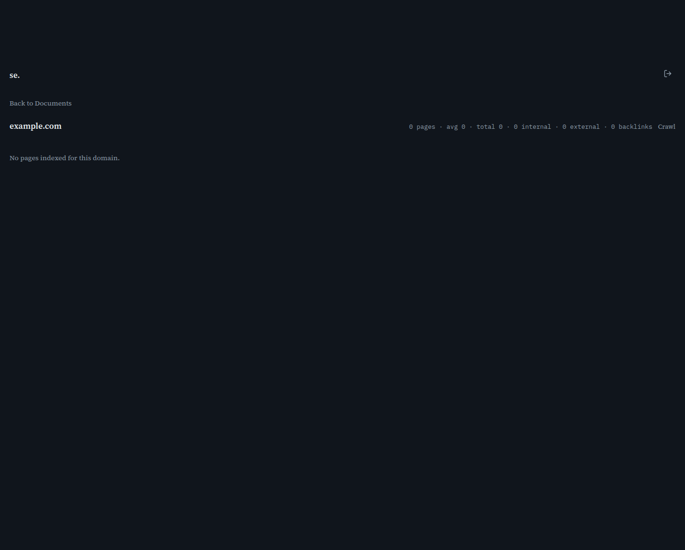
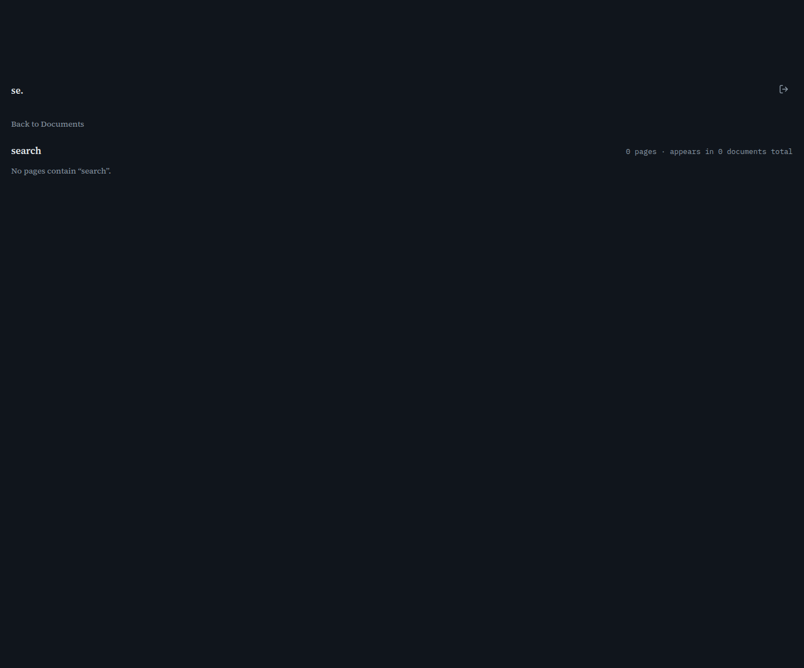
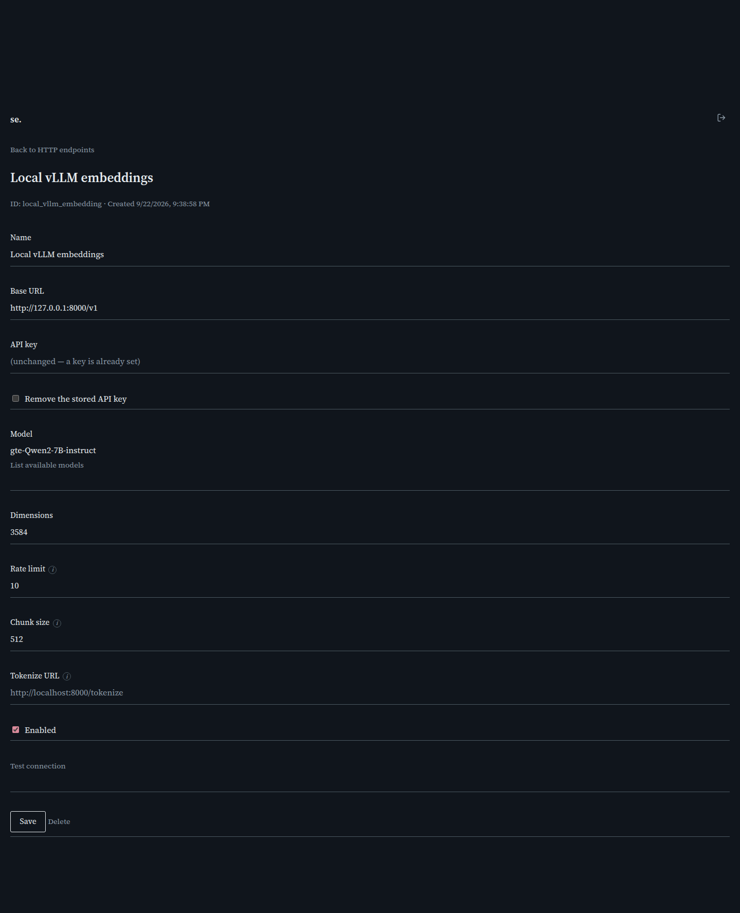
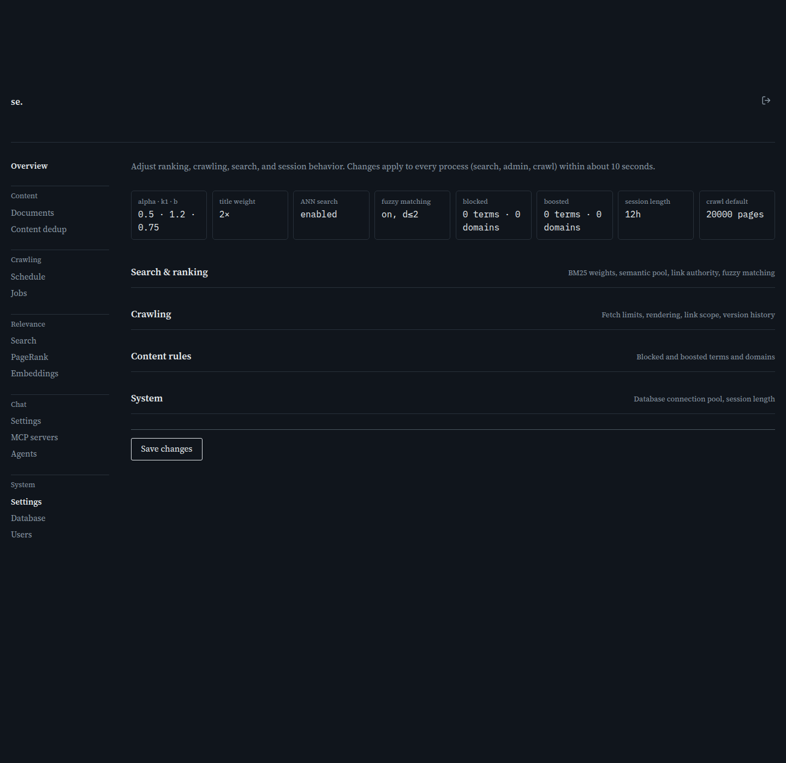

# User manual

Every admin settings page in searchengine's web UI, screenshotted and explained field by field, plus the public search/chat page every other user sees. This is written for someone *using* the running application -- for installing it or editing config files instead, see [docs/configuration.md](../configuration.md); for how it's built, see [docs/architecture/README.md](../architecture/README.md).

## Contents

- **Getting started**: [Signing In](#signing-in) · [Overview](#overview) · [Search & Chat](#search--chat)
- **Content**: [Documents](#documents) · [Domain detail](#domain-detail) · [Content Dedup](#content-dedup) · [Vocabulary term detail](#vocabulary-term-detail)
- **Crawling**: [Crawl](#crawl) · [Schedule detail](#schedule-detail) · [Jobs](#jobs)
- **Relevance**: [Search debug](#search-debug) · [PageRank](#pagerank) · [Embeddings](#embeddings) · [HTTP embedding endpoints](#http-embedding-endpoints) · [Embedding endpoint detail](#embedding-endpoint-detail)
- **Chat**: [Chat Settings](#chat-settings) · [MCP Servers](#mcp-servers) · [MCP Server detail](#mcp-server-detail) · [Agents](#agents) · [Agent detail](#agent-detail)
- **System**: [Settings](#settings) · [Database](#database) · [Users](#users) · [User detail](#user-detail)

## Getting started

### Signing In

*`/login`*

This is the gate in front of every admin page. Nobody reaches /admin, /crawl, or any /admin/api/* endpoint without a valid session cookie minted here first.

#### What you need

You need the admin username and password someone set up for this server -- there's no self-registration or "forgot password" flow for the admin account, so if you don't have credentials, ask whoever installed the system. If sign-in refuses every combination you try, including ones you're sure are correct, the most likely cause isn't a typo: no admin account has been configured on this server at all yet, and until one is, every sign-in attempt fails closed rather than defaulting to open access.

#### Signing in

Type your username and password into the two fields and submit. The page checks your credentials without a full reload -- a wrong password shows "Incorrect username or password" right next to the form and clears the password field so you can just retype it, while a network problem shows a separate "could not reach the server" message so you can tell the two apart. If you followed a link to a specific admin page while signed out, you were redirected here with that page remembered; signing in successfully sends you straight back to it instead of dumping you on the generic Overview page.

#### Staying signed in

A successful sign-in sets a session cookie that keeps you logged in for a fixed window -- 12 hours by default, but an admin can shorten or lengthen this under Settings > System (the "Session length" field). Once that window elapses you're simply asked to sign in again the next time you load an admin page; there's no silent renewal. The cookie itself never reveals your role or identity -- it's just an opaque token the server looks up server-side on every request, so nothing about your access level can be forged or tampered with from the browser.

#### Too many failed attempts

After 5 failed logins from the same address within 15 minutes, further attempts are locked out for 30 seconds; every additional failure while still locked doubles that wait, up to a 15-minute cap. A locked-out attempt gets a clear "too many failed login attempts, try again later" message rather than a misleading "wrong password" -- if you're sure your credentials are right but keep getting refused, you may just be waiting out a lockout from an earlier typo.

> **Worth knowing:**
> - The lockout is keyed by IP address, not by username -- if several people share one network connection (an office, a VPN exit), one person's repeated bad attempts can lock out everyone behind that same address for a while.
> - A correct sign-in immediately clears any failure history for your address, so a lockout never lingers past your next successful login.

### Overview

*`/admin`*

This is the page you land on right after signing in, and the top entry in the admin navigation rail. It's a dashboard, not a place you configure anything directly -- a fast read on whether crawling is healthy, how big the index is, and whether anything looks stuck, with links into the pages where you'd actually go fix something.

#### The navigation rail

Every admin page shares the same sidebar, grouped by what you're trying to do rather than listed as one long flat menu: Content (Documents, Content dedup) for browsing and de-duplicating what's actually indexed; Crawling (Schedule, Jobs) for starting and tracking crawls; Relevance (Search, PageRank, Embeddings) for tuning how results are ranked; Chat (Settings, MCP servers, Agents) for the chat assistant's configuration; and System (Settings, Database, Users) for server-wide settings and accounts. Overview itself sits above all the groups as a single top-level link, since it doesn't belong to any one category. Whichever page you're currently on is visually marked in the rail, so you always know where you are without checking the URL.

#### Signing out

The icon button at the top right of every admin page (not just this one) ends your session and sends you back to the public search page. It clears your session cookie on the server as well as in your browser, so the link you were on stops working immediately for anyone who might have it -- there's no "undo" short of signing in again.

#### Index stats

The "Index stats" panel is the three plainest numbers about your corpus: how many documents are indexed, their average length in tokens, and which database driver is actually running underneath (SQLite or Postgres). Average length matters more than it looks -- a sudden drop usually means a crawl started pulling in mostly boilerplate or near-empty pages rather than real content, worth checking on the Documents page if you see it.

#### Pages per domain and content age

The donut chart breaks your indexed pages down by domain, largest first; clicking any domain in its legend takes you straight to that domain's document list. Next to it, the age-of-content bar chart buckets every indexed page by how long ago it was last fetched, so you can see at a glance whether your content is fresh or has gone stale because crawling stopped running. Two more bar charts appear once there's data for them: documents by version number (how many times a page's content has actually changed since it was first indexed) and documents by number of stored versions (how many past copies are currently retained, which is capped by the version-history limit under Settings and will always be lower than the version-number chart once pruning kicks in).

#### Operational tiles

The small stat tiles above the charts are a live snapshot of what's happening right now: how many crawl jobs are running versus queued, how many schedules are enabled, disabled, currently in progress, or overdue (meaning their next scheduled run time has already passed without starting), and the database connection pool's current usage (in-use, idle, and total open connections). An "orphan pages" tile appears once PageRank has run at least once, showing how many pages scored at or below the orphan threshold -- pages PageRank effectively couldn't find a path to, which usually means broken or missing internal links.

#### Running crawl jobs

When one or more crawl jobs are actively running, they're listed here with their seed URLs and a live count of pages crawled so far -- the same information the Jobs page shows in full, just surfaced here so you don't have to navigate away to see whether a crawl you just started is actually making progress. This block disappears entirely when nothing is running, so its absence itself is informative: no crawl currently active.

#### Trend charts

Four more charts round out the page once there's enough history: a 30-day crawl job outcomes donut (how many jobs finished, failed, or were cancelled); a 14-day fetch throughput chart stacking each day's fetch outcomes (success, error, etc.) on top of each other; a 30-day line chart of documents indexed per day; and a 14-day line chart of average fetch duration, useful for spotting a target site that's started responding slowly or a crawler config that's gotten less efficient. A PageRank distribution histogram also appears once PageRank has been computed, showing how scores are spread across the whole corpus rather than just the single orphan-count tile above.

> **Worth knowing:**
> - Every chart here is read-only -- there's nothing to click through to change behavior directly; use it to notice a problem, then go to the relevant page (Jobs, Schedule, PageRank, Documents) to act on it.
> - Blocks with no data yet (no running jobs, no PageRank computed, a brand-new install with no crawl history) simply don't render rather than showing an empty chart, so a sparse-looking Overview page on a fresh install is expected, not a bug.

### Search & Chat

*`/ (search + chat page)`*

This is the page every signed-in user lands on after logging in -- it is not an admin screen. It has two modes, switched with one control in the top-right: Search, for querying the indexed pages directly, and Chat, for asking a model questions that it can answer using the index, the web, and your own files. Everything on this page works the same whether you're a regular self-service account or an admin (admins additionally get a gear icon that jumps to /admin).

#### Search vs Chat toggle

The pill-shaped control at the top switches the whole page between Search and Chat -- they are two independent views, not tabs of the same result: switching hides one set of controls and shows the other. Chat is selected by default when the page loads. Search is the plain, fast option when you already know roughly what you're looking for and want a ranked list of pages with snippets; Chat is for when you want a written answer synthesized from those pages (and optionally the live web), with the model doing the reading for you.

#### Search mode: the query box and syntax

Type a query and press Search (or Enter) to run it against the indexed content -- results come back ranked by a blend of keyword matching and semantic similarity, not keyword matching alone, so a query that doesn't share exact words with a page can still surface it if the meaning is close. The "Search syntax" disclosure above the results lists the operators the box understands: plain words match loosely, +word forces a term to be present, -word excludes it, "exact phrase" matches that phrase literally (and -"exact phrase" excludes it), and site:example.com (or -site:example.com) restricts results to, or excludes, a domain and its subdomains. These combine freely in one query, e.g. cats +shelter -kitten site:example.com. If your query is misspelled, a quiet note above the results says which term(s) were fuzzy-corrected for scoring -- your typed query itself is never silently rewritten, only substituted for ranking purposes.

#### Sort order

The dropdown next to the search box picks how results are ordered: "Best match" (the default) ranks by the combined relevance score; "Most recent" instead orders by how recently each page was crawled/updated, useful when you care about freshness more than exact topical fit -- e.g. checking whether a page has been re-indexed since a recent change. Switching this re-runs nothing by itself; re-submit the search to apply it.

#### Reading a search result

Each result shows a clickable title (opens the original page in a new tab), the full URL underneath, and a text snippet with your matched terms highlighted. A score sits next to the title -- the higher the number, the better that page's overall match. Expanding the "Details" disclosure on a result breaks that score down into its two components, bm25 (keyword-match strength) and semantic (meaning-similarity), plus the final blended score -- useful if a result's ranking looks surprising and you want to see which signal drove it.

#### Chat mode: asking a question

Switch to Chat, type a question in the text box at the bottom, and press Enter to send (Shift+Enter inserts a newline instead of sending, so you can compose a multi-line question first). The model answers using whatever context it's given -- the index, optionally the live web, and any files you've attached -- and its reply renders as formatted text (headings, lists, bold/italic, code blocks and links all work) rather than raw markdown. Each answer appears directly under your question in a running transcript, so a conversation reads top to bottom like any chat app.

#### The Web toggle

The "Web" checkbox next to the mode switch controls whether the model is allowed to use live web search and page fetching to answer your question, on top of whatever else it knows -- it's checked by default. Leave it on for questions that need current or outside-the-index information; turn it off if you specifically want an answer grounded only in what's already indexed (faster, and avoids the model wandering off to outside sources for something the index already covers). This is read fresh on every message you send, so you can flip it mid-conversation and it only affects the next question, not answers already given.

#### Picking an agent

The dropdown labeled "Default agent" next to the Web checkbox lets you choose a specific agent to answer with, if any have been configured on this deployment -- an agent bundles its own system prompt and set of enabled MCP tool servers, so picking one changes both the model's behavior and what tools it can reach for that conversation. Leaving it on "Default agent" uses whatever the deployment's administrator set as the fallback. Each chat tab remembers its own agent choice independently, so different tabs can be talking to different agents at once, and forking a tab carries its agent choice over to the fork.

#### Chat tabs: new, fork, export, import, attach

The strip above the transcript holds one tab per open conversation, plus five icon buttons on the right -- the + button starts a brand-new, empty chat; the fork icon (⎇) deep-copies the current tab's entire history into a new, independent tab, so you can branch a conversation without disturbing the original. Conversations are session-only: closing the page or reloading it discards them. The download icon (⬇) saves the active tab as a JSON file, and the upload icon (⬆) loads one back in as a new tab -- this is the only way to keep a conversation past a page reload, so export anything worth keeping. Closing a tab (× on its label) has no confirmation prompt -- export first if you might want it later -- and the last remaining tab can't be closed.

#### Attaching files

The paperclip icon, last in that same row of tab-actions above the transcript, uploads a file for the model to read during this conversation -- it doesn't inject the file's contents into your message directly; instead the model discovers and reads it on its own the next time it looks, via its file-access tools. Attached files (and any file the model itself produces, e.g. via a write_file tool call) show up as small boxes below the transcript with a download link and a × to delete them immediately, no confirmation needed. This requires a regular signed-in user account with the files feature configured on the deployment -- an admin session, or a deployment without it configured, simply won't show any file boxes.

#### Citations and tool results

When the model uses a tool mid-answer -- fetching a URL, running a search, writing a file -- that call shows up as a small closed-by-default fold directly under the answer, one per tool call. Expanding a fetch fold shows the URL it retrieved (a real clickable link) with the raw response tucked in a further nested fold; a search fold shows the query and, where the tool returned a recognizable result list, the top links directly, again with the raw JSON available if you want it. This is how you check what the model actually looked at before trusting an answer, without cluttering the main reply with that detail unless you ask for it.

#### Token usage indicator

The small ring next to the Web checkbox tracks how much of the model's context window the current conversation is using, broken into the global system prompt, tool/MCP-server prompts, your own messages, the active agent's prompt, and prior conversation history -- hover it for the full breakdown and a percentage of the model's context limit. It's a heads-up for when a long conversation is approaching the point where old messages start getting silently dropped: when that happens, the affected answer carries its own visible note ("Older messages were dropped from context to fit the model's limit") so you know that particular reply wasn't generated with the full conversation in view.

#### Signing out and account links

The header's top-right icons adapt to who's signed in: an admin session sees a gear icon linking to /admin (the internal admin UI), a regular user session instead sees a person icon linking to /account (where file uploads and personal MCP servers are managed). The sign-out button (present for both) ends the session and returns you to this page logged out; you'll need to sign back in via /login to search or chat again, since the page requires an authenticated session to load at all.

> **Worth knowing:**
> - Combine search operators freely in one query, e.g. cats +shelter -kitten site:example.com -- there's no separate advanced-search form, it's all in the one box.
> - Export a chat tab before closing it or navigating away -- nothing here persists across a page reload except what you explicitly download.
> - If a search result's ranking looks off, open its Details fold to see whether keyword (bm25) or meaning-based (semantic) matching drove the score.

## Content

### Documents

*`/admin/documents`*

The Documents page is where you find indexed pages and the domains they belong to, and where the crawl vocabulary lives. Use it to check whether a page or domain made it into the index, spot-check what got crawled, and jump into a domain's full page list or a vocabulary term's detail.

#### Domain/URL search

Type into the search box and results update as you type, after a short pause (200ms) so you're not re-searching on every keystroke. The text is a regular expression, not a plain substring — so a literal dot or parenthesis needs escaping, but you also get real pattern power: `^shop\.` matches only hosts starting with "shop.", `\.de$` matches every .de domain. Matching is case-insensitive. Leave the box empty and nothing is shown — the page doesn't dump every domain and document by default, since a large corpus would make that useless as a first screen.

#### How the search works under the hood

The first time you search, the page fetches up to 1000 domains and up to 2000 documents in one shot and caches them in memory; every keystroke after that just re-filters those two arrays client-side with your regex, so results feel instant and don't hammer the server. This means very large corpora are capped at that sample for search purposes — if your site has more than 2000 documents or 1000 distinct domains, an obscure one might not show up here even though it's genuinely indexed. Use the per-domain page (below) for a complete, uncapped view of one domain once you've found it.

#### Domain results

Each match shows the host and how many pages are indexed under it. Click a row to open that domain's dedicated page (`/admin/documents/{host}`), which lists every one of its pages, not just the up-to-2000-document sample this search page draws from.

#### Document results

Below the domain list, matching individual pages show as a table of URL, title, and host — matched against the URL, the title, or the derived host, so a search for a company name finds pages whose title mentions it even if the URL doesn't. Click through to a URL to open the live page in a new tab; there's no delete action here — deleting happens on the domain detail page, where you're looking at the full, current list rather than this search sample.

#### Vocabulary

This panel lists every distinct term the index has tokenized out of crawled content, each with a document frequency (how many pages contain it) and a total frequency (how many times it occurs across the whole corpus). Unlike domain/URL search, this list is server-paged and server-sorted, so it stays accurate and fast no matter how large the vocabulary gets — nothing here is capped to an in-memory sample.

#### Filtering, sorting, and paging vocabulary

The filter box is a plain substring match, not a regex, applied server-side against the lowercased term (indexed terms are always lowercased, so searching in mixed case still works). Click a column header to sort by it — clicking the already-active column flips ascending/descending; term starts ascending (A→Z) when first clicked, the two frequency columns start descending (most frequent first), since that's usually what you want to see first. "Per page" controls how many rows load at once; Previous/Next page through the filtered, sorted result set. The summary line always shows the true corpus-wide vocabulary size, and — only while a filter is active — how many terms that filter matched, which is also what the pager's page count is computed from.

#### Why vocabulary matters: fuzzy correction

This isn't just a diagnostic curiosity — it's the same term list the public search's typo correction draws from. When a searcher's query term gets zero hits, the engine fuzzy-matches it against this vocabulary (within a bounded edit distance) and quietly substitutes the closest real term for scoring, showing the correction transparently in results rather than silently rewriting what the user typed. If a term you'd expect users to find isn't showing up here, that's exactly why a related misspelled query wouldn't get corrected to it either.

#### Opening a term's detail

Click any term in the table to open its detail page, which shows exactly which documents contain it and how strongly. Use this to sanity-check that a term genuinely came from real content (not, say, boilerplate or a crawl artifact) before trusting how it's influencing ranking or fuzzy correction.

> **Worth knowing:**
> - Domain/URL search only sees a capped in-memory sample (1000 domains, 2000 documents) — for a complete picture of one domain's pages, open its detail page rather than relying on this search alone.
> - The domain/URL box takes a regex; the vocabulary box takes a plain substring. Typing regex syntax into the vocabulary box searches for it literally.

### Domain detail

*`/admin/documents/{host}`*

This page is the complete, current view of every page indexed under a single domain — reached by clicking a domain from the Documents search. It's where you review a site's crawl results in detail, spot pages worth re-crawling or removing, and see a page's edit history across re-crawls.

#### Header and summary

The host is read straight from the page's own URL (`/admin/documents/{host}`), so this one static page works for any domain you land on. The summary line next to the title gives page count, average and total indexed length (in tokens), and totals for internal links, external links, and backlinks across every page in the domain — a quick read on how substantial and how well-interlinked this domain's crawl is. A "Crawl" link next to it jumps straight to the Crawl page pre-filled with this domain's origin URL, so re-crawling a domain you're already looking at is one click away.

#### The length chart

Above the table, a bar chart shows each page's indexed document length (in tokens) as one bar, tallest relative to the domain's longest page. Hover a bar to see that page's title and exact token count. It's a fast way to spot outliers — a page that's suspiciously short (a near-empty template, a paywall stub) or one page that dwarfs the rest (maybe a sitemap or archive dump that shouldn't be weighted like a normal article).

#### Filtering the page table

The filter box matches a regex, case-insensitively, against each page's title or URL — the same convention used across the admin's other list filters. An invalid pattern is reported inline rather than throwing; fix it and the table updates automatically. This is purely a client-side filter over the domain's already-loaded pages, so it's instant with no extra requests.

#### The page table's columns

Each row is one page: title (linking out to the live URL) with the URL shown underneath, indexed length, internal links (links from this page to the same domain), external links (links to other domains), backlinks (other indexed pages that link to this one), and PageRank — the link-authority score fed into ranking, tunable via the Tuning page's PageRank weight. Hovering internal/external/backlinks explains each in a tooltip if you forget which is which.

#### Version history

A page that's been re-crawled with materially different content shows a version number greater than v1 in the last-but-one column; click it to open the History panel below, listing every prior version with its own title, indexed length, and crawl timestamp. A page still on v1 has only ever been crawled once, so there's nothing to show — the button only appears once there's real history.

#### Deleting a single page

The Delete button on a row asks for confirmation, then removes that one page from the index immediately — the row disappears from the table as soon as the request succeeds. This is a straightforward, synchronous single-document delete, unrelated to the bulk delete-all flow below.

#### Delete all in this domain

This button removes every page in the domain from the index in one action. After you confirm, the server looks up every matching document ID, queues their deletion in a background goroutine detached from your request, and responds immediately — so the removal survives you navigating away or closing the tab; it does not get silently half-finished the way one-request-per-page used to. While you stay on the page, it polls every 1.5 seconds and updates the status line and table live so you can watch the count shrink. If progress stalls (the remaining count holds steady for several polls in a row — some deletions failed and were logged server-side), it tells you how many were removed and how many are stuck rather than polling forever, and re-enables the button.

> **Worth knowing:**
> - Deleting all pages in a domain is irreversible and starts immediately after you confirm — there's no undo, only re-crawling the domain again from scratch.
> - If "Delete all" reports pages stuck rather than removed, check the server log for the specific document IDs that failed rather than assuming the whole domain is gone.

### Content Dedup

*`/admin/content_dedup`*

The Content Dedup page finds documents that are byte-identical or near-identical to another already-indexed document — a mirror site, a copy of the same article under a different host — and merges each group into one canonical document, so a search result never lists the same content twice. It shows the status of the last recompute, lets you trigger a new one on demand, and lists every document that currently has aliases folded into it.

#### What content dedup actually does

A document fingerprint is taken from its normalized text: an exact hash for byte-identical matches, and (when the "simhash" method is enabled) a 64-bit SimHash fingerprint for near-duplicate matches, such as two copies of the same article with a different ad banner or a slightly reformatted byline. When a group of two or more documents share a fingerprint (exact hash match, or within the configured SimHash distance), the job picks one document in the group to keep — the one with the shortest hostname, breaking ties by whichever was crawled first — and merges every other document in the group into it. Merging is destructive: the losing documents' own rows are deleted from the index, and their URLs are recorded as aliases of the surviving canonical document. This is why content dedup is off by default and has to be turned on explicitly on the Settings page, along with picking a matching method and threshold, before this page has anything to do.

#### Recompute now

This section shows whether a recompute is currently running, when the last one finished, and its result: how many groups were found and merged, how many documents were removed, and how long the run took. Click "Recompute now" to force a fresh full-corpus pass immediately, instead of waiting for the periodic run cmd/crawl performs on its own schedule (set by the recompute interval on Settings) or for the pass that runs automatically after each crawl finishes. This is most useful right after you first turn content dedup on, or right after you change its matching method or threshold on Settings — the existing corpus needs a pass under the new settings, and there's no reason to wait for the next scheduled tick to see the effect. The button is disabled while a recompute is already in progress, whether that recompute was started by your own click, another admin browser tab, or one of the automatic triggers — this page polls and reflects real state across every process talking to the same database, not just what this tab kicked off. If you click it while one is already running elsewhere, the request is rejected rather than starting a second overlapping pass, since two concurrent runs merging from their own separate snapshots of the corpus can leave inconsistent alias records behind.

#### Reading the recompute result

"Groups merged" is the number of distinct duplicate/near-duplicate clusters the run found and folded into one document each. "Documents removed" is the total number of losing documents deleted across all of those groups — always at least equal to the group count, since a group of 2 removes 1 document and a group of 3 removes 2. "Duration" is how long the full pass took in milliseconds; for a large corpus using the near-duplicate method this can take a while, since it involves pairwise comparisons within banded buckets of documents in addition to the fingerprint scan itself. A zero for both groups and documents after a run isn't an error — it means the pass found nothing new to merge, which is expected once a corpus has already been cleaned up and no new duplicate content has been crawled since.

#### Merged documents

This table lists every canonical document that currently has at least one alias URL attached to it, so a merge's effect is always visible rather than being a black-box count you have to trust blindly. Each row shows the canonical URL — the document that survived and is the one actually served in search results — and its aliases: every other URL now folded into it, with the reason each one was folded. "canonical tag" means ordinary crawl-time bookkeeping (a page declared a `rel=canonical` link, or the crawler folded a www/bare-domain pair) where no document was ever deleted or even separately created for that URL; "exact-content merge" and "near-duplicate merge" mean an actual content-dedup pass deleted that document's row and redirected it here. A single canonical document can accumulate aliases from more than one source over time, which is why aliases are listed individually rather than just as a count. The table is paginated 20 rows at a time — use Previous/Next to page through a large list — and shows "No documents have been merged yet" when the corpus is clean.

> **Worth knowing:**
> - Content dedup has to be turned on and configured (matching method, near-duplicate threshold, recompute interval) on the Settings page before this page shows any activity — it does nothing on its own while disabled.
> - A merge deletes the losing documents permanently. If you enable the near-duplicate (SimHash) method with too loose a threshold, review the Merged documents table after a recompute before trusting it — a threshold set too high can fold together documents that only coincidentally look similar.

### Vocabulary term detail

*`/admin/vocabulary/term`*

Opened by clicking a term on the Documents page's Vocabulary table, this page shows exactly which indexed pages contain one specific term, how strongly, and with what surrounding context — the postings list that underlies both BM25 ranking and typo/fuzzy correction for that term.

#### How you get here

The term itself comes from the page's own URL query string (`?term=...`), the same one-static-page-per-any-value pattern the domain detail page uses for hosts. That means this page only makes sense opened from the Vocabulary list (or a link carrying a term) — visiting it directly with no `term` param shows a message asking you to open it from there instead, since there's nothing to look up without one.

#### The summary line

Next to the term, you'll see how many pages are shown and how many documents the term appears in overall (its document frequency). When the list is capped — the server returns at most 500 postings — the summary says how many are "shown of" the true total rather than claiming to be complete, and a status message suggests narrowing the term if you need the rest. For a term that appears in fewer than 500 documents, the two numbers match and the wording switches to a plain "appears in N documents total".

#### Sort order

Results are sorted by term frequency, highest first — the pages where this term occurs most often lead the list, the same convention used in the public search debug page's BM25 term breakdown. That puts the pages most representative of the term at the top, which is usually what you want when judging whether a term is meaningful or noise.

#### Reading a row

Each row is one page containing the term: title (linking to the live page) with its URL underneath, a snippet excerpt showing the term in context, term frequency (how many times it occurs on that specific page), and that page's total indexed document length. The excerpt is generated the same way as public search result snippets, so what you see here matches what a searcher would see for a query matching this term.

#### Why this page matters

It's the ground truth behind two things: BM25 ranking's use of this term, and the fuzzy/typo correction the public search silently applies when a query term gets zero direct hits — a near-miss is matched to a real vocabulary term within a bounded edit distance. If you're wondering why a search for a particular word is surfacing (or failing to surface) certain pages, or why a misspelling did or didn't get corrected to this term, this postings list is where to check — it shows precisely which documents this term is grounded in, not just an aggregate count.

> **Worth knowing:**
> - An empty postings list ("No pages contain…") for a term you expected to find usually means it was never actually tokenized out of any crawled page — check the domain detail page's content for that page rather than assuming this page is broken.
> - Don't rely on the postings count alone to judge a term's usefulness for correction — check a few excerpts too, since a high-frequency term that's really boilerplate (a nav label, a cookie notice) skews ranking without being meaningful content.

## Crawling

### Crawl

*`/admin/crawl`*

This is where you start a new crawl of a site, either as a single one-off run or as a repeating schedule. Every option here — rendering, link scope, credentials, fetch overrides — is per-crawl: it only ever affects this one crawl, and leaving a field blank falls back to whatever the Settings page has configured site-wide.

#### URL and max pages

Type the site's URL into the main field and hit Crawl (or press Enter). You don't need to get the scheme or trailing slash exactly right — the field normalizes what you type when you tab or click away, adding https:// and stripping stray whitespace. Max pages caps how many pages this single crawl will fetch before it stops on its own, defaulting to 20,000; lower it for a quick spot-check of a site, or raise it if you know the site is larger than that and you want a complete pass.

#### Scheduling: interval and max runs

Leave Interval at 0 (or blank) for a one-off crawl that runs once and is done — the submit button reads "Crawl" in that case. Enter a positive number of minutes and the button relabels itself to "Schedule": the crawl repeats on that interval indefinitely until you pause or delete it from the Schedules table on the Jobs page. Max runs only matters for a repeating crawl — leave it blank for unlimited repeats, or set it to have the schedule disable itself automatically after that many runs (for example, a one-time nightly crawl you want to stop after 30 nights).

#### Rendering

"Use site default" follows whatever the Settings/Tuning page has configured. Most sites need nothing more than a plain HTTP fetch (None), which is fast and doesn't need anything extra installed. Pick Chromium or Firefox only for a site whose content is built by client-side JavaScript and wouldn't show up in a plain HTML fetch — it's substantially slower per page, and the first time either browser engine is used on this server it has to download it, so expect a delay on that first render-mode crawl.

#### Respect robots.txt

Off by default for this form, meaning the crawl ignores robots.txt entirely unless you check this box. Turn it on when crawling a third-party site you don't control and want to behave like a polite crawler; leave it off for your own sites or internal targets where you already know it's fine to fetch everything.

#### How far to follow links

Controls which discovered links this crawl will follow, from strictest to loosest: Exact seed host only stays on the literal host you seeded (e.g. only www.example.com); Seed's domain, including subdomains also follows blog.example.com from a seed of www.example.com, but not example.org; Same domain, any subdomain, any top-level domain is broader again — it follows example.org and www.example.de from a seed of example.com, but not other.com; Any domain follows everything discovered, anywhere. "Use site default" defers to the Settings page's global choice, which starts at the TLD-scope option out of the box since most real sites span more than one subdomain or TLD.

#### Allowed / blocked domains

These two lists (one domain per line) sit on top of the link-scope choice above rather than replacing it. Allowed domains are always followed even if link scope would otherwise reject them — use this to pull in a specific partner or CDN domain without loosening scope for everything else. Blocked domains always win over both link scope and the allowed list — use this to keep a known-noisy or irrelevant domain out of the crawl even if scope would otherwise include it.

#### Follow domains already in the index

Off by default. When checked, a discovered link is followed even outside the configured link scope as long as its domain already has at least one page indexed on this instance — the idea being that a domain you've already decided is worth indexing is worth following further, wherever it's linked from. Blocked domains still take precedence over this.

#### Discover pages via sitemap.xml

Off by default. Check it to also fetch /sitemap.xml from the seed's domain and queue every URL it lists, in addition to whatever's found by following links from the seed page. Turn this on for a site with a sitemap you trust to be complete — it's a reliable way to make sure pages with no inbound links from the seed still get crawled.

#### Prioritize pages not yet indexed

On by default. When checked, newly discovered pages are fetched ahead of pages already in the index, so a limited page budget (Max pages) goes toward new content first on a site that's mostly already indexed. Already-indexed pages still get crawled — just after every new page has had a chance to run. Turn it off if you specifically want to refresh already-indexed content before discovering anything new, e.g. after a site-wide content change.

#### User-Agent, cookie, and Basic auth

These apply only to this one crawl — nothing here is saved anywhere, unlike the same fields on a schedule (see the schedule-detail page). Leave User-Agent blank to use the standard Firefox string the server sends by default, or set a custom one if a site blocks or misbehaves for common crawler user-agents. Cookie header lets you crawl content that sits behind a login by pasting a session cookie (e.g. session=abc123) captured from a real browser session. The Basic auth fields start read-only and become editable the moment you click into them — that's deliberate, so your browser doesn't try to autofill a saved password into what's actually a one-time crawl credential.

#### Fetch overrides

Fetch timeout, Minimum text length, Delay between fetches, and Max response size each override the corresponding site-wide crawl default from the Settings page, for this crawl only. Leave any of them blank to use whatever's currently configured there — the placeholder text in each field shows you the actual current global value, not just a generic hint, so you can see exactly what you'd be overriding. Raise the delay if you're crawling a site you don't want to hit too hard; lower the minimum text length if you're deliberately indexing short pages (e.g. a documentation site with many short reference pages) that the global thin-content floor would otherwise skip; raise max response size if the site serves unusually large pages that are getting cut off.

#### What happens after you submit

Submitting always creates the same kind of record — a crawl definition — whether or not you set an interval. A one-off crawl is due immediately; crawl-server's scheduler picks it up within a few seconds and creates the Job you'll see appear on the Jobs page. A repeating crawl is scheduled the same way but shows up under Schedules on the Jobs page instead, where you can pause it, edit its options, or delete it later.

> **Worth knowing:**
> - If you submit a URL whose domain already has a schedule or a pending one-off crawl for the same host, the new submission replaces that existing entry's options in place rather than creating a duplicate — there's at most one schedule per domain.
> - To change a crawl's options after creating it, or to see one you already scheduled, go to the Jobs page and click the edit icon on its row — that opens the schedule-detail page, which has the same fields plus a few schedule-only ones (Enabled, stored credentials).

### Schedule detail

*`/admin/schedule/{id}`*

This page is the edit view for one existing crawl schedule — reached by clicking the edit (pencil) icon on a row in the Schedules table on the Jobs page. It carries the same crawl options as the Crawl page's form, plus a few fields that only make sense for something already saved: whether it's enabled, and stored (not one-off) credentials.

#### Header: title and run history

The heading shows the schedule's seed URL(s) as a short summary. Below it, the meta line reports when the schedule was created, how many times it's run so far, when its next run is due, and when it last ran (or "never" if it hasn't run yet) — a quick way to confirm a schedule is actually firing on the interval you expect before you go digging through the Jobs list.

#### Seed URLs and max pages

Seed URLs takes one URL per line — most schedules have just one, but you can seed a crawl from several starting points if a site's structure calls for it. Max pages caps how many pages each run of this schedule fetches before stopping, same meaning as on the Crawl page.

#### Interval, max runs, and Enabled

Interval is minutes between runs; 0 means run once and stop. Max runs caps how many times a recurring schedule repeats before disabling itself automatically — 0 means unlimited, and it's meaningless if Interval is 0 since a one-off already stops after its single run. Enabled is the on/off switch for the whole schedule: unlike editing the other fields (which always reschedules the next run to be Interval minutes from now), toggling Enabled from this page's checkbox — or the equivalent checkbox on the Jobs page's Schedules table — doesn't touch the next-run time, so pausing and resuming doesn't reorder or delay it beyond a simple pause.

#### Rendering, link scope, and domain rules

These fields — Rendering, Respect robots.txt, How far to follow links, Allowed/Blocked domains, Follow domains already in the index — work exactly as they do on the Crawl page; see that page for the full explanation of each. The difference here is only that they're being edited for an existing schedule rather than set once at creation.

#### Discover via sitemap.xml / Prioritize unindexed

Same fields, same meaning as on the Crawl page: sitemap discovery pulls in every URL listed at /sitemap.xml in addition to followed links, and prioritizing unindexed pages spends a limited page budget on new content before re-fetching pages already in the index.

#### Stored credentials: User-Agent, cookie, Basic auth

Unlike the Crawl page's one-off credential fields, a schedule's cookie and Basic auth are stored and reused on every run — that's the whole point of scheduling a crawl behind a login. For that reason the server never sends a stored cookie or password back to the browser: these fields always load blank, with a placeholder telling you one is already set ("unchanged — already set") rather than showing the value. Leaving them blank on save keeps whatever's currently stored; to actually remove a stored credential, use the "Remove the stored cookie" or "Remove the stored basic auth credentials" checkbox — typing a new value and saving replaces it, same as leaving it blank preserves it.

#### Fetch overrides

Fetch timeout, Minimum text length, Delay between fetches, and Max response size override the site-wide Settings-page defaults for every run of this schedule, exactly like the Crawl page's overrides — leave any blank to use the current global value.

#### Save, Run now, and Delete

Save writes every field above as a full replacement of the schedule's options and reschedules its next run to Interval minutes from now (this is why toggling Enabled has its own separate path — see above). Run now marks this schedule due immediately without waiting for its interval; crawl-server's scheduler ticker picks it up within a few seconds, the same way a freshly created one-off crawl starts, and you can watch it appear as a running Job on the Jobs page. Delete removes the schedule entirely after a confirmation prompt — it does not stop or affect any job already in progress from a previous run.

> **Worth knowing:**
> - Running a schedule that's already mid-run returns a conflict rather than starting a second overlapping crawl — the same seed can't have two active jobs at once.
> - If the page fails to load (bad or deleted ID), the heading changes to "Not found" and the form stays hidden rather than showing empty fields.

### Jobs

*`/admin/jobs`*

The Jobs page is the operational view of crawling on this instance: every schedule that's been set up, and every job (an actual triggered crawl run) that's ever executed, most recent first. Use it to check whether a crawl is running, see how it went, cancel something stuck, or manage the schedules behind repeating crawls.

#### Schedules table

Lists every crawl set up on this instance, one-off or repeating, with its options saved for reuse. Each row shows the seed, how it repeats ("once", or an interval plus a run-count fraction like "5/30 runs" if it has a max-runs cap), its link scope, next run time, last run time, and an Enabled checkbox you can flip directly from this table to pause or resume it — this uses the same dedicated toggle as the schedule-detail page's Enabled field, so it never reschedules the next run just from pausing and resuming. Per-row actions let you Run now (trigger it immediately without waiting for its interval), Edit (opens the schedule-detail page for full options), or Delete.

#### Jobs table

Lists every crawl actually triggered on this instance — one-off runs and every fire of a repeating schedule each show up as their own row here — most recent first. Columns show the seed, status (Queued, Running, Done, Failed, or Cancelled), pages crawled so far, duration, and a live speed reading in pages/second computed from consecutive polls of this list (it shows "—" until the job has been observed at least twice, since there's no prior sample to diff against yet). Only a limited number of jobs run at once — see the concurrency setting on the Settings page — so a job can sit in Queued for a while if others are already running; the rest simply wait their turn.

#### Viewing and cancelling a job

Click the magnifying-glass icon on a job row to load its detail below the tables: the exact options that job ran with (seed URLs, max pages, robots handling, link scope, allowed/blocked domains, renderer, sitemap/prioritization flags, fetch overrides, and whether a cookie or Basic auth was set — never the actual credential value), plus a per-page table of every URL the job attempted, its outcome, title, content length, links found, fetch duration, and timestamp. A Cancel action (✕) appears next to View only while a job is still Queued or Running; cancelling stops it and leaves whatever pages it already indexed in place rather than rolling them back.

#### Filtering and clearing ended jobs

Both the Schedules and Jobs tables get a regex filter box once they have at least one row — Schedules filters by seed, Jobs filters by seed or status text, so you can type "failed" to isolate failed runs. The job-detail page list has its own filter (matching URL, status, title, or error detail) plus pagination once a job has attempted more than 50 pages, and its columns are click-to-sort. "Clear ended jobs" on the Jobs panel removes every job that's no longer Queued or Running (Done, Failed, Cancelled) from the list in one action — useful for trimming a long history down to just what's currently active; it reports how many it removed.

#### One-off Crawl vs. recurring schedule

The Crawl page's form always creates the same kind of record regardless of whether you set an interval — the difference only shows up here. A one-off crawl (Interval left at 0) creates a schedule that's already due, runs exactly once, and its single execution shows up only as a row in the Jobs table below — it never appears in the Schedules table above, since there's nothing recurring to manage. A repeating crawl (positive Interval) shows up in both: as a row in Schedules (which you manage — pause, edit, delete) and, each time it fires, as a fresh row in Jobs (which you inspect after the fact). This page keeps polling for a short window after you're redirected here right after creating a crawl from the Crawl page, since the job isn't created synchronously with that submission — it appears once crawl-server's scheduler next ticks, typically within a few seconds.

> **Worth knowing:**
> - The Jobs table auto-refreshes (polling every 1.5s) whenever at least one job is Queued or Running, and stops polling once nothing is active — so leaving this page open during a large crawl keeps the numbers live without needing a manual refresh.
> - A job's page-list defaults to sorting by fetched time, most recent first — the most useful view while a crawl is still in progress or just finished.

## Relevance

### Search debug

*`/admin/search`*

This page runs a query the same way the public search box does, but shows you the machinery underneath: the raw BM25 and semantic-similarity scores for every result, unblended, plus a second tool for looking up exactly which documents contain a given term. Use it whenever ranking looks wrong and you need to see why a result placed where it did, rather than guessing from the public results page.

#### Debug a query

Type a query into the field the same way an end user would and hit Run. The query box understands the same syntax the public search does: plain words match anywhere, +word requires a term to be present, -word excludes documents containing it, "exact phrase" matches that phrase literally rather than as separate words, and site:example.com restricts results to one host. The Sort dropdown lets you compare Best match ranking against Most recent, which is useful for checking whether a document's low position is a ranking problem or just genuinely old content.

#### Reading the results table

Each row is one matching document with five numbers: bm25 (the lexical match score, unnormalized), semantic (cosine similarity between the query's and the document's embeddings, 0 to 1), pagerank (the document's raw link-authority score), and final (what actually determined its rank, after blending and after any admin override). A result with a strong bm25 but weak semantic score matched mostly on exact wording; the reverse means the document is conceptually related but doesn't use the query's words. This table fetches up to 5000 matches in one request and paginates them locally 50 at a time — the Next/Previous buttons don't refetch from the server, so paging through a large result set is instant.

#### Drilling into one result

Click a result's title to open its full score breakdown on a separate page. That's where you see the per-term BM25 contributions, the semantic similarity as a gauge, the document's PageRank in both raw and normalized form, and a visual bar showing exactly how much each of BM25, semantic, and PageRank contributed to the final score. Use this when a single result's position is surprising and the summary table's four numbers aren't enough to explain it.

#### Look up a term

The second panel is a plain inverted-index lookup: type a single token (not a phrase, not a query with operators) and it lists every document containing that term, with the term's frequency in each document and that document's total length. The status line also reports the term's document frequency — how many documents in the whole corpus contain it at all. This is the tool to reach for when you suspect a query isn't matching because a word was never indexed, was stemmed differently than expected, or is simply rarer in the corpus than you assumed.

> **Worth knowing:**
> - A result the debug tool finds through semantic similarity alone (no exact term match) shows an explicit note in its BM25 breakdown instead of an empty table — that's expected for synonym/paraphrase matches, not a bug.
> - If a result's composed score (bm25 + semantic + pagerank contributions) doesn't add up to its final score, the detail page tells you why: an admin ranking boost or block from Overrides was applied on top.

### PageRank

*`/admin/pagerank`*

PageRank scores every document's link authority — how much weight other pages lend it by linking to it — and this page is where you watch that score evolve, read the algorithm's fixed constants, and force a fresh recompute on demand. It's recomputed automatically on the interval set in Settings and right after every crawl finishes, so most of the time this page is read-only observation; the Force recalculation button exists for the moments you don't want to wait.

#### Current distribution

Shows the corpus-wide spread of PageRank scores right now: total scored documents, and the minimum, maximum, and average score. A healthy, well-linked corpus has a wide spread with a long tail of low-authority pages and a handful of clear high-authority ones; a distribution that's suspiciously flat (min ≈ max ≈ average) usually means PageRank hasn't run yet on this data, or the link graph is too sparse or too uniform to differentiate documents.

#### Last recompute

Reports when the most recent recompute finished, how many documents it scored, how many iterations it took to converge, the final convergence delta (how far the scores still moved on the last iteration before stopping), and how long the whole run took. If a recompute is running anywhere right now — this browser, another admin's session, or cmd/crawl's own scheduled or post-crawl trigger — this section shows "Recomputing…" instead, because the status is shared across every process touching the database, not just what this tab happened to start. If nothing has ever run on this instance, it says so plainly rather than showing zeros.

#### Algorithm

Damping factor, max iterations, and convergence epsilon are the classic PageRank constants — they're compiled into the binary, not editable here, and are shown for transparency so you can reason about the numbers above. Damping factor (0.85) is the probability mass a page passes along its outbound links, versus the remainder spread evenly across every page regardless of link structure; a higher damping factor makes link structure matter more relative to the uniform baseline. Max iterations caps how long a single recompute can run before giving up on convergence (50, well above what real graphs need in practice), and convergence epsilon is the threshold below which the total score movement across one iteration is considered settled. Blend weight and recompute interval, by contrast, are read from Tuning in Settings, not fixed — blend weight controls how much PageRank influences the final search ranking (0 means no influence at all), and recompute interval controls how often the scheduled recompute runs; change either one on the Settings page, not here.

#### Force recalculation

Recomputes every document's PageRank score from the current link graph immediately, instead of waiting for the next scheduled or post-crawl run. This runs synchronously and blocks until it's done — the button shows a loading state and the page reports the same documents/iterations/delta/duration numbers as any other run once it completes. Use this after a bulk link-graph change (a large crawl, a bulk document delete, a domain removal) when you want the corpus's authority scores to reflect reality right away rather than at the next scheduled tick.

> **Worth knowing:**
> - A document with no incoming or outgoing links at all is simply left untouched by a recompute rather than reset to 0 — it isn't part of the link graph, so it keeps whatever score it last had (1/N if it's never been scored).
> - An empty link graph (nothing to score) is reported as 0 documents scored in 0 iterations — that's a legitimate result, not an error, and shows up that way in both the stats panel and a forced recompute's result.

### Embeddings

*`/admin/embeddings`*

This page is the overview of the search engine's semantic vector space: which embedding providers are turned on, which one (or blend of several) actually scores search results, and a button to re-embed the whole corpus after you change a provider's model or dimensions. Use it as the landing page before diving into individual HTTP endpoint configuration.

#### Current configuration

This panel is a read-only summary pulled from two places: the operational settings (whether the built-in hash provider is enabled, and which providers are actively weighted into search) and the list of configured HTTP endpoints. "Enabled providers" lists every provider that is currently being kept warm on crawl -- the hash provider if it's on, plus the name of every HTTP endpoint whose own "Enabled" checkbox is checked, regardless of whether it's actually used for search yet. "Active for search" is a different, narrower list: it shows only the providers with a positive weight in the blended semantic score (domain.OperationalSettingsValues.EmbeddingSearchWeights), each with its weight in parentheses -- a provider that's enabled but sitting at weight 0 (or missing from the weights map) doesn't show up here because it isn't contributing anything to what a searcher sees. You change which providers are enabled and which are active for search from the Settings page, not from here; this page only reports the current state.

#### HTTP endpoints configured

A simple count of how many HTTP embedding endpoints exist, enabled or not. Click "Manage HTTP endpoints" to go add, edit, or delete them.

#### Title weight

Shows domain.OperationalSettingsValues.EmbeddingTitleWeight as a fraction from 0 to 1: at 0, semantic similarity is computed from the document body only; at 1, from the title only; anything in between blends the two. This value is also set on the Settings page, not here -- this page just surfaces it next to the rest of the embedding configuration since it affects every provider's scoring equally.

#### Recompute embeddings

Re-embeds every already-stored document's text against every currently-enabled provider. It does not re-crawl anything -- the indexed text itself hasn't changed -- it just recomputes the vectors. You need this after enabling a new provider for the first time, or after changing an already-enabled provider's model or dimensions on Settings, because existing stored vectors were computed against the old configuration and won't match the new one. You do NOT need to run this just to switch which already-enabled provider is active for search: both providers' vectors are kept current on every crawl regardless of which one search is currently reading from, so flipping the weight on Settings takes effect instantly with no recompute.

#### Recompute status and trigger

The "Recompute embeddings" button starts the job and immediately returns -- a full-corpus recompute is a real per-document network round trip against every enabled provider, so it always runs as a background job on the server rather than blocking your browser tab. Once started, this page polls the job's status every couple of seconds and shows a live "Recomputing..." state, corpus size, and once finished, how many documents were recomputed, how many failed, and how long it took. Because the status is stored server-side (not just in this browser tab), if another admin -- or another admin-server process -- triggers a recompute, this page picks that up too on its next poll. You cannot start a second recompute while one is already running; the button is disabled and the server rejects a duplicate trigger.

> **Worth knowing:**
> - "Active for search" can differ from "Enabled providers" -- a provider must be both enabled AND carry a positive weight to actually influence search results.
> - Recompute is corpus-wide and can take real time (minutes) on a large corpus; there's no per-provider or per-document recompute from this page.

### HTTP embedding endpoints

*`/admin/embeddings/endpoints`*

This page lists every configured HTTP embedding endpoint -- external OpenAI-compatible embeddings APIs, whether a local inference server (Ollama, llama.cpp, LM Studio) or a hosted provider -- and is where you add, edit, or remove them. It's the management view; the actual field-by-field configuration for one endpoint happens on its own detail page.

#### The endpoint table

Each row is one independently configured HTTP endpoint, showing its name, base URL, model, dimensions, rate limit per second, and whether it's enabled. Every endpoint's embeddings are computed and stored completely independently of every other endpoint and of the built-in hash provider -- there's no shared state between rows beyond the document text itself. You can enable any number of endpoints at once; the built-in hash provider and every HTTP endpoint can all be kept warm simultaneously, and switching which one search actually reads from (on the Settings page) then takes effect instantly with no recompute needed.

#### Adding an endpoint

Click "Add endpoint" to open a blank configuration form on the endpoint detail page. If no endpoints are configured yet, the table area instead shows a plain prompt telling you to add one.

#### Editing and deleting

Each row's "Edit" link opens that endpoint's detail page pre-filled with its current configuration. "Delete" asks for confirmation first, then removes the endpoint entirely -- the confirmation dialog explicitly warns that search and any future recompute will no longer be able to use it. Deleting an endpoint does not retroactively touch documents already indexed against it; it simply stops that provider from being usable going forward. If the deleted endpoint was contributing to the active search weights, the system falls back automatically (see ReconcileSearchWeights) to the hash provider or another still-enabled endpoint rather than leaving search silently broken.

> **Worth knowing:**
> - This table has no client-side search filter, unlike most other admin list pages -- fine for the realistic small number of embedding endpoints most installs configure.

### Embedding endpoint detail

*`/admin/embeddings/endpoint/{id}`*

The add/edit form for one HTTP embedding endpoint's full configuration: connection details, chunking behavior, and two live probes (List available models, Test connection) that call the endpoint for real before you save. The same page handles both creating a new endpoint (route ends in /new) and editing an existing one.

#### Name and Base URL

Name is the display label you'll see everywhere else (the endpoints table, the Settings weight picker, the embeddings overview). It's also used to mint the endpoint's internal ID the first time you save a new endpoint -- lowercased, non-alphanumeric characters collapsed, deduped against every other endpoint's ID and the reserved word "hash". That ID never changes afterward even if you rename the endpoint later, because it's the actual database column/index suffix storing this provider's vectors. Base URL is the OpenAI-compatible embeddings API's root, e.g. http://localhost:11434/v1 for a local Ollama instance -- the server appends /embeddings itself when calling out.

#### API key

Sent as an "Authorization: Bearer <key>" header on every call to this endpoint; leave it blank for a local server that doesn't require auth. For security, a previously saved key is never echoed back into this field -- it always starts blank when you open an existing endpoint, with the placeholder text telling you a key is already set. Leaving it blank and saving preserves whatever key is already stored; you only need to type a new value here if you're actually changing the key. To remove a stored key entirely (going back to no auth), check "Remove the stored API key" -- that checkbox is only enabled when a key is currently set.

#### Model

The model name sent in the embeddings request body's "model" field -- whatever the endpoint expects, e.g. bge-m3 or text-embedding-3-small. Use "List available models" next to this field to query the endpoint directly (using whatever base URL/API key/model you've currently typed, even before saving) and see what it actually offers; not every provider supports this, in which case you'll see a message saying model listing isn't supported rather than an error.

#### Dimensions

The expected length of the embedding vector this model returns. This must match reality: the server errors out if a real response's vector length doesn't match, and this number is also used to size the database column/index that stores this provider's vectors. Check the model's documentation if you're not sure -- common values are 768, 1024, or 1536 depending on the model.

#### Rate limit

Caps real HTTP requests per second against this specific endpoint, enforced per actual network call (not per document -- one document can fire multiple calls once chunking splits it). Leave at 0 for unlimited, which is fine for a local server you control. Set it lower for a hosted provider with its own rate limits to avoid getting throttled or blocked during a corpus-wide recompute or a busy crawl.

#### Chunk size

The maximum tokens sent in one embed call before longer text gets split into multiple chunks, each embedded separately and then mean-pooled into a single vector -- this exists because embedding models have a hard context limit, and a long document's full text would otherwise fail outright rather than degrade gracefully. Set to 0 to never split (send text whole) -- reasonable if your documents are always short or the model's context window is generous. When set, the chunk boundary is measured either by an exact tokenizer (if you set Tokenize URL below) or, absent that, by an estimate derived from character count, which is close enough for most models but not exact.

#### Tokenize URL

An optional separate endpoint -- for example vLLM's own /tokenize -- that this server calls to get an exact token count for a piece of text, used only to size chunks precisely when Chunk size is non-zero. It's opt-in: leaving it blank falls back to the character-count estimate described above, which works fine in practice but can occasionally over- or under-split near the boundary. Only worth setting if you're seeing chunking-related embedding failures with the estimate, or if you want maximally accurate chunk boundaries against a model with an unusually small context window.

#### Enabled

Controls whether this endpoint's embedding gets kept current for every document going forward, on every crawl. Unchecking this does not delete any already-computed vectors for this provider -- it just stops updating them, so search results from it (if it's still weighted as active) will drift stale over time. A newly added endpoint starts with this checked by default.

#### Test connection

Makes one real embed call against whatever base URL/API key/model/dimensions you've currently typed into the form -- even before you've saved -- so you find out immediately if the credentials or URL are wrong rather than discovering it on the next real search or recompute. Shows "Connection succeeded" or the actual error message (bad credentials, network failure, dimension mismatch, etc.) returned by the endpoint.

#### Save and Delete

Save creates a new endpoint (redirecting you to its own detail page once minted) or updates the existing one in place. Delete is only available when editing an existing endpoint (not on the "Add endpoint" form) and asks for confirmation, warning that search and recompute will no longer be able to use it -- the same warning and behavior as deleting from the endpoints list page.

> **Worth knowing:**
> - Test connection and List available models both work against the form's current unsaved values, so you can validate a brand-new endpoint before ever clicking Save.
> - If you're editing an endpoint and want to test it without retyping the API key, that's fine -- the test probe automatically falls back to the real stored key when you leave the field blank.

## Chat

### Chat Settings

*`/admin/chat/settings`*

This page configures the chat-completions backend that powers Chat mode on the public search page, plus the system prompt, default agent, web-search behavior, and context-length budget every chat turn uses. It's found under Chat -> Settings in the admin sidebar.

#### Chat endpoint

Enabled turns the Chat mode toggle on the public search page on or off — leave it off and visitors never see a chat option at all, regardless of what else is configured here. Base URL is the OpenAI-compatible chat-completions API root, e.g. http://localhost:8000/v1 for a self-hosted vLLM instance; the server posts to <base_url>/chat/completions, so paste the root, not the full completions path. Model is sent verbatim as the request's model field — it has to match a model name the backend at Base URL actually serves, so check that server's own model list before typing one in. API key is sent as an Authorization: Bearer header and is optional for a local, unauthenticated server; the field is always blank when you open this page even if a key is already stored (the server never echoes a saved key back), so leaving it blank on save keeps whatever key is already there. Check Remove the stored API key when you want to actually clear it — it's disabled until a key is on file, and it's the only way to get back to "no key" once one's been saved.

#### System prompt

This text is injected as a system message ahead of every turn, for every question, regardless of which agent (if any) is selected. It never appears in the chat transcript itself — visitors never see it — and it's the one piece of context that's never dropped even when older conversation history gets trimmed to fit the token budget below. Use it for instance-wide instructions that should always apply (tone, scope, disclaimers), and leave agent-specific instructions to the Agents page instead so they only apply when that agent is picked.

#### Agent

Default agent picks one of the agents defined on Chat -> Agents to specialize every conversation by default; its own system prompt is injected in addition to (after) the instance-wide system prompt above, and a visitor can override the choice per question from the chat page itself. Leaving it at (none) means no specialization at all — today's plain behavior, with only the global system prompt applied. The list includes every agent you've defined, even ones not yet enabled, so you can line up a default ahead of turning an agent on.

#### Web search

Search the web is the site-wide default for whether chat turns can search the web; a visitor can flip it per question with the chat page's own Web toggle. There's no separate "web search feature" to turn on beyond this: turning it on simply makes every MCP server marked "gated by web search" (configured on Chat -> MCP servers) available to the model for that turn — the model itself then decides whether to actually call a web_search or web_fetch tool, this setting doesn't force a search on every question. SearXNG base URL points at your self-hosted SearXNG instance, e.g. http://127.0.0.1:8888; it's handed to every active MCP server process as an environment variable so the search tool knows which instance to query, so it has to be reachable from wherever the chat backend/MCP servers run, not just from your browser. Result count caps how many results the web_search tool returns per call; 0 (the default) means no cap, returning SearXNG's full result set as-is — lower it if the model is getting overwhelmed with results or you want to keep the context budget tight.

#### Context budget

Max conversation length (tokens) bounds how much conversation — the leading system prompt, active MCP servers' own prompts, and message history combined — gets sent to the model per turn, estimated by character count rather than exact model tokenization. When the budget is exceeded, older messages are dropped first, oldest to newest, and the most recent message is always kept regardless. Leave it at 0 to auto-detect: on every save, the server asks the configured model for its own advertised maximum context length and sets the budget to 75% of that, reserving the rest for the model's reply — only type an explicit number here if you want a tighter cap than auto-detection would give you. The donut chart below the field is a live, client-side estimate (using the same rough character-count method as the backend) of how the global system prompt and active MCP servers' prompts currently split the budget, updating as you edit the system prompt or the max-length field — it's a preview to help you size the budget sensibly, not a value that gets saved.

#### Saving

Save chat settings writes every field on this page in one request — it's a full replace, not a per-field patch, so all the values shown are what get stored, including an unchanged API key placeholder handled specially as described above. After a successful save the page reloads its own state, which is also when a newly stored API key's field goes back to blank-with-placeholder. A negative max conversation length or a negative result count is rejected before anything is saved; any other failure (for instance the chat endpoint not being configured on this instance at all) shows an error message in place of "Saved." rather than silently discarding your edits.

> **Worth knowing:**
> - Web search here is not a separate feature toggle — it's a gate on MCP servers. If turning it on does nothing, check that at least one server on Chat -> MCP servers has "gated by web search" set and is enabled.
> - The API key field is always blank on load by design, even when a key is already saved — don't mistake that for the key having been lost.
> - Auto-detecting the context budget requires Base URL and Model to already be filled in and reachable; if the probe fails or times out, the budget silently falls back to 0 (no trimming) rather than blocking the save.

### MCP Servers

*`/admin/mcp-servers`*

This page lists every MCP server connection you've configured — the tools your chat model can reach beyond its own training, from web search to running code in a sandbox. From here you add a new server or jump into an existing one to edit or delete it.

#### What an MCP server is here

MCP (Model Context Protocol) is a standard way for a language model to call external tools with structured arguments. Each row on this page is a CONNECTION to one MCP server, not a single tool — a server can expose several tools at once (whatever its own tools/list response reports), and the chat model discovers and calls them natively during a conversation, deciding on its own whether and when a call is warranted. This replaced an older mechanism (ChatHook) where each row was a single script-backed tool with an admin-typed description; here the tool's name and description come live from the server itself, so they can never drift from what the tool actually does.

#### Requirements for tool-calling to work at all

Configuring servers here does nothing unless the chat endpoint itself supports native tool-calling. For a self-hosted vLLM endpoint that means it was launched with --enable-auto-tool-choice (and a matching --tool-call-parser). If the endpoint doesn't support it, the model simply never sees any tools, regardless of how many servers you've enabled — there's no error, the conversation just proceeds without them.

#### The server list

Each row shows the server's name, its transport (stdio or http), and whether it's enabled, plus Edit and Delete actions. An empty list shows a prompt to click "Add server" rather than a bare empty table. Deleting a server asks for confirmation first and warns that its tools will stop being offered to the model immediately — there's no undo, so if you're not sure, uncheck "Enabled" on the detail page instead of deleting.

#### The four built-in servers

The searchengine project ships four first-party stdio servers you can point Command at directly, each a separate binary: mcp-datetime exposes a single get_datetime tool (the model calls it only when it actually needs to know the current time, replacing an older mechanism that stamped every prompt with a timestamp whether needed or not). mcp-web exposes web_search (proxies to a self-hosted SearXNG instance) and web_fetch (fetches a URL's text content, guarded against SSRF) — see "Gated by web search" on the detail page for how this one interacts with the chat UI's own Web toggle. mcp-files exposes list_files/read_file/write_file, letting the model read a signed-in user's own uploaded files and hand back new ones for download; it holds no database credential of its own, only a short-lived per-turn token scoped to that one user's files. mcp-sandbox exposes run_python and run_go, executing model-supplied code inside a locked-down, disposable Docker container (no network access, resource limits) — every flag governing that container (memory, CPU, whether it gets network access at all) is admin-configured on the server's own Arguments field, never something the model can influence.

#### Adding a server you host yourself

Nothing restricts you to the four built-ins — any process that speaks MCP over stdio, or any remote endpoint that speaks MCP's Streamable HTTP transport, can be added the same way. Click "Add server" and fill in the detail form; see the mcp-server-detail page for what each field means.

> **Worth knowing:**
> - If a server's tools never show up in a chat, check three things in order: is the chat endpoint launched with tool-calling enabled, is the server's Enabled checkbox on, and — if it's gated — is the chat's Web toggle actually on for that turn.

### MCP Server detail

*`/admin/mcp-servers/{id}`*

The add/edit page for a single MCP server connection. Reached from "Add server" or by clicking Edit on a row in the MCP Servers list. Existing servers show their real live tool list on load; a new or edited server can be probed before you ever save it.

#### Name

A human label for this connection, e.g. "web tools" or "internal sandbox". It's shown only in this admin UI — never sent to the model — so it can be whatever's clearest to you, unlike the tool names themselves, which the server defines.

#### Transport: stdio vs http

Transport picks how this server is reached. "stdio" spawns Command as a local child process fresh at the start of each chat turn and keeps it open for that turn's duration, talking MCP over its stdin/stdout — this is what all four built-in servers (mcp-datetime, mcp-web, mcp-files, mcp-sandbox) use, and what you'd pick for any other locally installed server binary. "http" instead connects to a remote MCP endpoint over Streamable HTTP, for a third-party or otherwise remotely hosted server. Switching this dropdown shows only the fields that transport actually uses — Command/Arguments for stdio, Base URL/API key for http — so you're never left filling in something the backend will silently ignore.

#### Command and Arguments (stdio only)

Command is the executable to spawn — an absolute path (e.g. /usr/bin/searchengine-mcp-web) or a name resolvable on this process's own PATH. It's run directly, never through a shell, so shell syntax like pipes or globs won't work here. Arguments are real argv elements passed to that process, one per line: for mcp-sandbox that's flags like -network (grant the sandbox outbound network access, off by default), -memory/-cpus/-pids-limit/-timeout (resource limits), and -dns/-host-dns/-host-network for controlling DNS and networking mode when -network is set; for mcp-files it's -base-url (defaults to http://127.0.0.1:8080). An admin filling in Command is granted the same trust level as one configuring a crawl schedule or an embedding endpoint's base URL — real trust, no extra sandboxing at this layer, so only point Command at binaries you actually trust.

#### Base URL and API key (http only)

Base URL is the remote MCP endpoint's address, e.g. https://example.com/mcp. API key is optional and sent as an Authorization: Bearer header on every request to that URL — leave it blank if the remote server doesn't require auth. Once saved, the key is encrypted at rest and never shown again in the form; the field always starts blank on reload, with the placeholder text telling you whether a key is already stored. Leaving API key blank on save keeps whatever key is already stored — to actually remove a stored key, check "Remove the stored API key" instead, which only becomes available once a key is set.

#### List tools / Refresh tools

This button connects to the server exactly as the form is currently filled in — even before you've saved anything — and shows the real tool names and descriptions it reports back live. It runs automatically the moment an existing server's page finishes loading, and you can re-run it any time after changing fields to sanity-check a new Command, Base URL, or API key before committing to Save. A result of zero tools is ambiguous by nature (the server may have failed to connect, or may legitimately expose nothing) and the status message says so rather than guessing; check the server's own log if that happens unexpectedly. This is also the only place tool descriptions appear in the admin UI — they come from the server itself, not from anything you type here.

#### Prompt (optional)

This is not where you describe what the server does — each tool's own name and description, visible via List tools above, already tells the model that, live from the server. Prompt is for extra cross-tool steering that no single tool's description can carry on its own, e.g. "after searching, fetch the top 3 results with the fetch tool before answering." When non-empty and this server is active for a turn, it's injected as its own system message, positioned after the chat endpoint's persistent system prompt (set under Settings → Chat) — in addition to that prompt, not instead of it. Leave it empty if the tool descriptions already say everything the model needs; most servers don't need one.

#### Enabled

Turns this server on or off. A disabled server is never connected to and its tools are never offered to the model, regardless of any other setting — this is the safe way to temporarily pull a server without deleting its configuration.

#### Gated by web search

When checked, this server (and its Prompt, if set) is only active on a turn where the chat's own "Web" toggle is on — the same web-search setting configured under Settings → Chat, or overridden per-question in the chat UI itself. There's no separate control for this; it reuses that one toggle. When unchecked (the default), this server is active whenever Enabled is checked, independent of whether web search is on for that turn. This exists so a server like mcp-web can be wired to only run when the user has actually asked for web-grounded answers, rather than being offered on every turn regardless of intent.

#### Save and Delete

Save creates a new server (redirecting you to its own detail page once created) or updates an existing one's editable fields — the server's ID, once minted from its name, never changes. Delete removes the server outright after a confirmation prompt warning that its tools stop being offered immediately; there's no undo, so prefer unchecking Enabled if you might want it back.

> **Worth knowing:**
> - A stdio server's Command is spawned fresh per chat turn, not left running as a background service — so a crashing or slow-starting binary shows up as a per-turn failure, not a persistent outage you'd see in systemd.
> - mcp-sandbox's -network flag is off by default for good reason: enabling it (or -host-network, which goes further and shares the host's own network namespace) is a real privilege elevation for whatever code the model chooses to run inside it.

### Agents

*`/admin/agents`*

The Agents list, under Settings -> Chat -> Agents, shows every agent you've defined for the chat page and lets you add a new one or open an existing one for editing.

#### What an agent is

An agent is a named specialization: a fixed system prompt bundled with a scoped subset of the MCP servers configured on the MCP servers page. Instead of writing a persona into the endpoint's one global system prompt (Settings -> Chat -> Settings) and living with it on every conversation, you define a handful of agents -- a fact-checker, a code reviewer, a terse summarizer -- each with its own instructions and its own set of tools, and let whoever is chatting pick the one that fits the question in front of them. Nothing about an agent changes the underlying model or endpoint; it only adds a leading instruction and narrows tool access for the turns it's active on.

#### The list and its columns

Each row shows the agent's name, its description, and whether it's enabled. Name and description are exactly what a person picking an agent from the chat page's dropdown sees, so keep the description short and about the agent's purpose rather than about how it's built -- it's read by a human (or, eventually, a multi-agent planner) deciding whether this agent fits the question at hand, and it is never sent to the model as part of that agent's own conversation. Click a row's Edit link to open its full detail page, or Delete to remove it immediately after a confirmation -- there's no undo, so a mistaken delete means re-entering the system prompt from scratch.

#### Adding an agent

Click "Add agent" to open a blank detail page (this takes you to /admin/agents/new, the same form as editing, just with empty fields and "Enabled" checked by default). Nothing is saved until you fill in a name and submit -- see the agent-detail page for what each field does.

#### Enabled vs. disabled

Disabling an agent removes it from the chat page's agent picker (GET /agents, which the chat UI uses to build its dropdown, only returns enabled agents) without deleting its configuration. Use this to retire an agent temporarily -- while you're still tuning its system prompt, say -- without losing the work, or to keep an agent around as a default-agent candidate (Settings -> Chat -> Settings lets you pick a disabled agent as the endpoint's default ahead of turning it on) before rolling it out.

#### If the page says agents aren't configured

The agents feature depends on an agent store being wired into the admin server; if it isn't, every agents endpoint returns 503 and the list page shows a "not configured" status instead of a table. This mirrors how the MCP servers and other optional admin features degrade -- it's a deployment/configuration state, not something you can fix by clicking around this page.

> **Worth knowing:**
> - An agent with an empty MCP-server scope isn't "unrestricted" -- it gets no global MCP tools at all. See the agent-detail page's MCP-servers section for the full explanation.
> - Deleting an agent that's currently set as a chat endpoint's default agent (Settings -> Chat -> Settings) doesn't clear that setting for you -- the stored default_agent_id just stops matching anything, and turns fall back to running with no agent specialization.

### Agent detail

*`/admin/agents/{id}`*

The agent detail page, reached from the Agents list's Edit link or "Add agent" link, is where you write an agent's system prompt, describe it, scope its MCP tool access, and enable or disable it.

#### Name and description

Name is the required label shown everywhere this agent appears: this list, the endpoint's default-agent dropdown, and the chat page's own agent picker. Description is read by whoever (or, eventually, whatever planning logic) is choosing an agent to hand a question to -- it is never injected into the model's context for a conversation running under this agent, so write it as "what this agent is good for" (e.g. "Verifies claims against sources before including them"), not as build notes about the prompt itself.

#### System prompt

This is the field that actually makes the agent do anything: its contents are injected as the agent's own leading system message on every turn it's active for, layered in after the chat endpoint's persistent system prompt (Settings -> Chat -> Settings) and any per-user custom prompt, and before the conversation history. This is where the specialization lives -- write it the way you'd write any system prompt: concrete instructions and constraints, not a description of the agent. An empty system prompt is valid and means this agent adds nothing beyond what every conversation already gets, which only makes sense combined with a restricted MCP-server scope (an agent that exists purely to gate tool access, not to change behavior).

#### MCP servers

This checkbox list scopes which of the globally configured MCP servers (Settings -> Chat -> MCP servers) this agent may call tools from. There is no "unscoped" option: leaving every box unchecked does not mean "every server is available" -- it means this agent gets no global tools at all. If you want an agent to have access to everything, check every box explicitly. This restriction only narrows the shared/admin catalog; it never touches a user's own personal MCP servers, which stay available to every agent regardless of what's checked here. A turn with no agent selected at all skips this scoping entirely and offers every globally active server, so the restrictive behavior only kicks in once an agent is actually active for that turn.

#### Enabled

Controls whether this agent shows up in the chat page's own agent picker (via GET /agents, which filters to enabled agents only). A disabled agent still exists, can still be edited, and can still be picked as a chat endpoint's default agent ahead of time -- disabling just keeps it out of the day-to-day picker while you're not ready for people to select it themselves.

#### Saving, and how the ID is derived

Save validates only that Name is non-empty -- MCP-server IDs aren't cross-checked against the actual server catalog, so if you later delete a server this agent references, nothing breaks; the stale ID just never matches anything at chat time. On first save, the agent's ID is minted from its name (lowercased, punctuation collapsed, deduplicated against every other agent's ID) and is permanent from then on -- renaming an agent later changes its display name everywhere but never its ID, so a chat endpoint's stored default_agent_id or a saved chat tab's agent selection keeps working across a rename.

#### Deleting an agent

The Delete button (shown once you're editing an existing agent, not on the "Add agent" form) removes the agent immediately after a confirmation prompt and returns you to the Agents list. There's no recovery -- if you want to keep the configuration around but stop using it, disable the agent instead of deleting it.

#### How a chat user picks this agent, and how it relates to the default agent

On the public chat page, an agent picker dropdown (populated from every enabled agent) lets a person choose which agent handles the conversation in the active tab; their choice is remembered per tab and sent with every message as agent_id. If they leave the picker on "Default agent," the conversation instead uses whatever agent is set as DefaultAgentID on the chat endpoint's settings (Settings -> Chat -> Settings -> "Default agent") -- which can be any configured agent, enabled or not, since an admin may want to line up a default ahead of enabling it for general selection. If no default is set and the user doesn't pick one either, the conversation runs with no agent specialization at all, exactly like the system behaved before agents existed.

> **Worth knowing:**
> - Because MCP-server scoping is all-or-nothing per box, an agent meant to have broad tool access needs its boxes re-checked whenever a new MCP server is added globally -- new servers don't automatically join an existing agent's scope.
> - The system prompt textarea has no length limit enforced by the form; keep in mind it's injected on every turn this agent is active for, so an overly long prompt eats into the conversation's token budget alongside the endpoint's own system prompt and history.

## System

### Settings

*`/admin/settings`*

This is the single page for every global tuning knob in searchengine: how ranking blends BM25 and semantic scores, how the crawler behaves by default, which words or domains get blocked or boosted, and system-level limits like the database pool and session length. Every field here applies to all three processes (search, admin, crawl) within about 10 seconds of saving — there's no restart step. Groups are collapsed by default; open the one you need with the summary bar, and check the eight tiles at the top of the page for a quick read of the current configuration before you dig into any group.

#### At a glance (summary tiles)

The eight tiles above the form (alpha·k1·b, title weight, ANN search, fuzzy matching, blocked, boosted, session length, crawl default) are a read-only snapshot of the current values, refreshed the instant you save. Use them to sanity-check a change without reopening every group, or to confirm at a glance that nothing drifted from what you expect before you start editing. They read from the same two API calls (GET /admin/api/settings and GET /admin/api/overrides) that populate the form fields, so they're always in sync with what's actually stored.

#### Search & ranking → Ranking: Alpha

Alpha controls the blend between keyword matching (BM25) and semantic similarity in a search's final score: 0 is pure semantic, 1 is pure BM25, and the default is 0.5, an even split. Push it toward 1 if searches are returning semantically-related-but-off-topic results for exact-phrase queries; push it toward 0 if users type natural-language questions and expect concept matches even when the exact words aren't on the page. Any value you enter outside 0–1 is clamped rather than rejected, so there's no way to break search by fat-fingering this field.

#### Search & ranking → Ranking: k1

k1 controls term-frequency saturation in the BM25 formula — how much additional benefit a document gets from a search term appearing many times rather than once. The default is 1.2, a standard middle-of-the-road value. Raise it if you want documents that repeat a query term heavily to keep climbing in score; lower it toward 0 if you want a single mention to count almost as much as ten (useful against keyword-stuffed pages). Negative values are clamped to 0.

#### Search & ranking → Ranking: b

b controls document-length normalization: 0 means length has no effect on scoring, 1 means full normalization (a term match in a short document counts for much more than the same match in a long one). The default is 0.75. Raise it toward 1 if long pages are dominating results just by containing more words overall; lower it toward 0 if you're seeing thin pages outrank substantive ones purely because they're short. Values outside 0–1 are clamped.

#### Search & ranking → Ranking: Title weight

Title weight is how many times a match in a document's title counts toward its term frequency, compared to one occurrence of the same word in the body — the default of 2 means a title hit is worth roughly a double body mention (tempered by k1's saturation, so it's not a flat multiplier). Raise it if titles in your corpus are reliably descriptive and you want them to dominate ranking more; values below 1 fall back to the default. This only affects documents crawled or re-crawled after you change it — it is not retroactively applied to already-indexed content, so a change here needs a re-crawl to show up across the existing corpus.

#### Search & ranking → Search: Default result count

This is the number of results returned when a search request doesn't specify its own count — the default is 5000. It's a ceiling more than a typical page size (the UI paginates well below this), so you'd normally only raise it if something downstream is consuming the full result set programmatically and hitting the cap.

#### Search & ranking → Search: Semantic candidate pool size

This bounds how many documents get scored for semantic similarity on any single search, regardless of how large the corpus is — the default is 200. Every BM25 match is always scored in full; this setting only limits how many additional documents are sampled (or, with ANN search on, retrieved via nearest-neighbor) to catch a match that's semantically relevant but shares no keywords with the query. Raising it improves semantic recall at the cost of more work per search; on a corpus of millions of documents, this is what keeps semantic scoring fast rather than scanning everything.

#### Search & ranking → Search: Use ANN search when available

When checked (the default), the semantic candidate pool is filled from a real approximate-nearest-neighbor index rather than a bounded brute-force sample — but only on Postgres with the pgvector extension installed; on SQLite, MySQL, or a Postgres server without the extension, this setting has no effect and the brute-force path is always used. Uncheck it to force brute-force even where ANN is available, which is mainly useful for troubleshooting a suspicious ranking difference by ruling out the ANN index as the cause.

#### Search & ranking → Embeddings: Compute hash embeddings

This turns on the built-in, dependency-free hash embedding — feature hashing, not a trained model — as a semantic provider for every document. It's on by default and is the only semantic provider that requires no external service. Unlike every other field on this page, this one is read once at process startup (it sizes a pgvector column via EnableANN), so flipping it only takes effect after the process restarts, not within the usual ~10-second live-reload window.

#### Search & ranking → Embeddings: Active for search

This section lists one weight field per enabled semantic provider — the built-in hash provider plus any HTTP embedding endpoint you've enabled on the HTTP endpoints page — and controls how much each contributes to the blended semantic score. Weights are relative to each other, not absolute: 1 and 1 weighs two providers equally, the same as 10 and 10 would, and a weight of 0 removes a provider from the blend entirely. Switching which provider is active takes effect immediately, without a restart, but enabling a provider that wasn't already active changes the vector space for it from scratch — existing embeddings from a different provider aren't comparable until every document is recomputed for the new one, which you trigger from the Embeddings page. A weight entry naming a provider that's no longer enabled (its endpoint was deleted or disabled since this was last saved) shows up locked and labeled as stale; saving drops it automatically. Any individual search request can override these weights for itself via a `?semantic=` query parameter without touching this global default.

#### Search & ranking → Embeddings: Title weight in embeddings

This blends a document's title into its embedding vector as titleWeight × title-vector + (1 − titleWeight) × body-vector, rather than embedding the concatenated text in one call (where most pooling models dilute the title's signal away). The default is 0.3, a modest edge toward the body. Setting it to 0 embeds the body only; setting it to 1 embeds the title alone, which also doubles the number of embedding calls made against any enabled HTTP endpoint. Like title weight for BM25 above, this only takes effect for documents crawled, re-crawled, or explicitly recomputed afterward.

#### Search & ranking → Link authority: PageRank weight

This controls how much link authority (PageRank, computed from the crawled link graph) influences final ranking: 0, the default, means it has no effect at all; 1 means ranking is driven entirely by link authority, ignoring BM25/semantic score. Most deployments leave this at or near 0 unless you specifically want well-linked pages to consistently outrank sparse ones regardless of keyword relevance — it's a blunt instrument, so raise it gradually and check real search results after each change.

#### Search & ranking → Link authority: Recompute interval

This is how often, in minutes, the crawler recomputes PageRank from the current link graph in the background — the default is 60, with a 5-minute floor that can't be set lower even if you try, to prevent an aggressive value from spinning the recompute in a tight loop. A recompute always also runs immediately after any crawl job finishes, since that's when the link graph actually changes, so this interval mainly matters for catching graph changes between crawls (e.g. if you're deleting documents or editing links some other way).

#### Search & ranking → Fuzzy matching: Correct misspelled query terms

When checked (the default), a query term that matches nothing at all in the index is looked up against the vocabulary for a near-miss within the configured edit distance, and that correction is substituted for scoring purposes only — the query as displayed to the user is never rewritten. A term that already matches something is never touched, so this only kicks in for genuine zero-result terms, not to "improve" an already-working query. Turn it off if you'd rather searches fail cleanly on a typo than silently substitute a guessed correction.

#### Search & ranking → Fuzzy matching: Max edit distance

This bounds how many single-character edits (insertions, deletions, substitutions) a fuzzy correction may be from the original query term — the field only accepts 1 or 2, and the default is 2. 1 is conservative and mainly catches a single typo or transposition; 2 is more forgiving of multi-character mistakes but has a higher chance of matching an unrelated short word by coincidence. If fuzzy matching feels like it's guessing wrong too often, dropping this to 1 is the first thing to try before disabling the feature outright.

#### Crawling → Crawler: Fetch timeout

The number of seconds the crawler waits for a single page to respond before giving up on it — the default is 8. Raise it if you're crawling slow or heavily-loaded sites and seeing pages time out that would otherwise succeed; lower it if a crawl is getting stuck for a long time on unresponsive hosts and you'd rather move on quickly.

#### Crawling → Crawler: User-Agent

The User-Agent header sent with every crawl request — it defaults to a standard desktop Firefox string, chosen so crawled sites treat requests like an ordinary browser visit rather than flagging or blocking an identifiable bot. Change this if a specific site you need to crawl blocks or serves different content to the default string, or if you want your crawler to identify itself honestly (e.g. with a contact URL) for sites where that matters. A single crawl job can also override this per-job, independent of this global default.

#### Crawling → Crawler: Default max pages

The page limit applied to a crawl job that doesn't specify its own — the default is 20000. This is a safety ceiling as much as a target: it exists so a misconfigured or unexpectedly link-heavy seed doesn't crawl indefinitely. Any individual crawl can set its own limit that overrides this default.

#### Crawling → Crawler: Minimum text length

Pages whose extracted text is shorter than this many characters are skipped as thin content rather than indexed — the default is 50. Raise it if your corpus is picking up near-empty pages (redirect stubs, cookie-notice-only pages, broken renders) that add noise without real content; lower it toward 0 if you're crawling a source that legitimately has short-but-meaningful pages (e.g. short-form listings) that are being wrongly excluded.

#### Crawling → Crawler: Crawl delay

Milliseconds to wait before each fetch after the first, per crawl — the default is 250ms, a quarter-second of politeness between requests to the same crawl's target. Raise it for sites that rate-limit or block aggressive crawlers; lower it (down to 0) only for crawls against infrastructure you control or that you know can handle a faster pace, since this delay is the main thing standing between a crawl and looking like abuse to the site being crawled.

#### Crawling → Crawler: Max response size

The number of kilobytes read from a single page's response before the crawler truncates it — the default is 5120 KB (5MB). This protects against a single enormous response (a giant JSON blob served with an HTML content-type, a misconfigured endpoint) consuming disproportionate memory or time during a crawl. Raise it only if you have a specific, legitimate source with unusually large real pages that are getting cut off.

#### Crawling → Crawler: Crawl history retention

How many past crawl jobs — each with its full per-page detail — the crawl server keeps before pruning the oldest; the default is 200. This is DB-backed now, not memory-bounded, so raising it is mainly a matter of how much history you want to browse on the Jobs page versus how much storage you're comfortable spending; the oldest jobs beyond the limit are deleted periodically, not instantly, so a lowered value takes a little while to actually shrink the stored history.

#### Crawling → Crawler: Concurrent crawls

How many crawl jobs are allowed to actually fetch pages at the same time — the default is 3. A burst of triggered jobs beyond this limit queues rather than opening unbounded connections. Changing this takes effect for the next job that starts, without a restart, but an already-running job keeps its slot until it finishes, so lowering this doesn't immediately free up capacity — it just stops new jobs from starting until the count drops.

#### Crawling → Crawler: Rendering

This chooses how a crawl fetches each page by default, unless the crawl job itself overrides it: None (plain HTTP fetch, the default — fastest, no JavaScript execution), or a real headless browser (Chromium or Firefox) that runs the page's JavaScript before extracting content. Real browser rendering is much slower — each page opens its own browser tab — and downloads the browser engine the first time it's ever used on that machine. Turn it on globally only if most of the sites you crawl need JavaScript to render their real content; otherwise, leave this on None and enable rendering per-crawl for the specific sites that need it.

#### Crawling → Crawler: Link scope

This controls how far a crawl follows discovered links by default, unless a crawl job sets its own scope. The default is "Same domain, any subdomain, any top-level domain" (broader than domain-only, since most real sites span multiple subdomains and sometimes multiple TLDs for the same brand). The four options, narrowest to broadest: exact seed host only; the seed's domain including subdomains (e.g. a seed of www.example.com also follows blog.example.com but not example.org); same domain name under any subdomain and any TLD (from example.com, also follows example.org and www.example.de, but not other.com); and any domain at all, which follows every link the crawler finds regardless of host. Pick the narrowest scope that still covers the site you actually want indexed — a scope broader than necessary can pull in unrelated content fast.

#### Crawling → Crawler: Treat www. and the bare domain as the same page

When checked (the default), the crawler folds a leading "www." off a page's host before deciding its identity, so www.example.com/x and example.com/x are always treated and stored as the same document, never crawled or indexed twice. This only affects future crawls; duplicates that already exist from before this was enabled are found and merged separately by content dedup, not by this setting. Turn it off only for a site you know genuinely serves different content at www. than at its bare domain — that's rare, but it does happen.

#### Crawling → Documents: Version history

This bounds how many versions of a document — the current one plus archived predecessors — are kept when a re-crawl changes its content; the default is 3. A document that's never changed always has exactly one version regardless of this setting; it only limits how much history a frequently-changing page accumulates. Lowering the value prunes existing extra versions the next time that specific document is re-crawled, not immediately across the whole corpus — so don't expect an instant storage drop from lowering it.

#### Crawling → Content dedup: Merge duplicate/near-duplicate documents

When checked (the default), a periodic background pass finds documents that are byte-identical or near-identical to another already-indexed document — a mirror, a copy served under a different host — and merges each group into one canonical document, so a search never lists the same content twice. Unlike most toggles on this page, turning this on matters immediately in a destructive way: a merge deletes the losing documents' own rows, including their individual link/version/embedding history, which is not migrated to the surviving document. Review results and trigger an on-demand recompute from the Content dedup page rather than only waiting for the scheduled pass.

#### Crawling → Content dedup: Matching method

Exact (the default) only merges documents whose normalized text is byte-identical. Near-duplicate additionally merges documents within the SimHash distance threshold below, catching near-misses like the same article with a different timestamp or ad slot. Switch to near-duplicate if you're seeing obvious duplicates survive exact matching because of small incidental differences in the page text; be aware it's a fuzzier match and can occasionally merge documents that only happen to share a lot of vocabulary.

#### Crawling → Content dedup: Near-duplicate threshold

The maximum Hamming distance (out of 64 bits) two documents' SimHash fingerprints may differ by and still count as a match — only used when the matching method above is set to near-duplicate. The default is 3, clamped to a 1–10 range; the default is a moderately conservative starting point meant to catch real near-duplicates without merging documents that only share some vocabulary. Raise it cautiously — each step up merges a meaningfully wider range of "close enough" content.

#### Crawling → Content dedup: Recompute interval

How often, in minutes, the background content-dedup pass runs automatically — the default is 120, with a 15-minute floor (higher than PageRank's 5-minute floor, since a dedup pass is a destructive write that deletes rows, not just a re-score). A recompute also always runs immediately after a crawl finishes, once dedup is enabled, so this interval mainly matters for catching duplicates that appear between crawls.

#### Content rules → Blocked: Blocked words

One word per line; any document whose title or body contains one of these words is excluded from search results entirely, not just down-ranked. Matching uses the same tokenization as search itself, so capitalization and punctuation don't matter — entering "Spam" and "spam" behave identically. Use this for genuinely disqualifying content (profanity, known spam markers) rather than topics you merely want to rank lower, which is what boosted terms with a factor below 1 are for.

#### Content rules → Blocked: Blocked domains

One host or URL per line; any document served from one of these is excluded from results entirely, the domain-level counterpart to blocked words. Use the bare host (e.g. spammy.example) — matching is against the document's URL host. This is the right tool for cutting off an entire low-quality or spam source rather than trying to enumerate every objectionable word it might contain.

#### Content rules → Boosted: Boosted words

One "word factor" pair per line (e.g. "official 1.5") — a document whose title or body matches the word has its final score multiplied by that factor. A factor above 1 pushes matching documents higher; a factor between 0 and 1 pushes them lower without excluding them outright, which is the main alternative to fully blocking a word. If multiple boosted words match the same document, their factors multiply together, so stacking several modest boosts can compound into a large effect — keep that in mind before adding many overlapping boost terms. A zero or blank factor is simply ignored.

#### Content rules → Boosted: Boosted domains

One "host factor" pair per line (e.g. "trusted.example 2.0"), following the exact same rules as boosted words but matched against the document's URL host instead of its text. Use this to consistently favor documents from sources you know are authoritative for your use case, without needing to also enumerate the specific words that make them good.

#### System → Database connection pool: Max open connections

The maximum number of simultaneous connections to the database — the default is 25. On SQLite this setting has no practical effect: SQLite always keeps a single connection regardless of what you set here, since it serializes writers at the file level and a larger pool would just add lock contention. It matters on the dev deployment's Postgres backend, where raising it lets more concurrent requests hit the database at once at the cost of more database-side resource usage.

#### System → Database connection pool: Max idle connections

How many connections are kept warm (open but unused) between requests rather than closed immediately — the default is 25, matching max open connections. Keeping idle connections around avoids the overhead of reconnecting for every request, at the cost of holding those connections open on the database server even when they're not actively doing anything.

#### System → Database connection pool: Connection max lifetime

How many minutes a pooled connection is reused before it's recycled and replaced with a fresh one — the default is 5. A running process re-reads and re-applies this setting within about 10 seconds of a save, but the effect on connections that are already open is limited to pool bookkeeping (when they're eligible to be closed and replaced) — it's not an instant forced reconnect of everything in the pool.

#### System → Session: Session length

How many hours a signed-in admin session stays valid before it expires and requires signing in again — the default is 12. This only applies to sessions created after you save the change; anyone already signed in keeps whatever expiration their session was given at login. Shorten it for a more security-sensitive deployment where you want admins re-authenticating more often; lengthen it if 12 hours is genuinely too short for how this admin UI gets used day to day.

> **Worth knowing:**
> - Changes on this page apply to all three processes (search, admin, crawl) within about 10 seconds — there's no restart needed for anything except "Compute hash embeddings," which only takes effect after a restart because it sizes a database column at startup.
> - Ranking and crawling changes to title weight, embedding title weight, and version/dedup settings only affect documents crawled or re-crawled (or explicitly recomputed) after the change — they are never applied retroactively to already-indexed content without a re-crawl.
> - Saving this page actually saves two independent resources (settings and overrides) under one button; if the status line reports an error for one of them, the other may still have saved successfully — check which one is named in the error.

### Database

*`/admin/database`*

The Database page shows live diagnostics for the SQL database that search-server, admin-server and crawl-server all share, and holds two irreversible bulk-delete actions. Use it to check the connection is healthy, see how big each table has grown, and — only when you really mean it — wipe crawled content or reset configuration back to defaults.

#### Connection

Shows the database driver this deployment is running on: sqlite for a local or CI install, postgres for the dev deployment at se.mo-sys.de. This is read-only and set at install time by which DSN the binaries were started with — you can't change it from the UI. It's mostly useful for confirming you're looking at the environment you think you are before you touch anything in the danger zone below.

#### Connection pool

Live numbers straight from Go's sql.DBStats for the connection pool this admin-server process holds: how many connections are open versus the configured maximum, how many are actively in use versus sitting idle, how many requests had to wait for a free connection and for how long, and how many connections have been closed because of the idle-connection limit, the idle-timeout, or the max-lifetime setting. A healthy pool normally shows a low wait count and wait duration; if wait count keeps climbing, the pool is undersized for the current load or something is holding connections open too long. This is diagnostic only — there's nothing to configure here, and the underlying pool limits are set at the code/config level, not editable through this page.

#### Tables

A row-count per table in the database, sorted alphabetically — documents, postings, crawl jobs, sessions, settings tables, and everything else the schema defines. Use it as a sanity check after a crawl (document and posting counts should climb) or after a clear-content run (they should drop to zero) rather than as a tool in its own right. A table sitting at a surprising number — postings much smaller than expected relative to documents, for instance — is usually the first sign something upstream (a crawl, an indexing step) didn't finish cleanly.

#### Danger zone — Clear content

Permanently deletes every crawled document and everything derived from it — postings, links, versions, embeddings, aliases — plus every crawl job. Every settings table (tuning, operational settings, overrides, chat/embedding endpoints, crawl schedules) is left untouched, so your configuration survives. This is the button to reach for when you want to start crawling from a clean slate without redoing any setup. It asks for a plain browser confirmation before running (no typed confirmation phrase), fires immediately, and there is no undo — the underlying repository call is a real DELETE across every content table, not a soft delete or a recycle bin.

#### Danger zone — Clear settings

Permanently deletes every row of every settings table: tuning weights, operational settings, ranking overrides, the chat endpoint, embedding endpoints, and crawl schedules. Crawled content itself is left untouched. This admin-server process resets its own in-memory settings to their built-in defaults immediately so you see the effect right away, but search-server and crawl-server only pick up the change once you restart them — until then they keep running on whatever settings they last loaded into memory, out of sync with what the database now says. Use this when your tuning/configuration has gotten into a bad state and you'd rather start over than hunt down what's wrong; it's rare to need day to day. Like clear content, it's gated only by a plain confirmation dialog and cannot be undone.

### Users

*`/admin/users`*

The Users page lists every regular-user account — accounts that can sign in to the public search site and use chat, but are always refused on every admin route, no matter what. It's separate from the single admin login you used to reach this backend in the first place, which isn't a database row at all and doesn't appear here.

#### Why user accounts exist

A User row lets someone sign in to the public-facing search page and chat without giving them any access to this admin UI — there's no privilege escalation path from a user session to an admin one; the role is resolved fresh from the server-side session on every request, not something a client can influence. There's no self-service signup: every account is created, edited, and deleted here, by whoever can reach /admin. This is the right tool when you want to give a colleague or a service account search/chat access without handing them the keys to crawl configuration, database maintenance, or anything else under /admin.

#### The user list

Each row shows a username and when the account was created. "Edit" opens the account's own subpage to change its password or personal prompt; "Delete" removes the account immediately after a confirmation prompt — the person can no longer sign in afterward, and this cannot be undone (there's no way to recover a deleted account or its custom prompt). If no accounts exist yet, the page just tells you to click "Add user" to create the first one. The list itself isn't paginated or searchable — with typical account counts for a self-hosted deployment that hasn't been a problem.

#### Adding a user

"Add user" opens a blank version of the same subpage the edit links use. You set a username (permanent — it can't be changed after creation, since the account's internal ID is derived from it) and a password of at least 8 characters, optionally with a personal prompt. Note that you can't reuse the admin login's own username for a regular-user account — the server rejects it outright, since the two would be ambiguous at login time otherwise.

### User detail

*`/admin/users/{id}`*

The per-user edit page is where you actually create a new user account or make changes to an existing one — set or reset their password, and read or edit their personal chat prompt on their behalf. It's the same form for both "Add user" and "Edit", just pre-filled and retitled when you're editing an existing account.

#### Username

Free text when adding a new user, and read-only once the account exists. It can't be changed after creation because the account's internal ID is derived from it at creation time (a slugified, uniqueness-checked version of the username) and other records reference that ID — renaming afterward would orphan the original identity. If you need a different username, delete the account and create a new one.

#### Password

Required when adding a new user (minimum 8 characters, and it's also capped at 72 bytes — bcrypt's own hard limit, enforced here so you get a clear error instead of an opaque failure). When editing an existing user, leave this field blank to keep their current password unchanged; type a new one to reset it. The password is stored only as a bcrypt hash — it is never shown again after saving, not even to you, so if a user forgets their password, resetting it here (not looking it up) is the only path back in.

#### Personal prompt (custom_prompt)

Free text, up to 4000 characters, injected as this user's own leading system message on every chat turn they send — in addition to, not instead of, the site-wide chat prompt configured elsewhere and any active MCP server's own prompt. Use it to give a specific user a standing instruction (a preferred answer style, a domain they work in, a language) without changing chat behavior for everyone else. It's the same field the user can set themselves from their own Account page, so anything you set here is just as visible and editable to them afterward — this isn't a private admin note. Leave it empty for no per-user injection.

#### Saving and deleting

Save applies whatever is in the form: on a new account it creates the user and takes you straight to their new edit page; on an existing one it sends only the fields that make sense to change (password only if you typed one, the prompt always, since the textarea is the single source of truth for it on every save including clearing it back to empty). Delete removes the account immediately after a confirmation prompt and returns you to the user list — the account can no longer sign in, and, as with every delete in this admin UI, there is no undo.

