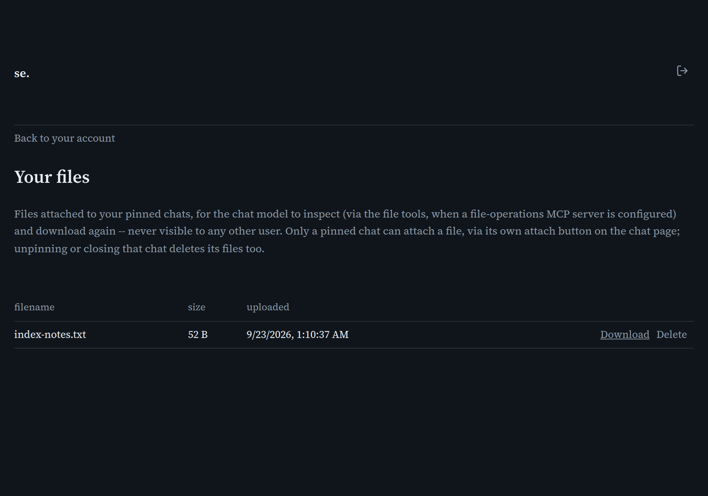

# Your files

[← Manual home](README.md)

*`/account/files`*

Files attached to your pinned chats, or that the model itself produced on your behalf via a write_file tool call during chat -- reachable from Your account, next to Your MCP servers. This page only ever lists and manages files; it has no upload form of its own -- see "Attaching files" below.

## Attaching files

Files are attached from the chat page itself, via a tab's own paperclip button (see [Search & Chat](search-chat.md)'s "Attaching files" section) -- and only a pinned (persistent) chat tab can attach a file at all. A file becomes available to the model the next time it looks, via the file-access tools (see mcp-files on the [MCP servers](mcp-servers.md) page) -- attaching doesn't inject the file's contents into your next message directly. Unpinning or closing a pinned chat deletes every file attached to it, so this list shrinks along with your pinned chats, not just when you delete a row directly.

## Limits and ownership

Capped at 5 MiB per file and 100 files per account, neither configurable by an admin. Every file is owned by, and only ever visible or downloadable by, you -- there's no admin view of anyone's uploaded files at all.

## Downloading and deleting

Each row has a Download link and a Delete link -- deleting has no confirmation prompt, so download anything worth keeping before removing it.

---
← [Your MCP servers](account-mcp-servers.md) &nbsp;·&nbsp; [↑ Manual home](README.md) &nbsp;·&nbsp; [Documents](documents.md) →
