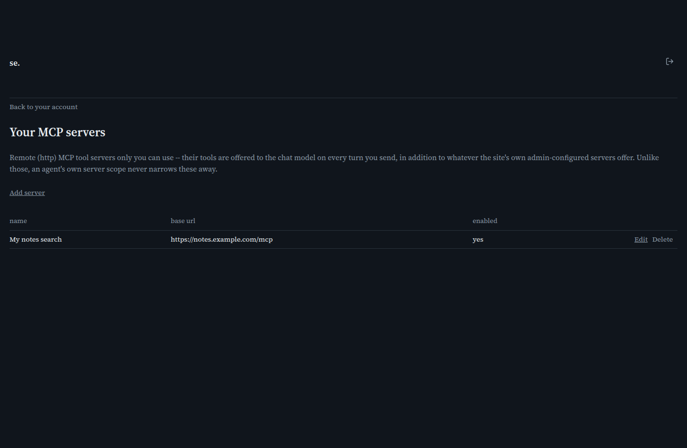

# Your MCP servers

[← Manual home](README.md)

*`/account/mcp-servers`*

Your own personal MCP tool servers, visible and usable only by you -- the same idea as the admin-configured catalog on the [MCP servers](mcp-servers.md) page, but scoped to your account instead of shared deployment-wide.

## How this differs from the admin catalog

Every row is private to your account. Transport is always `http` -- no `stdio` option, since that runs a real local command on the server's own machine, a trust tier reserved for admin-configured rows. A personal server is merged into your chat turns unconditionally, unlike the shared catalog, which an Agent selection can narrow.

## Adding a server

Give it a name, a base URL (an HTTP MCP endpoint you control or trust), an optional API key, and a prompt telling the model when to use it. Check "Gated by web search" to only offer it when the chat page's Web toggle is on -- same convention as the shared catalog.

---
← [Your account](account.md) &nbsp;·&nbsp; [↑ Manual home](README.md) &nbsp;·&nbsp; [Your files](account-files.md) →
