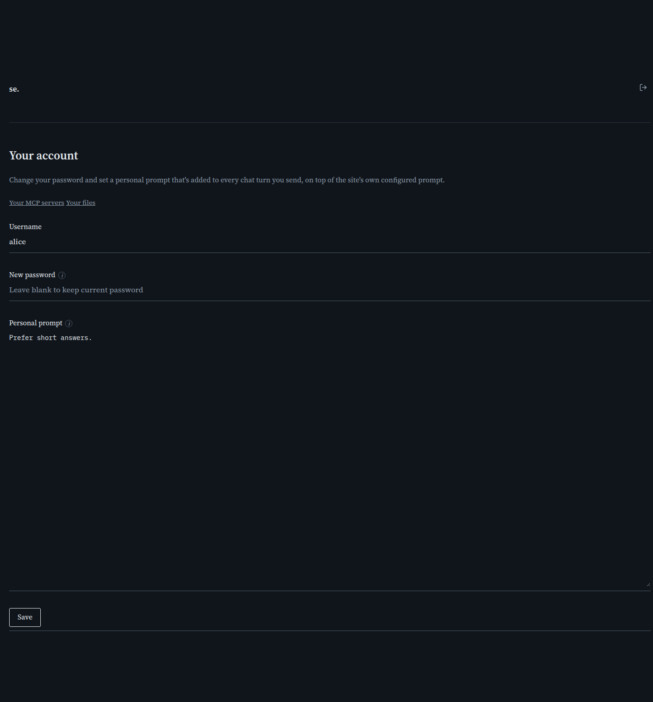

# Your account

[← Manual home](README.md)

*`/account`*

Self-service page for a signed-in regular-user (not admin) account to change their own password and set a personal chat prompt -- no admin involvement needed for either. Reached from the gear/person icon on the public search/chat page.

## New password

Leave blank to keep your current password. When you do set one, it must be 8-72 characters -- a present-but-invalid value is rejected outright rather than silently ignored, so you'll know immediately if it didn't take.

## Personal prompt

Free text, up to 4000 characters, injected as your own leading system message on every chat turn you send -- in addition to (not instead of) the deployment's own configured system prompt and any active MCP servers' own prompts. Use it for standing preferences ('prefer short answers', 'always answer in German') you don't want to repeat every conversation. Saving an empty value clears it.

## Your MCP servers and Your files

Two links at the top of this page lead to your own personal tool servers and uploaded files -- see [Your MCP servers](account-mcp-servers.md) and [Your files](account-files.md).

> **Worth knowing:**
> - This page refuses the admin account with a 403 -- the hardcoded admin login has no `users` row to act on, so there's nothing here for it to change.

---
← [Search & Chat](search-chat.md) &nbsp;·&nbsp; [↑ Manual home](README.md) &nbsp;·&nbsp; [Your MCP servers](account-mcp-servers.md) →
