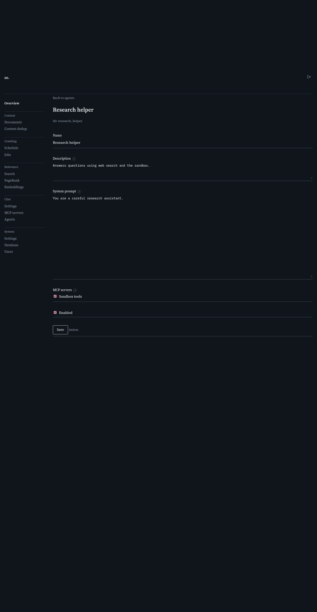

# Agent detail

[← Manual home](README.md)

*`/admin/agents/{id}`*

Reached from the Agents list's Edit or "Add agent" link, this is where you write an agent's system prompt, describe it, scope its MCP tool access, and enable or disable it.

## Name and description

Name is the required label shown everywhere this agent appears: this list, the endpoint's default-agent dropdown, and the chat page's agent picker. Description is read by whoever is choosing an agent for a question -- it's never injected into the model's context, so write it as "what this agent is good for" (e.g. "Verifies claims against sources before including them"), not as build notes about the prompt.

## System prompt

This is what makes the agent do anything: it's injected as the agent's own leading system message on every turn it's active for, layered in after the chat endpoint's persistent system prompt (Settings -> Chat -> Settings) and any per-user custom prompt, before conversation history. Write it like any system prompt -- concrete instructions and constraints, not a description of the agent. An empty prompt is valid: the agent adds nothing beyond the baseline, which only makes sense paired with a restricted MCP-server scope (an agent that exists purely to gate tool access).

## MCP servers

This checkbox list scopes which globally configured MCP servers (Settings -> Chat -> MCP servers) this agent may call tools from. There's no "unscoped" option: every box unchecked means no global tools at all, not "everything available" -- check every box explicitly for full access. This only narrows the shared/admin catalog; a user's own personal MCP servers stay available to every agent regardless. A turn with no agent selected skips this scoping entirely and offers every globally active server.

## Enabled

Controls whether this agent shows up in the chat page's agent picker (GET /agents, which filters to enabled agents only). A disabled agent still exists, can still be edited, and can still be picked as a chat endpoint's default agent ahead of time -- disabling just keeps it out of the day-to-day picker.

## Saving, and how the ID is derived

Save validates only that Name is non-empty -- MCP-server IDs aren't cross-checked against the catalog, so deleting a referenced server later doesn't break anything; the stale ID just never matches. The agent's ID is minted from its name on first save (lowercased, punctuation collapsed, deduplicated) and is permanent -- renaming later changes the display name everywhere but never the ID, so a default_agent_id or saved chat tab keeps working across a rename.

## Deleting an agent

Delete (shown only when editing an existing agent) removes it immediately after a confirmation prompt and returns you to the Agents list. There's no recovery -- disable an agent instead if you want to keep its configuration around.

## How a chat user picks this agent, and how it relates to the default agent

On the public chat page, an agent picker (every enabled agent) lets a person choose which agent handles the conversation in their tab; the choice is remembered per tab and sent with every message as agent_id. Left on "Default agent," the conversation uses whatever's set as DefaultAgentID on the chat endpoint (Settings -> Chat -> Settings) -- which can be any agent, enabled or not, so an admin can line one up ahead of enabling it. With neither set, the conversation runs with no agent specialization at all.

> **Worth knowing:**
> - A new MCP server doesn't automatically join an existing agent's scope -- re-check its boxes if it needs broad tool access.
> - The system prompt textarea has no length limit; it's injected on every turn this agent is active for, so an overly long one eats into the token budget alongside the endpoint's own prompt and history.

---
← [Agents](agents.md) &nbsp;·&nbsp; [↑ Manual home](README.md) &nbsp;·&nbsp; [Settings](settings.md) →
