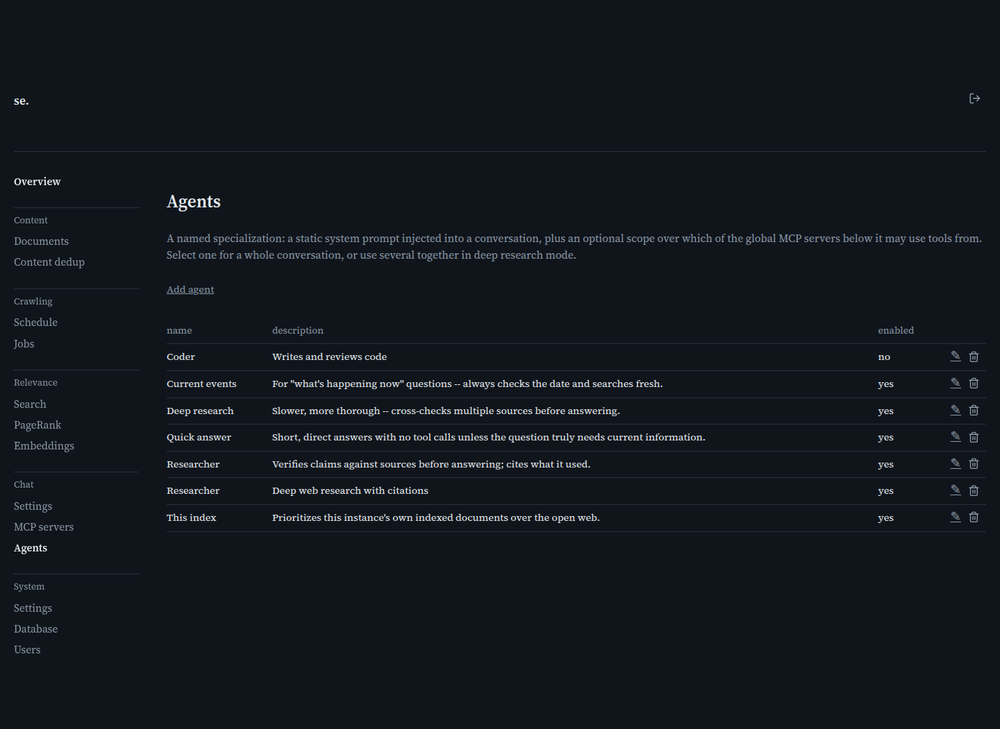

# Agents

[← Manual home](README.md)

*`/admin/agents`*

Under Chat -> Agents, this list shows every agent you've defined and lets you add or edit one.

## What an agent is

An agent is a named specialization: a fixed system prompt bundled with a scoped subset of the MCP servers on the MCP servers page. Instead of writing one persona into the endpoint's global system prompt (Chat -> Settings) for every conversation, define a handful of agents -- a fact-checker, a code reviewer, a terse summarizer -- each with its own instructions and tools, and let whoever's chatting pick the one that fits. An agent never changes the underlying model or endpoint; it only adds a leading instruction and narrows tool access for its active turns.

## The list and its columns

Each row shows the agent's name, description, and whether it's enabled -- exactly what a person picking from the chat page's dropdown sees, so keep the description short and about purpose, not build details; it's never sent to the model. Click Edit (✎) to open the detail page, or Delete (trash) to remove it after a confirmation -- there's no undo, so a mistaken delete means re-entering the system prompt from scratch.

## Adding an agent

Click "Add agent" for a blank detail page (/admin/agents/new -- the same form as editing, empty fields, "Enabled" checked by default). Nothing saves until you fill in a name and submit -- see the agent-detail page for what each field does.

## Enabled vs. disabled

Disabling removes an agent from the chat page's picker (GET /agents returns only enabled agents) without deleting its configuration. Use this to retire an agent temporarily while tuning its prompt, or to line it up as a default-agent candidate (Chat -> Settings allows picking a disabled agent as default) before rolling it out.

## If the page says agents aren't configured

The agents feature depends on an agent store being wired into the admin server; if it isn't, every agents endpoint returns 503 and the list page shows "not configured" instead of a table -- same degradation pattern as MCP servers and other optional admin features. It's a deployment/config state, not something clicking around this page fixes.

## Suggested global agents

A fresh install seeds six ready-to-use starter agents the first time the agents table is completely empty -- delete one and it stays deleted; delete all six and the next restart re-seeds them, since that looks identical to a genuinely fresh database. Each starts with an **empty MCP-server scope** deliberately: a real server's row ID is deployment-specific data nothing can safely guess. To let one use web search (or sandbox/files), open it and check the box for whatever row this deployment's server is configured as.

| Agent | Purpose | Needs an MCP server scoped to work as intended? |
|---|---|---|
| Researcher | Fact-checking generalist -- searches for and cites a primary source before answering anything it isn't certain of. | Yes (web search/fetch) |
| Quick answer | Short, direct answers; only searches when the question genuinely needs current information. A good default-agent pick. | No (works fine with zero tools; searches opportunistically if scoped) |
| This index | Prioritizes this deployment's own indexed documents over the open web. | Yes (web search/fetch) |
| Current events | For "what's happening now" questions -- calls get_datetime first, then always searches rather than trusting training knowledge. | Yes (web search/fetch, plus the get_datetime MCP server if configured) |
| Deep research | Slower and more thorough -- fetches and reads the top few results before answering, not just search snippets. | Yes (web search/fetch) |
| Image analyst | Makes use of an attached image, or an image URL pasted in chat -- finds visually related pages in this index, or describes what it shows/answers a question about it. | Yes (the mcp-vision MCP server; either or both of its capabilities also need enabling on [Chat Settings](chat-settings.md)'s Vision section) |

> **Worth knowing:**
> - An empty MCP-server scope isn't "unrestricted" -- it gets no global tools at all. See agent-detail's MCP-servers section.
> - Deleting an agent set as a chat endpoint's default doesn't clear that setting -- default_agent_id just stops matching, and turns fall back to no specialization.
> - Image analyst's two tools (vision_similarity/vision_caption) each independently report themselves unavailable if their own Vision setting isn't enabled/configured -- scoping the mcp-vision server alone isn't enough on its own.

---
← [MCP Server detail](mcp-server-detail.md) &nbsp;·&nbsp; [↑ Manual home](README.md) &nbsp;·&nbsp; [Agent detail](agent-detail.md) →
