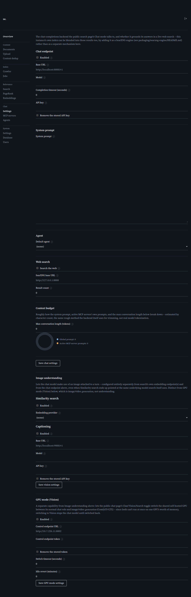

# Chat Settings

[← Manual home](README.md)

*`/admin/chat/settings`*

Configures the chat-completions backend powering Chat mode on the public search page, plus the system prompt, default agent, web-search behavior, and context-length budget every chat turn uses. This instance's own crawled index can also be blended into those web-search results, by adding it as a SearXNG engine (see packaging/searxng-engine/README.md) rather than via any separate setting on this page. Found under Chat -> Settings in the admin sidebar.

## Chat endpoint

Enabled turns the Chat mode toggle on the public search page on or off — leave it off and visitors never see a chat option, regardless of anything else here. Base URL is the OpenAI-compatible chat-completions API root, e.g. http://localhost:8000/v1 for a self-hosted vLLM instance; the server posts to <base_url>/chat/completions, so paste the root, not the full path. Model is sent verbatim as the request's model field — it must match a name the backend actually serves. Completion timeout (seconds) bounds how long a single completion call may take before it's given up on; one chat turn can make several calls in a row (the tool-calling follow-up loop, plus retries recovering from a model that emits a tool call as literal text instead of a real one), each bounded independently by this value, not a shared budget for the whole turn — leave at 0 to use the built-in default (300s), and keep it at or below the deployment's own nginx `proxy_read_timeout`, since a call that runs longer than that gets disconnected by the proxy regardless of this setting. API key is sent as an Authorization: Bearer header, optional for a local unauthenticated server; the field is always blank on load even when a key is stored (never echoed back), so leaving it blank on save keeps the existing key. Check "Remove the stored API key" to actually clear it — disabled until a key is on file, and the only way back to "no key."

## System prompt

Injected as a system message ahead of every turn, regardless of which agent (if any) is selected. It never appears in the transcript, and it's the one piece of context never dropped when history gets trimmed to fit the token budget below. Use it for instance-wide instructions that should always apply (tone, scope, disclaimers); leave agent-specific instructions to the Agents page so they only apply when that agent is picked.

## Agent

Default agent picks one of the agents on Chat -> Agents to specialize every conversation by default; its prompt is injected after the instance-wide prompt above, and a visitor can override the choice per question. Leaving it at (none) means no specialization — only the global prompt applies. The list includes every agent, even ones not yet enabled, so you can line up a default ahead of turning one on.

## Web search

Search the web is the site-wide default for whether chat turns can search the web; a visitor can flip it per question with the chat page's own Web toggle. There's no separate feature toggle beyond this: turning it on makes every MCP server marked "gated by web search" (Chat -> MCP servers) available for that turn — the model still decides whether to actually call web_search or web_fetch. SearXNG base URL points at your self-hosted instance, e.g. http://127.0.0.1:8888; it's passed to every active MCP server process, so it must be reachable from wherever those run, not just your browser. Result count caps how many results web_search returns per call; 0 means no cap. Keep it generous (50 is the suggested starting point) — too small a cap can leave the model with only a couple of same-domain results, and nothing to fall back to if that domain blocks fetching; lower it only if you specifically need to keep context budget tight.

## Context budget

Max conversation length (tokens) bounds how much conversation — system prompt, active MCP servers' prompts, and message history combined — gets sent per turn, estimated by character count rather than exact tokenization. When exceeded, older messages drop first, oldest to newest; the most recent message is always kept. Leave at 0 to auto-detect: on save, the server asks the model for its advertised max context and sets the budget to 75% of that. Type an explicit number only for a tighter cap. The donut chart below is a live client-side preview of how the system prompt and MCP prompts currently split the budget — not itself a saved value.

## Saving

Save writes every field in one request — a full replace, not a per-field patch, except the API key placeholder handled specially above. After a successful save the page reloads its state, which is when a newly stored key's field goes back to blank-with-placeholder. A negative max conversation length or result count is rejected before saving; any other failure shows an error message in place of "Saved." rather than silently discarding your edits.

> **Worth knowing:**
> - Web search is a gate on MCP servers, not its own feature. If it does nothing, check that a server on Chat -> MCP servers is enabled and "gated by web search."
> - The API key field is always blank on load by design — don't mistake that for the key being lost.
> - Auto-detecting the budget needs Base URL and Model already filled in and reachable; if the probe fails, it falls back to 0 (no trimming) rather than blocking the save.

## Vision

Configures what the mcp-vision MCP server's two tools can do with an image attached to a chat turn, or an image URL pasted into one — its own "Save vision settings" button, a separate request from the rest of this page above. Deliberately independent of both the chat endpoint above and search's own embedding endpoints (Embeddings -> HTTP endpoints), even where Similarity search ends up pointed at the same underlying model search itself uses.

**Similarity search** lets the vision_similarity tool embed an image and vector-search this instance's own indexed documents with it — "reverse image search into your own index." Embedding provider picks which configured HTTP embedding endpoint (Embeddings -> HTTP endpoints) to reuse for this: its own base URL/model/API key, so there's nothing new to enter here, just a reference. Keep it pointed at the same model search itself uses (visible on the Embeddings page) — a mismatched model still runs without erroring, just produces meaningless results, since the two embedding spaces aren't comparable. Enabling a provider here never changes whether it contributes to search's own blended score, and vice versa.

**Captioning** lets the vision_caption tool describe an image (or answer a question about it) via a configured vision-language chat-completions endpoint — a different capability from Similarity (generation, not embedding/search), almost certainly a different model deployment (an embedding-only model, like the one commonly used for Similarity, cannot do this). Base URL/Model/API key work exactly like the chat endpoint's own fields above — root URL only (posted to `<base_url>/chat/completions`), API key blank-means-unchanged with its own "Remove the stored API key" checkbox. A vision-capable hosted model (e.g. [IONOS AI Model Hub](infrastructure.md#hosted-ai-instead-of-self-hosting)) is a common choice here when self-hosting a second, vision-capable model alongside the main chat endpoint isn't worth the GPU capacity.

> **Worth knowing (Vision):**
> - Both tools independently report themselves unavailable to the model (not an error, just a plain "not configured" message) when their own Enabled toggle is off or unconfigured — enabling one doesn't require the other.
> - The Image analyst agent (Chat -> Agents) is the suggested starting point for using either tool from the chat page.
> - Either tool accepts an already-attached file **or** a plain image URL the model was given (e.g. one the user pasted in chat), never both at once. A pasted URL is fetched directly by mcp-vision, guarded against SSRF the same way crawling/web_fetch are — an internal/private-network URL is always rejected.

---
← [Embedding endpoint detail](embedding-endpoint-detail.md) &nbsp;·&nbsp; [↑ Manual home](README.md) &nbsp;·&nbsp; [MCP Servers](mcp-servers.md) →
