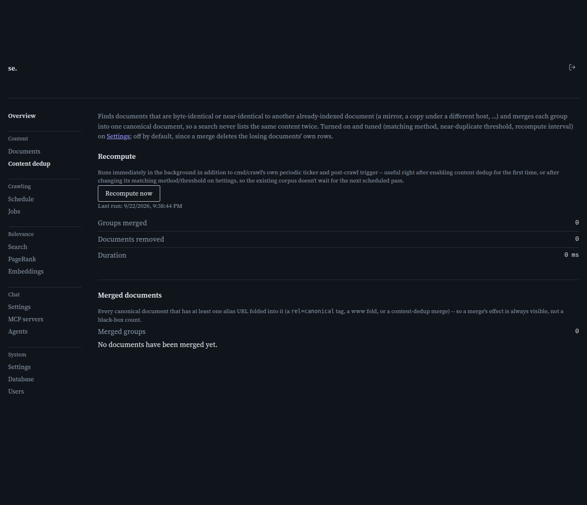

# Content Dedup

[← Manual home](README.md)

*`/admin/content_dedup`*

Finds documents that are byte-identical or near-identical to another already-indexed one — a mirror site, a copy of an article under a different host — and merges each group into one canonical document, so a search result never lists the same content twice. Shows the last recompute's status, lets you trigger a new one, and lists every document with aliases folded into it.

## What content dedup actually does

A document fingerprint comes from its normalized text: an exact hash for byte-identical matches, and (when "simhash" is enabled) a 64-bit SimHash fingerprint for near-duplicates, such as two copies of the same article with a different ad banner. When two or more documents share a fingerprint (exact match, or within the configured SimHash distance), the job keeps one — shortest hostname, ties broken by earliest crawl — and merges the rest into it. Merging is destructive: losing documents are deleted from the index, and their URLs are recorded as aliases of the survivor. This is why content dedup is off by default and must be turned on explicitly on the Settings page, with a matching method and threshold, before this page has anything to do.

## Recompute now

Shows whether a recompute is running, when the last one finished, and its result: groups found and merged, documents removed, run duration. Click "Recompute now" to force a fresh full-corpus pass instead of waiting for the periodic run (Settings' recompute interval) or the automatic post-crawl pass — most useful right after first enabling dedup, or after changing its matching method or threshold, since the existing corpus needs a pass under the new settings. The button is disabled while a recompute runs anywhere — this tab, another admin, or an automatic trigger — since the status is shared across every process on the database. Clicking it while one runs elsewhere is rejected rather than starting a second overlapping pass, since two concurrent runs merging from separate corpus snapshots can leave inconsistent alias records.

## Reading the recompute result

"Groups merged" is the number of duplicate/near-duplicate clusters folded into one document each. "Documents removed" is the total losing documents deleted — always at least the group count, since a group of 2 removes 1 and a group of 3 removes 2. "Duration" is the pass length in milliseconds; near-duplicate matching on a large corpus can take a while, since it adds pairwise comparisons within banded buckets on top of the fingerprint scan. Zero for both after a run isn't an error — it just means nothing new to merge.

## Merged documents

Lists every canonical document with at least one alias, so a merge's effect stays visible rather than a black-box count. Each row shows the canonical URL — the survivor, served in search results — and its aliases, each with why it was folded. "canonical tag" is ordinary crawl-time bookkeeping (a `rel=canonical` link, or a www/bare-domain fold) where no document was ever deleted; "exact-content merge" and "near-duplicate merge" mean a real dedup pass deleted that row. A canonical document can accumulate aliases from more than one source over time, hence listing them individually. Paginated 20 rows at a time; shows "No documents have been merged yet" when clean.

> **Worth knowing:**
> - Content dedup must be turned on and configured (matching method, threshold, recompute interval) on Settings first — it does nothing while disabled.
> - A merge deletes losing documents permanently. With near-duplicate (SimHash) matching, review the Merged documents table after a recompute — too loose a threshold can fold together documents that only coincidentally look similar.

---
← [Vocabulary term detail](vocabulary-term.md) &nbsp;·&nbsp; [↑ Manual home](README.md) &nbsp;·&nbsp; [Crawl](crawl.md) →
