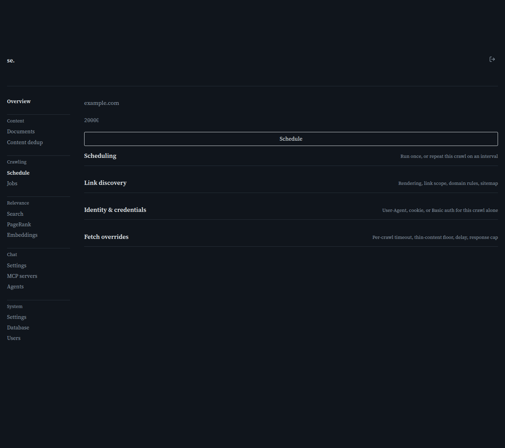

# Crawl

[← Manual home](README.md)

*`/admin/crawl`*

Start a new crawl of a site, either a one-off run or a repeating schedule. Every option here — rendering, link scope, credentials, fetch overrides — is per-crawl only; leaving a field blank falls back to the Settings page's site-wide default.

## URL and max pages

Type the site's URL and hit Crawl (or Enter). The field normalizes the scheme when you tab away: it trims stray whitespace and, if the value doesn't already start with a scheme like https://, prepends https:// — it doesn't otherwise rewrite the URL (a trailing slash, for instance, is left as typed). Max pages caps how many pages this crawl fetches before stopping (default 20,000) — lower it for a quick spot-check, raise it for a complete pass of a larger site.

## Scheduling: interval and max runs

Interval starts pre-filled at 360 (6 hours), not blank — the page opens already in Schedule mode, and the submit button already reads "Schedule" until you change this field. Clear Interval to 0 (or blank) for a one-off crawl instead — the button then reads "Crawl." Any positive number of minutes keeps it labeled "Schedule": the crawl repeats on that interval until paused or deleted from the Jobs page's Schedules table. Max runs only matters for a repeating crawl — blank for unlimited, or set it to disable the schedule automatically after that many runs (e.g. a nightly crawl that stops after 30 nights).

## Rendering

"Use site default" follows the Settings/Tuning page's configuration. Most sites need nothing more than a plain HTTP fetch (None) — fast, no extra install. Pick Chromium or Firefox only for JavaScript-built content that wouldn't show up in a plain fetch; it's substantially slower per page, and the first use downloads the browser engine, so expect a delay on that first render-mode crawl.

## Respect robots.txt

Off by default: the crawl ignores robots.txt unless checked. Turn it on for a third-party site you don't control; leave off for your own sites or internal targets you already know are fine to fetch fully.

## How far to follow links

Controls which discovered links this crawl follows, strictest to loosest: Exact seed host only stays on the literal seeded host; Seed's domain, including subdomains also follows blog.example.com from a seed of www.example.com, but not example.org; Same domain, any subdomain, any TLD follows example.org and www.example.de from a seed of example.com, but not other.com; Any domain follows everything discovered. "Use site default" defers to Settings' global choice, which starts at the TLD-scope option since most real sites span more than one subdomain or TLD.

## Allowed / blocked domains

These two lists (one domain per line) sit on top of the link-scope choice, not in place of it. Allowed domains are always followed even if link scope would reject them — use this to pull in a specific partner or CDN domain without loosening scope elsewhere. Blocked domains always win over both link scope and the allowed list — use this to keep a known-noisy domain out even if scope would include it.

## Follow domains already in the index

Off by default. When checked, a discovered link is followed even outside link scope as long as its domain already has a page indexed here — a domain worth indexing is worth following further, wherever it's linked from. Blocked domains still take precedence.

## Discover pages via sitemap.xml

Off by default. Check it to also fetch /sitemap.xml from the seed's domain and queue every URL it lists, alongside links found from the seed page. Turn this on for a site with a sitemap you trust to be complete — a reliable way to catch pages with no inbound links from the seed.

## Prioritize pages not yet indexed

On by default. New pages are fetched ahead of already-indexed ones, so a limited page budget (Max pages) goes toward new content first. Already-indexed pages still get crawled, just after new ones. Turn it off to refresh existing content before discovering anything new, e.g. after a site-wide content change.

## User-Agent, cookie, and Basic auth

These apply only to this one crawl — nothing here is saved, unlike the same fields on a schedule (see schedule-detail). Leave User-Agent blank for the server's default Firefox string, or set a custom one if a site blocks common crawler user-agents. Cookie header crawls content behind a login by pasting a session cookie (e.g. session=abc123) from a real browser session. The Basic auth fields start read-only and become editable on click — deliberate, so your browser doesn't autofill a saved password into a one-time crawl credential.

## Fetch overrides

Fetch timeout, Minimum text length, Delay between fetches, and Max response size each override the corresponding Settings-page default, for this crawl only. Leave blank to use the current global value — the placeholder shows the actual value, not a generic hint. Raise the delay for a site you don't want to hit hard; lower minimum text length for deliberately short pages (e.g. reference docs) the global thin-content floor would skip; raise max response size if large pages are getting cut off.

## What happens after you submit

Submitting always creates the same kind of record — a crawl definition — regardless of interval. A one-off crawl is due immediately; crawl-server's scheduler picks it up within seconds and creates the Job you'll see on the Jobs page. A repeating crawl shows up under Schedules on the Jobs page instead, where you can pause, edit, or delete it later.

> **Worth knowing:**
> - Submitting a URL whose exact host already has a schedule or pending one-off crawl replaces that entry's options in place rather than duplicating — at most one schedule per host, not per domain (www.example.com and blog.example.com dedup separately, even though "Seed's domain, including subdomains" link scope would follow both from either one).
> - To change a crawl's options after creating it, go to the Jobs page and click its row's edit icon — that opens schedule-detail, with the same fields plus a few schedule-only ones (Enabled, stored credentials).

---
← [Content Dedup](content-dedup.md) &nbsp;·&nbsp; [↑ Manual home](README.md) &nbsp;·&nbsp; [Schedule detail](schedule-detail.md) →
