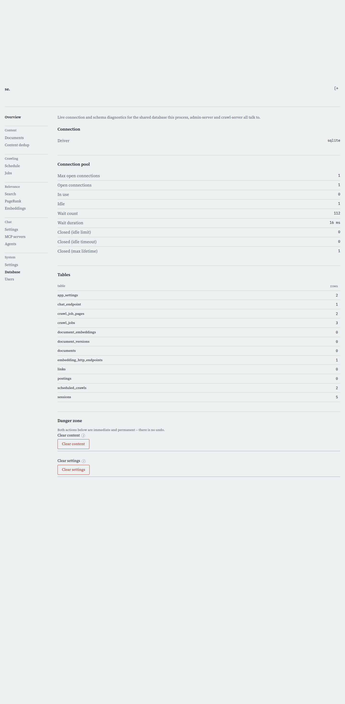

# Database

[← Manual home](README.md)

*`/admin/database`*

Shows live diagnostics for the SQL database search-server, admin-server and crawl-server all share, plus two irreversible bulk-delete actions. Use it to check connection health, see table sizes, and — only when you really mean it — wipe crawled content or reset configuration to defaults.

## Connection

Shows the database driver this deployment runs on: sqlite locally/CI, postgres for the dev deployment at se.mo-sys.de. Read-only, set at install time by the binaries' DSN. Useful for confirming you're in the right environment before touching the danger zone below.

## Connection pool

Live numbers from Go's sql.DBStats for this admin-server process's pool: open vs. configured maximum, in-use vs. idle, requests that had to wait (count and duration), and connections closed by the idle-limit, idle-timeout, or max-lifetime setting. A healthy pool shows low wait count/duration; a climbing wait count means the pool is undersized or something's holding connections too long. Diagnostic only — pool limits are set at the code/config level, not here.

## Tables

A row-count per table, sorted alphabetically — documents, postings, crawl jobs, sessions, settings tables, and everything else the schema defines. Use it as a sanity check after a crawl (counts should climb) or a clear-content run (they should drop to zero). A surprising number — postings much smaller than expected relative to documents — is usually the first sign something upstream didn't finish cleanly.

## Danger zone — Clear content

Permanently deletes every crawled document and everything derived from it — postings, links, versions, embeddings, aliases — plus every crawl job. All settings tables are left untouched, so your configuration survives. Use this to start crawling from a clean slate without redoing setup. Gated only by a plain browser confirmation (no typed phrase), fires immediately, no undo — a real DELETE across every content table, not a soft delete.

## Danger zone — Clear settings

Permanently deletes every row of every settings table: tuning weights, operational settings, ranking overrides, the chat endpoint, embedding endpoints, and crawl schedules. Crawled content is untouched. This admin-server process resets its in-memory settings to defaults immediately, but search-server and crawl-server only pick up the change on restart — until then they run on stale settings, out of sync with the database. Use this when configuration has gotten into a bad state you'd rather reset than debug; rare day to day. Same plain confirmation dialog, no undo.

---
← [Settings: System](settings-system.md) &nbsp;·&nbsp; [↑ Manual home](README.md) &nbsp;·&nbsp; [Users](users.md) →
