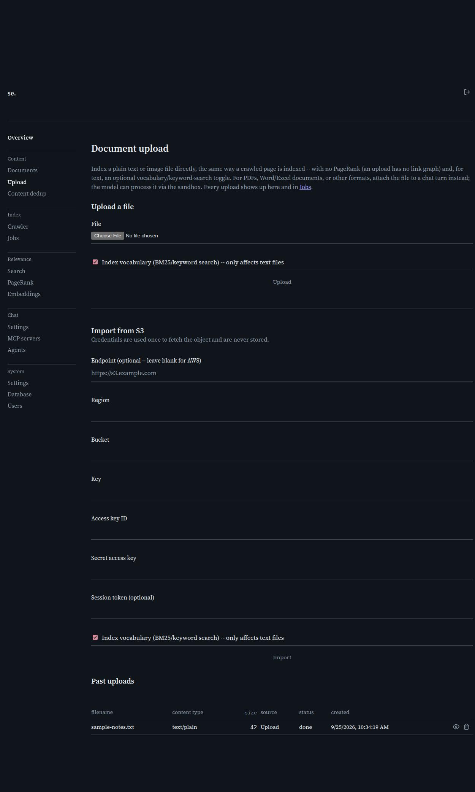

# Document upload

[← Manual home](README.md)

*`/admin/document-upload`*

Index a plain text or image file directly, the same way a crawled page is indexed — but with no PageRank (an upload has no link graph to compute one from) and, for text, an optional vocabulary/keyword-search toggle. For PDFs, Word/Excel documents, or other formats, attach the file to a chat turn instead — the model can process it via the sandbox (see [MCP servers](mcp-servers.md)); this page deliberately doesn't do per-format extraction of its own.

## Upload a file

Pick a file and, for a text file, decide whether to index its vocabulary (BM25/keyword search) — on by default. Only plain UTF-8 text and `image/*` content are accepted; anything else is rejected with an error rather than silently mishandled. Submitting responds immediately with a queued job, then indexes it in the background — refresh the table below (or the [Jobs](jobs.md) page) to watch its status.

## Import from S3

An alternative to a browser upload: fetch an object from an S3(-compatible) bucket by bucket/key/region and credentials. The credentials are used once, to fetch that one object via a signed request, and are never stored — re-enter them for every import. Leave "Endpoint" blank for real AWS; set it (e.g. to an IONOS S3-compatible endpoint) for anything else.

## What happens after upload

- **Text**: indexed for similarity search against every enabled embedding provider, and — if the checkbox was on — for keyword/BM25 search too.
- **Image**: embedded for similarity search only through the same provider Chat's own vision-similarity feature uses (Settings → Chat → Image understanding → Similarity search). If that isn't configured, the image still gets indexed with its metadata, just without a similarity vector.
- Either way, the resulting document has no PageRank and never appears in a crawl's link graph.

## Past uploads

A table of every job this page has created, most recent first — filename, content type, size, source (upload vs. S3 import), status, and created-at. Click a row's View action to open its detail page: full metadata, an image preview when applicable, and the indexed text once a text job finishes. Delete removes the job and, if it finished indexing one, the resulting document too.

> **Worth knowing:**
> - Every upload also shows up in [Jobs](jobs.md), alongside crawl jobs.
> - S3 credentials are genuinely never persisted anywhere — not in the job record, not in a settings row.
> - "Endpoint" is checked against the same guard every other admin-configured endpoint in this app goes through — it can't be pointed at a link-local address (e.g. a cloud metadata service), even though it's otherwise fully admin-controlled.

---
← [Documents](documents.md) &nbsp;·&nbsp; [↑ Manual home](README.md) &nbsp;·&nbsp; [Domain detail](domain-detail.md) →
