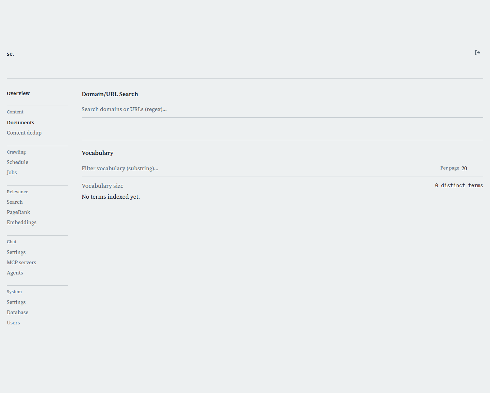

# Documents

[← Manual home](README.md)

*`/admin/documents`*

Where you find indexed pages and their domains, and where the crawl vocabulary lives. Use it to check whether a page or domain made it into the index, spot-check what got crawled, and jump into a domain's full page list or a vocabulary term's detail.

## Domain/URL search

Results update as you type, after a 200ms pause. The text is a regular expression, not a plain substring — `^shop\.` matches hosts starting with "shop.", `\.de$` matches every .de domain — and matching is case-insensitive. Leave the box empty and nothing shows; a large corpus dumped by default would be useless as a first screen.

## How the search works under the hood

The first search fetches up to 1000 domains and 2000 documents and caches them in memory; every keystroke after that just re-filters client-side, so results feel instant. Very large corpora are capped at that sample — an obscure domain/document beyond it might not show here even though it's genuinely indexed. Use the per-domain page for a complete, uncapped view once you've found it.

## Domain results

Each match shows the host and how many pages are indexed under it. Click a row to open that domain's page (`/admin/documents/{host}`), which lists every one of its pages, not just this search's up-to-2000-document sample.

## Document results

Below the domain list, matching pages show as a table of URL, title, and host — matched against all three, so a company name finds pages whose title mentions it even without a URL match. Clicking a URL opens the live page; there's no delete here — that's on the domain detail page, which shows the full, current list rather than this search sample.

## Vocabulary

Lists every distinct term the index has tokenized out of crawled content, with a document frequency (pages containing it) and a total frequency (occurrences across the corpus). Unlike domain/URL search, this list is server-paged and server-sorted, so it stays accurate and fast at any vocabulary size — nothing here is capped to an in-memory sample.

## Filtering, sorting, and paging vocabulary

The filter box is a plain substring match (not regex), server-side against the lowercased term, so mixed-case searches still work. Click a column header to sort — clicking the active column flips direction; term starts ascending, the two frequency columns start descending (most frequent first). "Per page" sets row count; Previous/Next page through the filtered, sorted set. The summary line shows the true corpus-wide vocabulary size, and, while filtering, how many terms matched.

## Why vocabulary matters: fuzzy correction

This is the same term list the public search's typo correction draws from: a zero-hit query term gets fuzzy-matched against this vocabulary (within a bounded edit distance) and quietly substituted for scoring, shown transparently in results rather than silently rewriting what the user typed. A term missing here is exactly why a related misspelled query wouldn't get corrected to it.

## Opening a term's detail

Click any term to open its detail page, showing exactly which documents contain it and how strongly. Use this to sanity-check a term came from real content, not boilerplate or a crawl artifact, before trusting how it influences ranking or fuzzy correction.

> **Worth knowing:**
> - Domain/URL search sees only a capped in-memory sample (1000 domains, 2000 documents) — open a domain's detail page for the complete picture.
> - The domain/URL box takes a regex; the vocabulary box takes a plain substring, so regex syntax there is searched literally.

---
← [Your files](account-files.md) &nbsp;·&nbsp; [↑ Manual home](README.md) &nbsp;·&nbsp; [Domain detail](domain-detail.md) →
