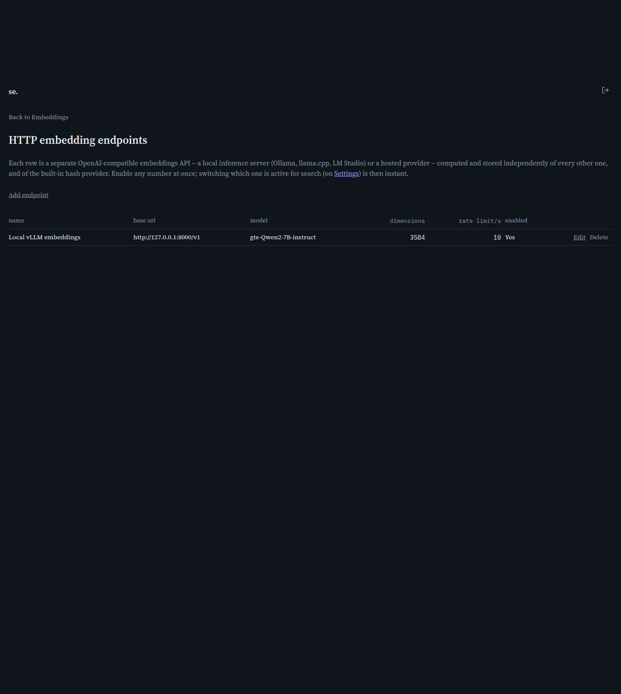

# HTTP embedding endpoints

[← Manual home](README.md)

*`/admin/embeddings/endpoints`*

Lists every configured HTTP embedding endpoint -- external OpenAI-compatible embeddings APIs, local (Ollama, llama.cpp, LM Studio) or hosted -- and is where you add, edit, or remove them. This is the management view; field-by-field configuration happens on the detail page.

## The endpoint table

Each row shows one endpoint's name, base URL, model, dimensions, rate limit, and enabled state. Every endpoint's embeddings are computed and stored independently of every other endpoint and of the built-in hash provider -- no shared state beyond the document text. Any number of endpoints, plus the hash provider, can be kept warm simultaneously; switching which one search reads from (Settings page) takes effect instantly, no recompute needed.

## Adding an endpoint

Click "Add endpoint" to open a blank configuration form on the detail page. With no endpoints configured, the table area shows a prompt to add one instead.

## Editing and deleting

"Edit" opens the endpoint's detail page pre-filled. "Delete" asks for confirmation, warning that search and any future recompute will no longer use it, then removes it entirely. Deleting doesn't retroactively touch already-indexed documents; it just stops the provider being usable going forward. If it was contributing to active search weights, the system falls back automatically (ReconcileSearchWeights) to the hash provider or another enabled endpoint rather than leaving search silently broken.

> **Worth knowing:**
> - This table has no client-side search filter, unlike most other admin list pages -- fine for the realistic small number of embedding endpoints most installs configure.
> - A **disabled** row you didn't create yourself isn't a bug -- some deployments (see [Infrastructure options](infrastructure.md#hosted-ai-instead-of-self-hosting)) pre-stage a few other hosted-provider models here as convenience placeholders, so switching providers later is enabling+keying one rather than starting from scratch. This is deployment-specific seeded data, not something every fresh install gets.

---
← [Embeddings](embeddings.md) &nbsp;·&nbsp; [↑ Manual home](README.md) &nbsp;·&nbsp; [Embedding endpoint detail](embedding-endpoint-detail.md) →
