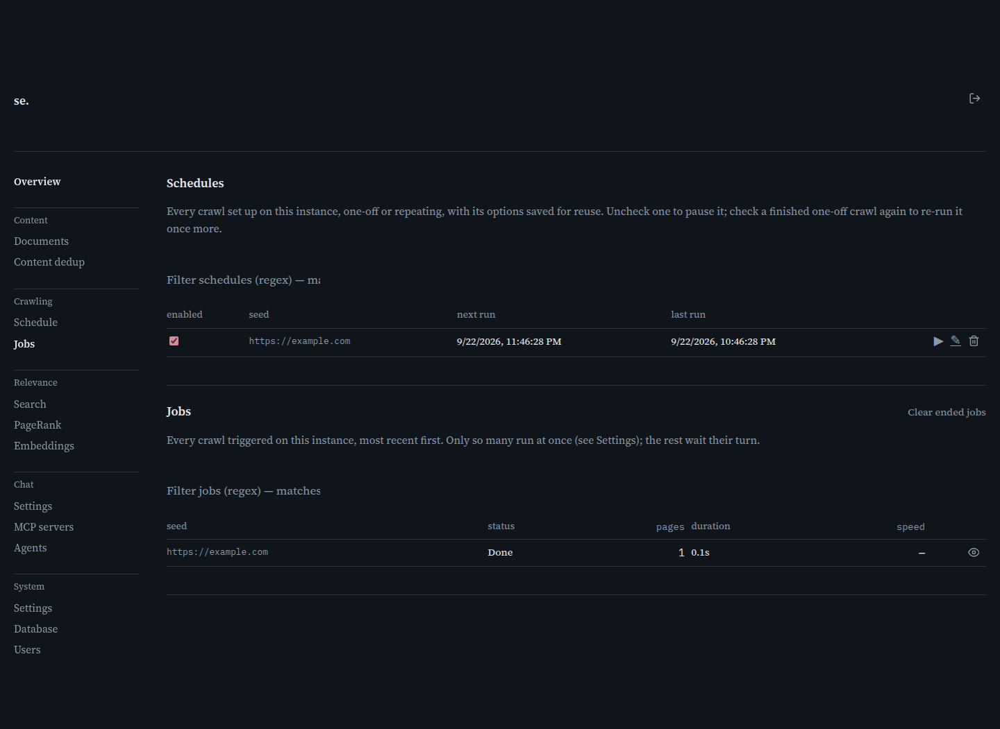

# Jobs

[← Manual home](README.md)

*`/admin/jobs`*

The Jobs page is the operational view of crawling on this instance: every schedule that's been set up, and every job (an actual triggered crawl run) that's ever executed, most recent first. Use it to check whether a crawl is running, see how it went, cancel something stuck, or manage the schedules behind repeating crawls.

## Schedules table

Lists every crawl set up on this instance, one-off or repeating, with its options saved for reuse. The first column is an Enabled checkbox you can flip directly from this table to pause or resume it — this uses the same dedicated toggle as the schedule-detail page's Enabled field, so it never reschedules the next run just from pausing and resuming — followed by the seed, next run time, and last run time (how it repeats and its link scope are still shown on the schedule-detail page, just not repeated as their own columns here). Per-row icon actions let you Run now (▶), Edit (✎, opens the schedule-detail page for full options), or Delete (the trash icon).

## Jobs table

Lists every crawl actually triggered on this instance — one-off runs and every fire of a repeating schedule each show up as their own row here — most recent first. Columns show the seed, status (Queued, Running, Done, Failed, or Cancelled), pages crawled so far, duration, and a live speed reading in pages/second computed from consecutive polls of this list (it shows "—" until the job has been observed at least twice, since there's no prior sample to diff against yet). Only a limited number of jobs run at once — see the concurrency setting on the Settings page — so a job can sit in Queued for a while if others are already running; the rest simply wait their turn.

## Viewing and cancelling a job

Click the magnifying-glass icon on a job row to load its detail below the tables: the exact options that job ran with (seed URLs, max pages, robots handling, link scope, allowed/blocked domains, renderer, sitemap/prioritization flags, fetch overrides, and whether a cookie or Basic auth was set — never the actual credential value), plus a per-page table of every URL the job attempted, its outcome, title, content length, links found, fetch duration, and timestamp. A Cancel action (the same trash icon used for Delete elsewhere, labeled "Cancel" on hover) appears next to View only while a job is still Queued or Running; cancelling stops it and leaves whatever pages it already indexed in place rather than rolling them back.

## Filtering and clearing ended jobs

Both the Schedules and Jobs tables get a regex filter box once they have at least one row — Schedules filters by seed, Jobs filters by seed or status text, so you can type "failed" to isolate failed runs. The job-detail page list has its own filter (matching URL, status, title, or error detail) plus pagination once a job has attempted more than 50 pages, and its columns are click-to-sort. "Clear ended jobs" on the Jobs panel removes every job that's no longer Queued or Running (Done, Failed, Cancelled) from the list in one action — useful for trimming a long history down to just what's currently active; it reports how many it removed.

## One-off Crawl vs. recurring schedule

The Crawl page's form always creates the same kind of record regardless of whether you set an interval — the difference only shows up here. A one-off crawl (Interval left at 0) creates a schedule that's already due, runs exactly once, and its single execution shows up only as a row in the Jobs table below — it never appears in the Schedules table above, since there's nothing recurring to manage. A repeating crawl (positive Interval) shows up in both: as a row in Schedules (which you manage — pause, edit, delete) and, each time it fires, as a fresh row in Jobs (which you inspect after the fact). This page keeps polling for a short window after you're redirected here right after creating a crawl from the Crawl page, since the job isn't created synchronously with that submission — it appears once crawl-server's scheduler next ticks, typically within a few seconds.

> **Worth knowing:**
> - The Jobs table auto-refreshes (polling every 1.5s) whenever at least one job is Queued or Running, and stops polling once nothing is active — so leaving this page open during a large crawl keeps the numbers live without needing a manual refresh.
> - A job's page-list defaults to sorting by fetched time, most recent first — the most useful view while a crawl is still in progress or just finished.

---
← [Schedule detail](schedule-detail.md) &nbsp;·&nbsp; [↑ Manual home](README.md) &nbsp;·&nbsp; [Search debug](search-debug.md) →
