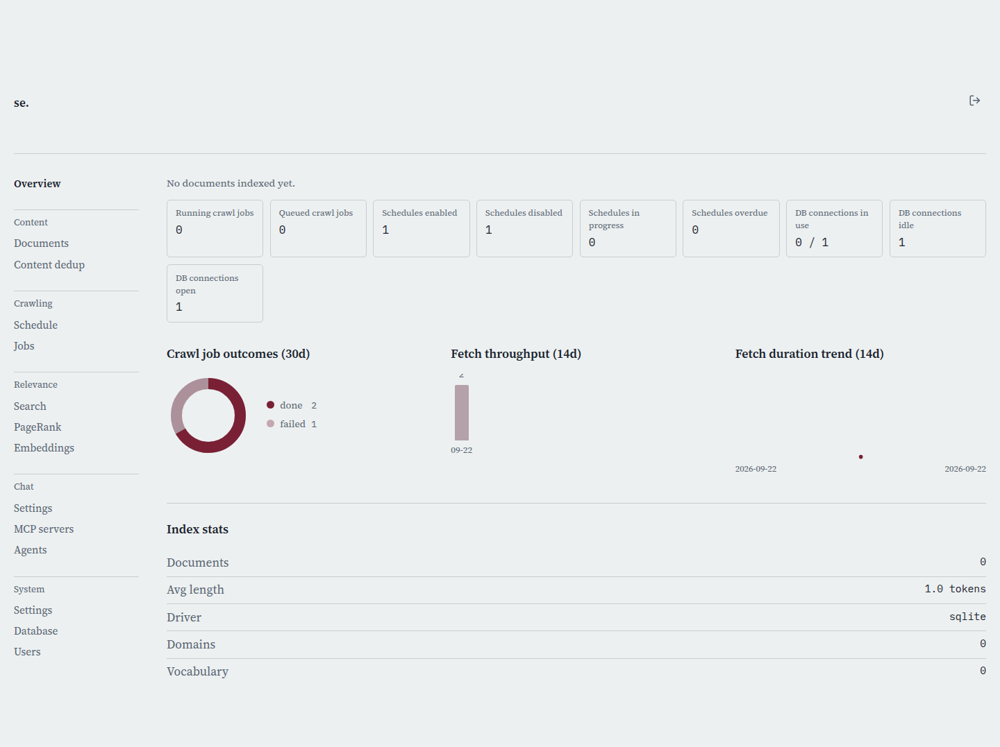

# Signing In

[← Manual home](README.md)

*`/login`*

This is the gate in front of every admin page. Nobody reaches /admin, /crawl, or any /admin/api/* endpoint without a valid session cookie minted here first.

## What you need

You need the admin username and password someone set up for this server -- there's no self-registration or "forgot password" flow for the admin account, so if you don't have credentials, ask whoever installed the system. If sign-in refuses every combination you try, including ones you're sure are correct, the most likely cause isn't a typo: no admin account has been configured on this server at all yet, and until one is, every sign-in attempt fails closed rather than defaulting to open access.

## Signing in

Type your username and password into the two fields and submit. The page checks your credentials without a full reload -- a wrong password shows "Incorrect username or password" right next to the form and clears the password field so you can just retype it, while a network problem shows a separate "could not reach the server" message so you can tell the two apart. If you followed a link to a specific admin page while signed out, you were redirected here with that page remembered; signing in successfully sends you straight back to it instead of dumping you on the generic Overview page.

## Staying signed in

A successful sign-in sets a session cookie that keeps you logged in for a fixed window -- 12 hours by default, but an admin can shorten or lengthen this under Settings > System (the "Session length" field). Once that window elapses you're simply asked to sign in again the next time you load an admin page; there's no silent renewal. The cookie itself never reveals your role or identity -- it's just an opaque token the server looks up server-side on every request, so nothing about your access level can be forged or tampered with from the browser.

## Too many failed attempts

After 5 failed logins from the same address within 15 minutes, further attempts are locked out for 30 seconds; every additional failure while still locked doubles that wait, up to a 15-minute cap. A locked-out attempt gets a clear "too many failed login attempts, try again later" message rather than a misleading "wrong password" -- if you're sure your credentials are right but keep getting refused, you may just be waiting out a lockout from an earlier typo.

> **Worth knowing:**
> - The lockout is keyed by IP address, not by username -- if several people share one network connection (an office, a VPN exit), one person's repeated bad attempts can lock out everyone behind that same address for a while.
> - A correct sign-in immediately clears any failure history for your address, so a lockout never lingers past your next successful login.

---
← [Config files](config-files.md) &nbsp;·&nbsp; [↑ Manual home](README.md) &nbsp;·&nbsp; [Overview](overview.md) →
