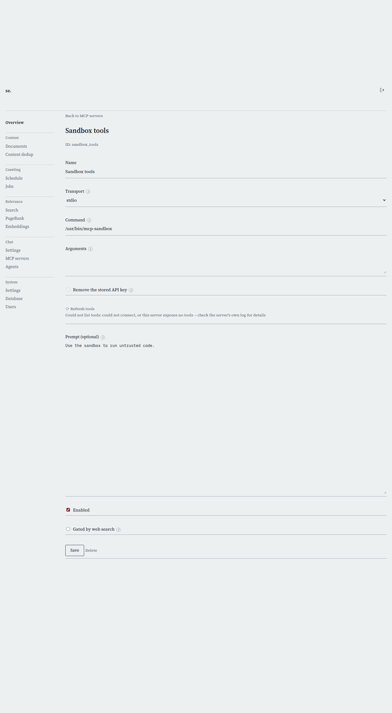

# MCP Server detail

[← Manual home](README.md)

*`/admin/mcp-servers/{id}`*

The add/edit page for a single MCP server connection, reached from "Add server" or a row's Edit link. Existing servers show their real live tool list on load; a new or edited server can be probed before you save.

## Name

A human label for this connection, e.g. "web tools" or "internal sandbox". Shown only in this admin UI, never sent to the model, so it can be whatever's clearest to you — unlike the tool names, which the server itself defines.

## Transport: stdio vs http

Transport picks how this server is reached. "stdio" spawns Command as a local child process fresh at the start of each chat turn, talking MCP over stdin/stdout — what all four built-in servers use, and what any other locally installed binary needs too. "http" connects to a remote MCP endpoint over Streamable HTTP instead. Switching the dropdown shows only the fields that transport actually uses — Command/Arguments for stdio, Base URL/API key for http.

## Command and Arguments (stdio only)

Command is the executable to spawn — an absolute path (e.g. /usr/bin/searchengine-mcp-web) or a name resolvable on this process's PATH. It runs directly, never through a shell, so pipes or globs won't work. Arguments are real argv elements, one per line: for mcp-sandbox, flags like -network (grant outbound network access, off by default — also unlocks a "packages" argument letting the model request pip/Go module installs, only possible with real network access), -memory/-cpus/-pids-limit/-timeout (resource limits), and -dns/-host-dns/-host-network for DNS and networking mode when -network is set; for mcp-files, -base-url (defaults to http://127.0.0.1:8080). An admin filling in Command gets the same trust level as one configuring a crawl schedule or embedding endpoint — real trust, no extra sandboxing here, so only point it at binaries you actually trust.

## Base URL and API key (http only)

Base URL is the remote MCP endpoint's address, e.g. https://example.com/mcp. API key is optional, sent as an Authorization: Bearer header — leave blank if the remote server doesn't require auth. Once saved, the key is encrypted at rest and never shown again; the field starts blank on reload, with placeholder text noting whether a key is stored. Leaving it blank on save keeps the existing key — check "Remove the stored API key" to actually remove one.

## List tools / Refresh tools

Connects to the server exactly as the form is currently filled in — even unsaved — and shows real tool names/descriptions live. Runs automatically when an existing server's page loads; re-run it after changing fields to sanity-check before Save. Zero tools is ambiguous (failed connection, or legitimately nothing exposed) and the status message says so rather than guessing; check the server's log if unexpected. This is also the only place tool descriptions appear — they come from the server itself, never from anything typed here.

## Prompt (optional)

Not where you describe what the server does — each tool's own name and description (via List tools above) already tells the model that. Prompt is for extra cross-tool steering no single tool's description can carry, e.g. "after searching, fetch results from a few different domains, not just the top-ranked ones — if a fetch is blocked, try a different domain rather than the same one again." (Picking only the top-ranked results by rank alone risks several sharing one domain — if that domain blocks fetching, the model has nothing left to fall back to.) When non-empty and the server is active, it's injected as a system message after the chat endpoint's persistent prompt (Settings → Chat), in addition to it. Leave empty if tool descriptions already say enough; most servers don't need one.

## Enabled

Turns this server on or off. A disabled server is never connected to and its tools never offered, regardless of any other setting — the safe way to temporarily pull a server without deleting its configuration.

## Gated by web search

When checked, this server (and its Prompt) is only active on a turn where the chat's "Web" toggle is on — the same setting under Settings → Chat, overridable per-question. There's no separate control; it reuses that toggle. Unchecked (default), the server is active whenever Enabled is checked, regardless of web search. This lets a server like mcp-web run only when the user has actually asked for web-grounded answers.

## Save and Delete

Save creates a new server (redirecting to its detail page) or updates an existing one's editable fields — its ID, once minted from its name, never changes. Delete removes it outright after a confirmation warning its tools stop being offered immediately; no undo, so prefer unchecking Enabled if you might want it back.

> **Worth knowing:**
> - A stdio server's Command is spawned fresh per chat turn, not left running as a background service — a crashing or slow-starting binary shows up as a per-turn failure, not a systemd outage.
> - mcp-sandbox's -network flag is off by default for good reason: enabling it (or -host-network, which shares the host's network namespace) is a real privilege elevation for whatever code the model runs inside it.

---
← [MCP Servers](mcp-servers.md) &nbsp;·&nbsp; [↑ Manual home](README.md) &nbsp;·&nbsp; [Agents](agents.md) →
