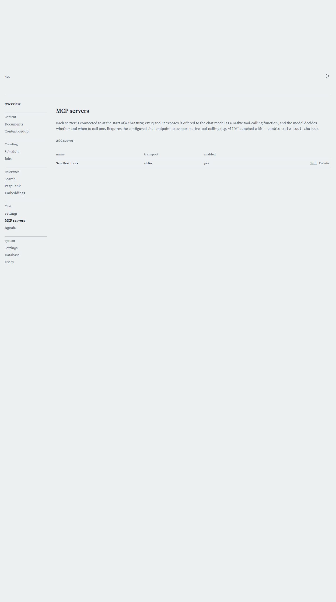

# MCP Servers

[← Manual home](README.md)

*`/admin/mcp-servers`*

This page lists every MCP server connection you've configured — the tools your chat model can reach beyond its own training, from web search to running code in a sandbox. From here you add a new server or jump into an existing one to edit or delete it.

## What an MCP server is here

MCP (Model Context Protocol) is a standard way for a language model to call external tools with structured arguments. Each row on this page is a CONNECTION to one MCP server, not a single tool — a server can expose several tools at once (whatever its own tools/list response reports), and the chat model discovers and calls them natively during a conversation, deciding on its own whether and when a call is warranted. This replaced an older mechanism (ChatHook) where each row was a single script-backed tool with an admin-typed description; here the tool's name and description come live from the server itself, so they can never drift from what the tool actually does.

## Requirements for tool-calling to work at all

Configuring servers here does nothing unless the chat endpoint itself supports native tool-calling. For a self-hosted vLLM endpoint that means it was launched with --enable-auto-tool-choice (and a matching --tool-call-parser). If the endpoint doesn't support it, the model simply never sees any tools, regardless of how many servers you've enabled — there's no error, the conversation just proceeds without them.

## The server list

Each row shows the server's name, its transport (stdio or http), and whether it's enabled, plus Edit and Delete actions. An empty list shows a prompt to click "Add server" rather than a bare empty table. Deleting a server asks for confirmation first and warns that its tools will stop being offered to the model immediately — there's no undo, so if you're not sure, uncheck "Enabled" on the detail page instead of deleting.

## The four built-in servers

The searchengine project ships four first-party stdio servers you can point Command at directly, each a separate binary: mcp-datetime exposes a single get_datetime tool (the model calls it only when it actually needs to know the current time, replacing an older mechanism that stamped every prompt with a timestamp whether needed or not). mcp-web exposes web_search (proxies to a self-hosted SearXNG instance) and web_fetch (fetches a URL's text content, guarded against SSRF) — see "Gated by web search" on the detail page for how this one interacts with the chat UI's own Web toggle. mcp-files exposes list_files/read_file/write_file, letting the model read a signed-in user's own uploaded files and hand back new ones for download; it holds no database credential of its own, only a short-lived per-turn token scoped to that one user's files. mcp-sandbox exposes run_python and run_go, executing model-supplied code inside a locked-down, disposable Docker container (no network access, resource limits) — every flag governing that container (memory, CPU, whether it gets network access at all) is admin-configured on the server's own Arguments field, never something the model can influence.

## Adding a server you host yourself

Nothing restricts you to the four built-ins — any process that speaks MCP over stdio, or any remote endpoint that speaks MCP's Streamable HTTP transport, can be added the same way. Click "Add server" and fill in the detail form; see the mcp-server-detail page for what each field means.

> **Worth knowing:**
> - If a server's tools never show up in a chat, check three things in order: is the chat endpoint launched with tool-calling enabled, is the server's Enabled checkbox on, and — if it's gated — is the chat's Web toggle actually on for that turn.

---
← [Chat Settings](chat-settings.md) &nbsp;·&nbsp; [↑ Manual home](README.md) &nbsp;·&nbsp; [MCP Server detail](mcp-server-detail.md) →
