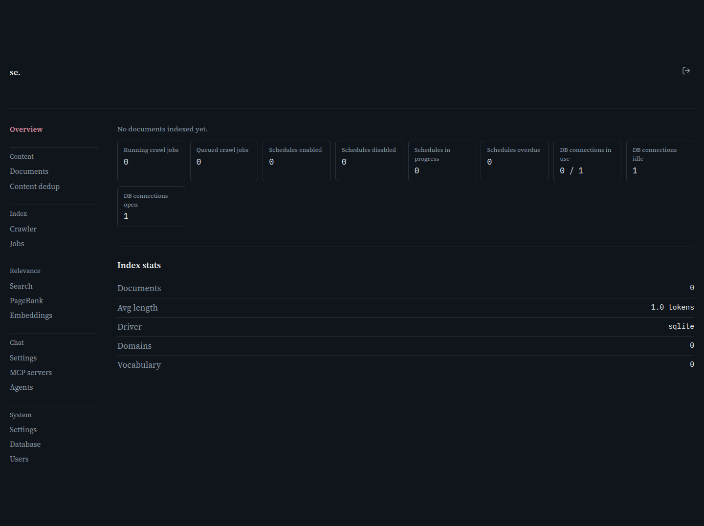

# Overview

[← Manual home](README.md)

*`/admin`*

The page you land on right after signing in, and the top entry in the admin nav rail. A dashboard, not a place you configure anything -- a fast read on whether crawling is healthy, how big the index is, and whether anything looks stuck, with links to the pages where you'd actually fix something.

## The navigation rail

Every admin page shares the same sidebar, grouped by intent rather than one flat menu: Content (Documents, Content dedup) for browsing and de-duplicating what's indexed; Index (Crawler, Jobs); Relevance (Search, PageRank, Embeddings) for ranking tuning; Chat (Settings, MCP servers, Agents); and System (Settings, Database, Users). Overview sits above all groups as a single top-level link. The current page is visually marked in the rail, so you always know where you are.

## Signing out

The icon button at the top right of every admin page ends your session and sends you back to the public search page. It clears your session cookie server-side and in-browser, so the link stops working immediately for anyone who has it -- no "undo" short of signing in again.

## Index stats

"Index stats" shows the three plainest numbers about your corpus: documents indexed, their average length in tokens, and the running database driver (SQLite or Postgres). Average length matters more than it looks -- a sudden drop usually means a crawl started pulling in boilerplate or near-empty pages, worth checking on Documents.

## Pages per domain and content age

The donut chart breaks indexed pages down by domain, largest first; click any domain in the legend to jump to its document list. Next to it, the age-of-content bar chart buckets pages by how long since last fetch, showing at a glance whether content is fresh or stale. Two more bar charts appear once there's data: documents by version number (how many times content has changed) and documents by stored version count (capped by Settings' version-history limit, so always lower once pruning kicks in).

## Operational tiles

The stat tiles above the charts are a live snapshot: crawl jobs running vs. queued, schedules enabled/disabled/in-progress/overdue (next run time already passed without starting), and the connection pool's in-use/idle/total. An "orphan pages" tile appears once PageRank has run at least once, showing pages at or below the orphan threshold -- pages PageRank couldn't find a path to, usually meaning broken or missing internal links.

## Running crawl jobs

Actively running jobs are listed here with seed URLs and a live pages-crawled count -- the same info the Jobs page shows in full, surfaced here so you don't have to navigate away. This block disappears entirely when nothing is running.

## Trend charts

Four more charts appear once there's enough history: a 30-day crawl outcomes donut (finished/failed/cancelled); a 14-day fetch throughput chart stacking each day's outcomes; a 30-day documents-indexed-per-day line chart; and a 14-day average fetch duration line chart, useful for spotting a slowing target site or a less efficient crawler config. A PageRank distribution histogram appears once PageRank has run, showing the full score spread rather than just the orphan-count tile.

> **Worth knowing:**
> - Every chart is read-only -- notice a problem here, then go to the relevant page (Jobs, Schedule, PageRank, Documents) to act on it.
> - Blocks with no data yet simply don't render rather than showing an empty chart, so a sparse Overview on a fresh install is expected, not a bug.

---
← [Signing In](login.md) &nbsp;·&nbsp; [↑ Manual home](README.md) &nbsp;·&nbsp; [Search & Chat](search-chat.md) →
