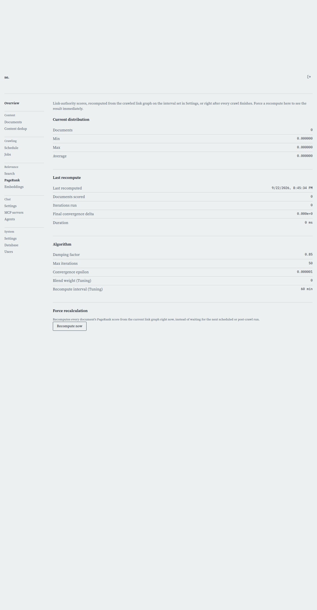

# PageRank

[← Manual home](README.md)

*`/admin/pagerank`*

PageRank scores every document's link authority — how much weight other pages lend it by linking to it — and this page is where you watch that score evolve, read the algorithm's fixed constants, and force a fresh recompute on demand. It's recomputed automatically on the interval set in Settings and right after every crawl finishes, so most of the time this page is read-only observation; the Force recalculation button exists for the moments you don't want to wait.

## Current distribution

Shows the corpus-wide spread of PageRank scores right now: total scored documents, and the minimum, maximum, and average score. A healthy, well-linked corpus has a wide spread with a long tail of low-authority pages and a handful of clear high-authority ones; a distribution that's suspiciously flat (min ≈ max ≈ average) usually means PageRank hasn't run yet on this data, or the link graph is too sparse or too uniform to differentiate documents.

## Last recompute

Reports when the most recent recompute finished, how many documents it scored, how many iterations it took to converge, the final convergence delta (how far the scores still moved on the last iteration before stopping), and how long the whole run took. If a recompute is running anywhere right now — this browser, another admin's session, or cmd/crawl's own scheduled or post-crawl trigger — this section shows "Recomputing…" instead, because the status is shared across every process touching the database, not just what this tab happened to start. If nothing has ever run on this instance, it says so plainly rather than showing zeros.

## Algorithm

Damping factor, max iterations, and convergence epsilon are the classic PageRank constants — they're compiled into the binary, not editable here, and are shown for transparency so you can reason about the numbers above. Damping factor (0.85) is the probability mass a page passes along its outbound links, versus the remainder spread evenly across every page regardless of link structure; a higher damping factor makes link structure matter more relative to the uniform baseline. Max iterations caps how long a single recompute can run before giving up on convergence (50, well above what real graphs need in practice), and convergence epsilon is the threshold below which the total score movement across one iteration is considered settled. Blend weight and recompute interval, by contrast, are read from Tuning in Settings, not fixed — blend weight controls how much PageRank influences the final search ranking (0 means no influence at all), and recompute interval controls how often the scheduled recompute runs; change either one on the Settings page, not here.

## Force recalculation

Recomputes every document's PageRank score from the current link graph immediately, instead of waiting for the next scheduled or post-crawl run. This runs synchronously and blocks until it's done — the button shows a loading state and the page reports the same documents/iterations/delta/duration numbers as any other run once it completes. Use this after a bulk link-graph change (a large crawl, a bulk document delete, a domain removal) when you want the corpus's authority scores to reflect reality right away rather than at the next scheduled tick.

> **Worth knowing:**
> - A document with no incoming or outgoing links at all is simply left untouched by a recompute rather than reset to 0 — it isn't part of the link graph, so it keeps whatever score it last had (1/N if it's never been scored).
> - An empty link graph (nothing to score) is reported as 0 documents scored in 0 iterations — that's a legitimate result, not an error, and shows up that way in both the stats panel and a forced recompute's result.

---
← [Search debug](search-debug.md) &nbsp;·&nbsp; [↑ Manual home](README.md) &nbsp;·&nbsp; [Embeddings](embeddings.md) →
