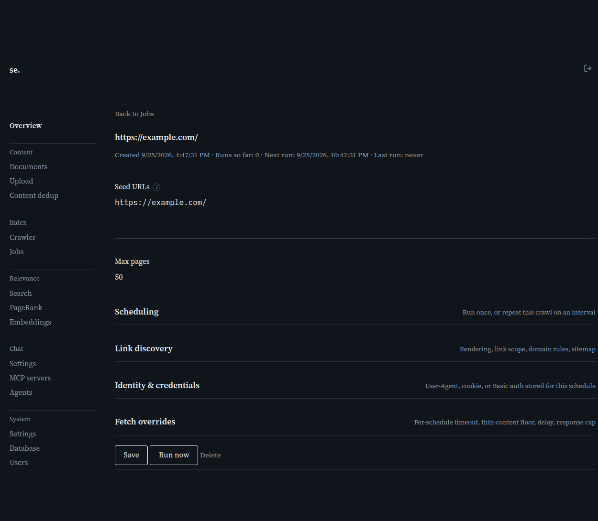

# Schedule detail

[← Manual home](README.md)

*`/admin/schedule/{id}`*

This page is the edit view for one existing crawl schedule — reached by clicking the edit (pencil) icon on a row in the Schedules table on the Jobs page. It carries the same crawl options as the Crawl page's form, plus a few fields that only make sense for something already saved: whether it's enabled, and stored (not one-off) credentials.

## Header: title and run history

The heading shows the schedule's seed URL(s) as a short summary. Below it, the meta line reports when the schedule was created, how many times it's run so far, when its next run is due, and when it last ran (or "never" if it hasn't run yet) — a quick way to confirm a schedule is actually firing on the interval you expect before you go digging through the Jobs list.

## Seed URLs and max pages

Seed URLs takes one URL per line — most schedules have just one, but you can seed a crawl from several starting points if a site's structure calls for it. Max pages caps how many pages each run of this schedule fetches before stopping, same meaning as on the Crawl page.

## Interval, max runs, and Enabled

Interval is minutes between runs; 0 means run once and stop. Max runs caps how many times a recurring schedule repeats before disabling itself automatically — 0 means unlimited, and it's meaningless if Interval is 0 since a one-off already stops after its single run. Enabled is the on/off switch for the whole schedule: unlike editing the other fields (which always reschedules the next run to be Interval minutes from now), toggling Enabled from this page's checkbox — or the equivalent checkbox on the Jobs page's Schedules table — doesn't touch the next-run time, so pausing and resuming doesn't reorder or delay it beyond a simple pause.

## Rendering, link scope, and domain rules

These fields — Rendering, Respect robots.txt, How far to follow links, Allowed/Blocked domains, Follow domains already in the index — work exactly as they do on the Crawl page; see that page for the full explanation of each. The difference here is only that they're being edited for an existing schedule rather than set once at creation.

## Discover via sitemap.xml / Prioritize unindexed

Same fields, same meaning as on the Crawl page: sitemap discovery pulls in every URL listed at /sitemap.xml in addition to followed links, and prioritizing unindexed pages spends a limited page budget on new content before re-fetching pages already in the index.

## Stored credentials: User-Agent, cookie, Basic auth

Unlike the Crawl page's one-off credential fields, a schedule's cookie and Basic auth are stored and reused on every run — that's the whole point of scheduling a crawl behind a login. For that reason the server never sends a stored cookie or password back to the browser: these fields always load blank, with a placeholder telling you one is already set ("unchanged — already set") rather than showing the value. Leaving them blank on save keeps whatever's currently stored; to actually remove a stored credential, use the "Remove the stored cookie" or "Remove the stored basic auth credentials" checkbox — typing a new value and saving replaces it, same as leaving it blank preserves it.

## Fetch overrides

Fetch timeout, Minimum text length, Delay between fetches, and Max response size override the site-wide Settings-page defaults for every run of this schedule, exactly like the Crawl page's overrides — leave any blank to use the current global value.

## Save, Run now, and Delete

Save writes every field above as a full replacement of the schedule's options and reschedules its next run to Interval minutes from now (this is why toggling Enabled has its own separate path — see above). Run now marks this schedule due immediately without waiting for its interval; crawl-server's scheduler ticker picks it up within a few seconds, the same way a freshly created one-off crawl starts, and you can watch it appear as a running Job on the Jobs page. Delete removes the schedule entirely after a confirmation prompt — it does not stop or affect any job already in progress from a previous run.

> **Worth knowing:**
> - Running a schedule that's already mid-run returns a conflict rather than starting a second overlapping crawl — the same seed can't have two active jobs at once.
> - If the page fails to load (bad or deleted ID), the heading changes to "Not found" and the form stays hidden rather than showing empty fields.

---
← [Crawl](crawl.md) &nbsp;·&nbsp; [↑ Manual home](README.md) &nbsp;·&nbsp; [Jobs](jobs.md) →
