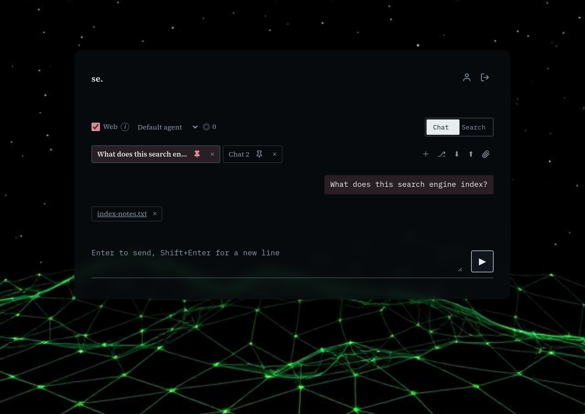

# Search & Chat

[← Manual home](README.md)

*`/ (search + chat page)`*

The page every signed-in user lands on after logging in -- not an admin screen. Two modes, switched with one control top-right: Chat, for asking a model questions it answers using the index, the web, and your files; Search, for querying indexed pages directly. Everything here works the same for a regular account or an admin (admins additionally get a gear icon linking to /admin).

## Chat vs Search toggle

The pill-shaped control at the top switches the whole page between Chat and Search -- two independent views, not tabs of the same result: switching hides one set of controls and shows the other. Chat sits on the left, selected by default. Chat is for a written answer synthesized from the index (and optionally the live web), with the model doing the reading; Search, on the right, is the plain, fast option when you already know roughly what you're looking for.

## Search mode: the query box and syntax

Type a query and press Search (or Enter) to run it against indexed content -- results are ranked by a blend of keyword matching and semantic similarity, so a query sharing no exact words with a page can still surface it if the meaning is close. The "Search syntax" disclosure lists the operators: plain words match loosely, +word forces presence, -word excludes, "exact phrase" matches literally (and -"exact phrase" excludes it), and site:example.com (or -site:example.com) restricts to or excludes a domain and its subdomains. These combine freely, e.g. cats +shelter -kitten site:example.com. Appending &top_k=N to the page's URL (e.g. /?q=cats&top_k=50) requests more than the default number of results. A misspelled query gets a quiet note above the results naming which term(s) were fuzzy-corrected for scoring -- your typed query is never silently rewritten, only substituted for ranking.

## Sort order

The dropdown next to the search box picks result order: "Best match" (default) ranks by combined relevance score; "Most recent" orders by crawl/update recency, useful when freshness matters more than topical fit. Switching this re-runs nothing by itself; re-submit the search to apply it.

## Reading a search result

Each result shows a clickable title (opens in a new tab), the full URL underneath, and a snippet with matched terms highlighted. A score next to the title -- higher is a better match. Expanding "Details" breaks the score into bm25 (keyword-match strength) and semantic (meaning-similarity), plus the final blended score -- useful if a ranking looks surprising and you want to see which signal drove it.

## Chat mode: asking a question

Switch to Chat, type a question, and press Enter to send (Shift+Enter inserts a newline for a multi-line question first). The model answers using whatever context it's given -- the index, optionally the live web, and attached files -- and its reply renders as formatted text (headings, lists, bold/italic, code blocks, links) rather than raw markdown. Each answer appears directly under your question in a running transcript, top to bottom like any chat app.

## The Web toggle

The "Web" checkbox controls whether the model can use live web search and page fetching on top of whatever else it knows -- checked by default. Leave it on for questions needing current or outside-the-index information; turn it off for an answer grounded only in what's already indexed (faster, and avoids the model wandering off-index). Read fresh on every message, so flipping it mid-conversation only affects the next question, not prior answers.

## Picking an agent

The "Default agent" dropdown lets you choose a specific agent to answer with, if any are configured -- an agent bundles its own system prompt and enabled MCP tool servers, so picking one changes both behavior and available tools. Leaving it on "Default agent" uses whatever the administrator set as fallback. Each tab remembers its own agent choice independently, so different tabs can talk to different agents at once, and forking a tab carries its choice over.

## Chat tabs: new, fork, export, import

The strip above the transcript holds one tab per open conversation -- the + button starts a brand-new chat, pinned immediately if you're signed in (see "Pinning" below); the fork icon (⎇) deep-copies the current tab's full history into a new, independent tab, so you can branch a conversation without disturbing the original (a fork always starts unpinned, even from a pinned chat, so branching never silently saves a copy you didn't ask for). The download icon (⬇) saves the active tab as JSON; the upload icon (⬆) loads one back as a new tab, still the only way to bring a conversation in from outside this account.

## Pinning, renaming, and closing chats

Each tab has its own pin button. An unpinned tab is session-only: closing or reloading the page discards it, and it can't attach files (see "Attaching files" below). A signed-in account's chats are pinned by default -- every new tab (though not a fork, see above) is saved to your account as soon as you create it, reloading automatically next time (most recently updated first) and able to attach files right away. Clicking the pin unpins a tab, deleting the saved chat and its attached files, though the tab stays open as a plain, session-only conversation; clicking it again re-pins it. Pinning additionally requires the files feature to be configured (see Settings > System); without it, every account's chats stay session-only the same way an unpinned tab does.

Click a tab's own name to rename it, but only while it's already active -- clicking a background tab's name switches to it instead. A pinned tab's rename saves immediately; an unpinned tab's title is session-only, same as its history.

The × on a tab closes it. For an unpinned tab this discards it with no confirmation -- export first if you might want it later. For a pinned tab, closing deletes the saved chat and its files, same as unpinning then removing the tab; the last remaining tab can't be closed either way.

## Attaching files

The paperclip button uploads a file for the model to read during this conversation -- it doesn't inject the contents into your message; the model discovers and reads it via its file-access tools the next time it looks. Attached files (and any the model produces via write_file) show up as small boxes below the transcript with a real download link, a view (eye) icon that opens an inline preview -- images render directly, text/JSON/YAML files show in a plain-text view, anything else shows a "no preview available" message with a note to use the download link instead -- and a × to delete immediately, no confirmation needed. Only a pinned tab can attach files -- the paperclip is disabled (with a tooltip explaining why) until you pin the tab. Requires a signed-in account with the files feature configured; a deployment without that feature shows no file boxes.

## Citations and tool results

When the model uses a tool mid-answer -- fetching a URL, running a search, writing a file -- that call shows up as a small closed-by-default fold under the answer, one per call. Expanding a fetch fold shows the retrieved URL (a real clickable link) with the raw response in a nested fold; a search fold shows the query and, where recognizable, the top links directly, with raw JSON available. This is how you check what the model actually looked at before trusting an answer, without cluttering the reply unless you ask for it.

## Token usage indicator

The small ring next to the Web checkbox tracks how much of the model's context window the conversation is using, broken into the global system prompt, MCP-server prompts, your messages, the active agent's prompt, and prior history -- hover for the full breakdown and a percentage of the context limit. It's a heads-up for when old messages start getting silently dropped: the affected answer then carries a visible note ("Older messages were dropped from context to fit the model's limit").

## Signing out and account links

The header's top-right icons adapt to who's signed in: an admin sees a gear icon linking to /admin, a regular user sees a person icon linking to /account (file uploads, personal MCP servers). The sign-out button (both) ends the session and returns you here logged out; sign back in via /login to search or chat again, since the page requires an authenticated session to load.

> **Worth knowing:**
> - Combine search operators freely in one query, e.g. cats +shelter -kitten site:example.com -- there's no separate advanced-search form.
> - Signed in, a new chat tab is pinned (and attachable) automatically -- unpin it if you'd rather it stayed session-only; an unpinned tab is discarded on reload or close, so export it first if you might want it later.
> - If a search result's ranking looks off, open its Details fold to see whether keyword (bm25) or meaning-based (semantic) matching drove the score.

---
← [Overview](overview.md) &nbsp;·&nbsp; [↑ Manual home](README.md) &nbsp;·&nbsp; [Your account](account.md) →
