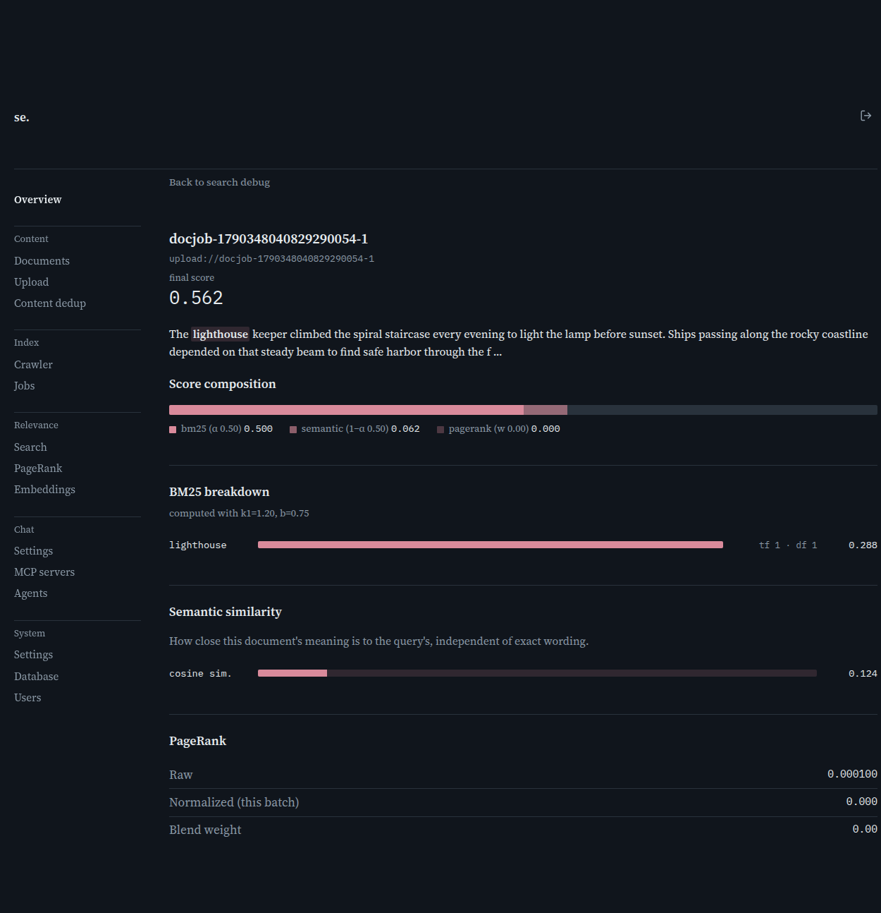

# Search debug

[← Manual home](README.md)

*`/admin/search`*

Runs a query the same way the public search box does, but shows the machinery underneath: raw BM25 and semantic-similarity scores for every result, unblended, plus a term-lookup tool. Use it whenever ranking looks wrong and you need to see why, rather than guessing from the public results page.

## Debug a query

Type a query the same way an end user would and hit Run. The box understands the same syntax as public search: plain words match anywhere, +word requires presence, -word excludes, "exact phrase" matches literally, and site:example.com restricts to one host. The Sort dropdown compares Best match against Most recent, useful for checking whether a low position is a ranking problem or just old content.

## Reading the results table

Each row is one matching document with its numbers: bm25 (lexical match, unnormalized), semantic (cosine similarity, 0-1), pagerank (raw link-authority score), and final (what actually determined rank, after blending and any admin override). Strong bm25 with weak semantic means the match was mostly exact wording; the reverse means conceptually related but different words. This table fetches up to 5000 matches in one request and paginates locally 50 at a time, so paging is instant.

## Drilling into one result

Click a result's title to open its full score breakdown: per-term BM25 contributions, semantic similarity as a gauge, PageRank in raw and normalized form, and a visual bar showing how much each of BM25, semantic, and PageRank contributed. Use this when a result's position is surprising and the summary table's numbers aren't enough to explain it.

## Look up a term

The second panel is a plain inverted-index lookup: type a single token (not a phrase or operator query) and it lists every document containing it, with per-document frequency and length. The status line also reports document frequency — how many documents in the whole corpus contain it. Reach for this when a query isn't matching because a word was never indexed, was stemmed unexpectedly, or is rarer than assumed.

> **Worth knowing:**
> - A result found through semantic similarity alone (no exact term match) shows an explicit note in its BM25 breakdown instead of an empty table — expected for synonym/paraphrase matches, not a bug.
> - If a result's composed score doesn't add up to its final score, the detail page tells you why: an admin ranking boost or block from Overrides was applied on top.

---
← [Jobs](jobs.md) &nbsp;·&nbsp; [↑ Manual home](README.md) &nbsp;·&nbsp; [PageRank](pagerank.md) →
