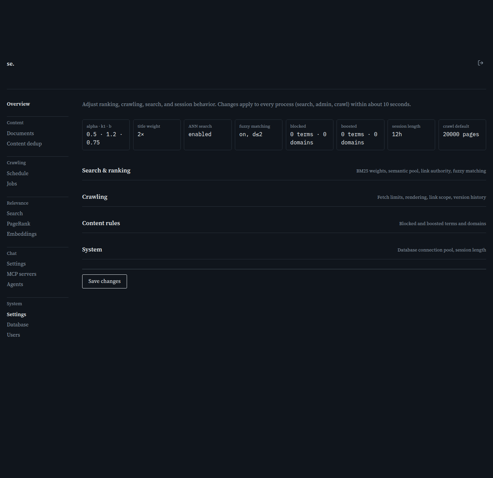

# Settings

[← Manual home](README.md)

*`/admin/settings`*

The single page for every global tuning knob: ranking's BM25/semantic blend, default crawler behavior, blocked/boosted words and domains, and system limits like the database pool and session length. Every field applies to all three processes (search, admin, crawl) within about 10 seconds of saving — no restart. Groups are collapsed by default; open the one you need, and check the eight tiles at the top for a quick read before digging into any group.

This single page holds four collapsible groups of global tuning knobs, each documented on its own page:

- [Search & ranking](settings-search-ranking.md) -- BM25 weights, semantic pool, link authority, fuzzy matching
- [Crawling](settings-crawling.md) -- fetch limits, rendering, link scope, version history
- [Content rules](settings-content-rules.md) -- blocked and boosted terms and domains
- [System](settings-system.md) -- database connection pool, session length

## At a glance (summary tiles)

The eight tiles above the form (alpha·k1·b, title weight, ANN search, fuzzy matching, blocked, boosted, session length, crawl default) are a read-only snapshot, refreshed the instant you save. Use them to sanity-check a change without reopening every group. They read from the same two API calls (GET /admin/api/settings, GET /admin/api/overrides) that populate the form, so they're always in sync with what's stored.

---
← [Agent detail](agent-detail.md) &nbsp;·&nbsp; [↑ Manual home](README.md) &nbsp;·&nbsp; [Settings: Search & ranking](settings-search-ranking.md) →
