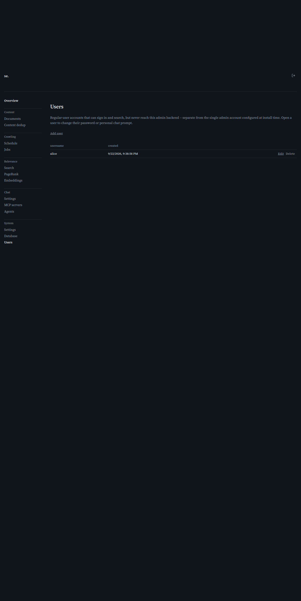

# Users

[← Manual home](README.md)

*`/admin/users`*

Lists every account — every one of them can sign in to the public search site and use chat/self-service; the "Admin" flag is what additionally grants access to this backend. There is no separate hardcoded admin login and no account that doesn't appear here.

## Why user accounts exist

A User row lets someone sign in to the public search page and chat, with or without admin UI access depending on its Admin flag — there's no privilege escalation path from a non-admin session to an admin one; the role is resolved fresh from the server-side session every request, from that row's current `is_admin` value. No self-service signup: every account is created, edited, and deleted here, by whoever can reach /admin. Use this to give a colleague or service account search/chat access without admin rights, or to grant a second person full admin access alongside yours — any number of accounts can hold the Admin flag at once.

## The user list

Each row shows a username, whether it's an admin, and creation date. Edit (✎) opens the account's subpage to change its password, Admin flag, or personal prompt; Delete (trash) removes the account after a confirmation prompt — no longer able to sign in afterward, and no undo (no way to recover a deleted account or its custom prompt). Deleting or demoting the last remaining admin is refused (400) -- there must always be at least one, or nothing could reach this page again. With no accounts yet, the page tells you to click "Add user" -- though in practice `packaging/create-admin.sh` (see [Installation](installation.md) step 7) is how the very first admin gets created, since this page itself needs an admin session to reach. The list isn't paginated or searchable — fine for typical self-hosted account counts.

## Adding a user

"Add user" opens a blank version of the same subpage the edit links use. Set a username (permanent — the account's internal ID is derived from it) and a password of at least 8 characters, optionally checking Admin and/or setting a personal prompt.

---
← [Database](database.md) &nbsp;·&nbsp; [↑ Manual home](README.md) &nbsp;·&nbsp; [User detail](user-detail.md) →
